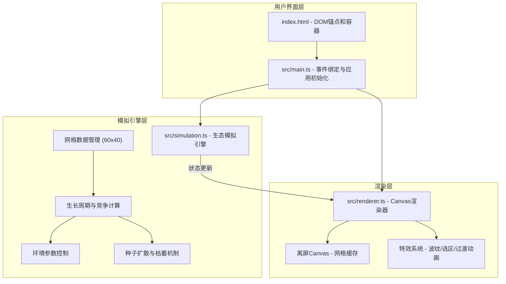

## 1. 架构设计



## 2. 技术说明
- 前端技术栈：TypeScript + 原生HTML/CSS + Vite
- 构建工具：Vite（开发端口8080）
- 渲染技术：Canvas 2D API + requestAnimationFrame
- 状态管理：模拟引擎内部状态，外部通过getState()订阅

## 3. 项目结构
```
e:\solo\VersionFast\tasks\auto230\
├── package.json          # 项目依赖与脚本（vite, typescript）
├── vite.config.js        # Vite构建配置
├── tsconfig.json         # TypeScript严格模式配置
├── index.html            # 入口页面（Canvas+UI锚点）
└── src/
    ├── main.ts           # 应用初始化入口
    ├── simulation.ts     # 生态模拟核心引擎
    └── renderer.ts       # Canvas渲染层
```

## 4. 数据模型

### 4.1 植物类型定义
```typescript
enum PlantType {
  EMPTY = 'empty',
  GRASS_SEED = 'grass_seed',
  GRASS = 'grass',
  SHRUB_SEED = 'shrub_seed',
  SHRUB = 'shrub',
  TREE_SEED = 'tree_seed',
  TREE = 'tree',
}
```

### 4.2 单元格数据
```typescript
interface Cell {
  plantType: PlantType;
  growthCycles: number;        // 连续生长周期计数
  lowCompetitionCycles: number; // 竞争得分低于阈值的连续周期
  withering: boolean;          // 是否正在枯萎（闪烁红色）
  witherCycles: number;        // 枯萎动画剩余周期
}
```

### 4.3 模拟状态
```typescript
interface SimulationState {
  grid: Cell[][];               // 60列x40行
  totalCycles: number;          // 已运行周期数
  elapsedSeconds: number;       // 已运行秒数
  isRunning: boolean;           // 是否正在运行
  params: {
    lightCoefficient: number;   // 光照系数 0.5-1.5
    waterCoefficient: number;   // 水分系数 0.5-1.5
    competitionStrength: number;// 竞争强度 0.1-1.0
  };
  stats: {
    total: number;
    grass: number;
    shrub: number;
    tree: number;
    shannonIndex: number;
  };
}
```

## 5. 核心算法

### 5.1 竞争得分计算
每个格子根据其周围8个邻居的植物类型和数量计算竞争得分：
- 成熟植物贡献：乔木=3, 灌木=2, 草=1, 种子=0.5
- 竞争得分 = 自身权重 + Σ(邻居权重) × 竞争强度系数

### 5.2 光照与水分分布
- 光照：顶部(y=0)光照100%，底部(y=39)光照30%，线性递减
- 水分：左侧(x=0)水分20%，右侧(x=59)水分80%，线性渐变
- 实际值 = 基础值 × 对应系数滑块

### 5.3 生长判定规则
- 草种子：竞争得分 > 邻居平均 且 光照 > 40% → 成熟草
- 灌木种子：连续6个生长周期 且 光照 > 50% → 成熟灌木
- 乔木种子：连续12个生长周期 且 光照 > 70% → 成熟乔木

### 5.4 种子扩散
成熟植物5%概率在半径5格内的空地产生同类型种子

### 5.5 枯萎机制
竞争得分连续3周期 < 1.5 → 植物枯萎，格子闪烁红色2周期后变为空地

### 5.6 Shannon生物多样性指数
H = -Σ(pi × ln(pi))，其中pi为第i种植物占总植物数的比例
