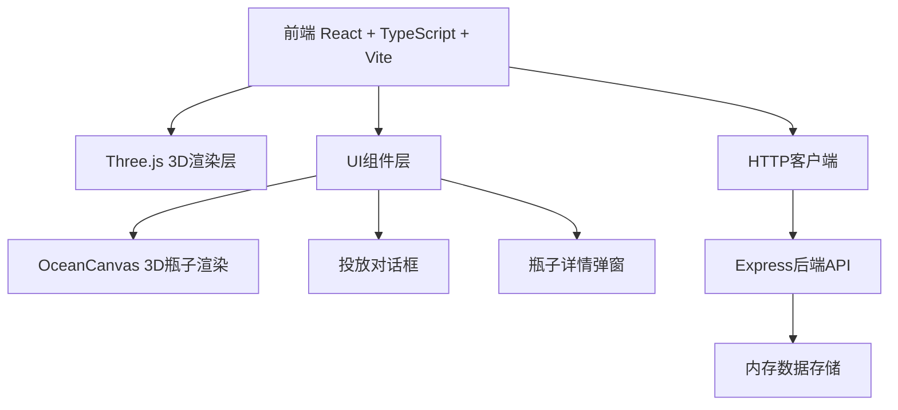
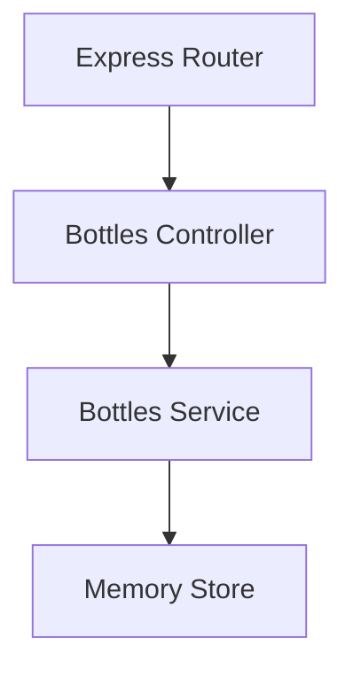
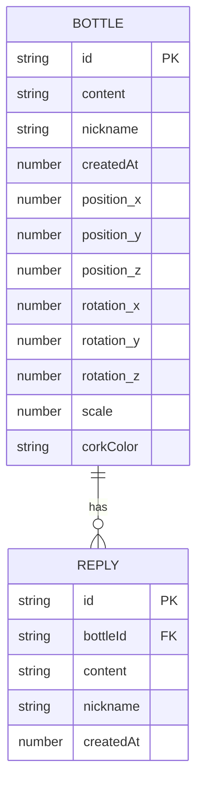

## 1. 架构设计



## 2. 技术说明

- 前端：React 18 + TypeScript + Vite
- 3D渲染：Three.js
- 后端：Express 4 + TypeScript
- 数据存储：内存存储（开发阶段）
- 工具库：uuid（ID生成）、date-fns（时间格式化）、cors（跨域）

## 3. 路由定义

| 路由 | 用途 |
|------|------|
| / | 首页，海洋场景主页面 |

## 4. API定义

```typescript
// 漂流瓶数据类型
interface Bottle {
  id: string;
  content: string;
  nickname?: string;
  createdAt: number;
  replies: Reply[];
  position: { x: number; y: number; z: number };
  rotation: { x: number; y: number; z: number };
  scale: number;
  corkColor: string;
}

interface Reply {
  id: string;
  content: string;
  nickname?: string;
  createdAt: number;
}

// API接口
GET /api/bottles - 获取所有漂流瓶列表
POST /api/bottles - 投放新漂流瓶
GET /api/bottles/:id - 获取单个漂流瓶详情
POST /api/bottles/:id/replies - 回复漂流瓶
DELETE /api/bottles/:id - 删除漂流瓶
```

请求/响应示例：

```typescript
// POST /api/bottles 请求
{
  "content": "你好，陌生人...",
  "nickname": "匿名用户"
}

// POST /api/bottles 响应
{
  "success": true,
  "data": { "id": "...", "content": "...", ... }
}

// POST /api/bottles/:id/replies 请求
{
  "content": "我也有同样的感受...",
  "nickname": "路过的人"
}
```

## 5. 服务端架构图



## 6. 数据模型

### 6.1 数据模型定义



### 6.2 内存数据结构

```typescript
// 内存存储结构
interface Store {
  bottles: Map<string, Bottle>;
}
```
