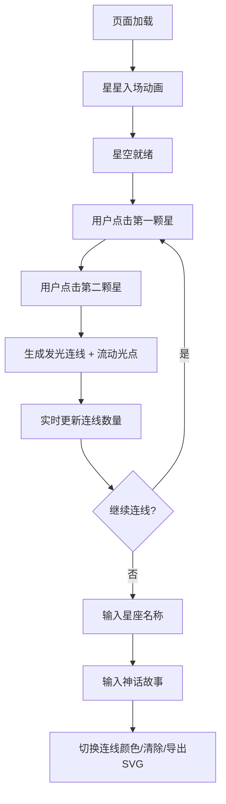

## 1. 产品概述

"幻境星图"是一款交互式星座生成器，让用户化身古代天文学家，在深邃的虚拟夜空中连接星辰，绘制独一无二的星座图案，并为其谱写神话故事。

- 核心目标：提供沉浸式、富有诗意的星空创作体验，融合艺术创作与天文想象
- 目标用户：创意爱好者、天文爱好者、神话故事创作者、寻求放松与灵感的用户

## 2. 核心功能

### 2.1 功能模块

1. **星空画布**：全屏深蓝色星空背景，随机分布闪烁恒星
2. **星座连线**：点击两颗星星生成发光连线，带有流动光点动画
3. **设定面板**：折叠式控制面板，包含连线颜色切换、清除连线、导出SVG、神话故事输入
4. **故事展示**：星座名称旁羽毛笔图标，悬停展开卷轴式故事气泡

### 2.2 页面详情

| 页面名称 | 模块名称 | 功能描述 |
|----------|----------|----------|
| 主界面 | 星空画布 | 300颗随机恒星，大小1-4px，1-3秒闪烁周期，白色到淡蓝渐变，入场飞入动画 |
| 主界面 | 星座连线系统 | 点击两颗星生成发光连线，流动光点，最多60条连线，超过自动清除最早 |
| 主界面 | 实时信息显示 | 星座名称输入框、已连线数量计数 |
| 主界面 | 设定面板 | 三色连线切换按钮、清除连线按钮、导出SVG按钮、神话故事文本框 |
| 主界面 | 故事气泡 | 羽毛笔图标悬停展开卷轴动画，展示用户输入的神话故事 |

## 3. 核心流程

用户打开页面 → 星星从四周飞入形成星空 → 用户点击第一颗星 → 用户点击第二颗星生成发光连线（带流动光点）→ 重复连线构建星座 → 输入星座名称和神话故事 → 切换连线颜色调整效果 → 导出SVG星座图保存作品

## 4. 用户界面设计

### 4.1 设计风格

- **主色调**：深邃夜空蓝 #0B1026（背景）、淡蓝 #A8D8FF（默认连线）、金色 #FFD700、粉色 #FF69B4
- **星星颜色**：从纯白到淡蓝 #B0C4DE 渐变
- **按钮风格**：半透明玻璃态，圆角，悬停时轻微发光
- **字体**：Google Fonts Cormorant Garamond（古典衬线字体，增强天文史诗感）
- **面板风格**：半透明底色 + 高斯模糊 backdrop-filter: blur(12px)
- **动画气质**：优雅、流动、诗意，所有过渡柔和自然

### 4.2 页面设计概览

| 页面名称 | 模块名称 | UI元素 |
|----------|----------|--------|
| 主界面 | 星空画布 | 全屏Canvas、300颗闪烁星、飞入动画、星座名称输入框、连线计数器 |
| 主界面 | 设定面板 | 折叠/展开按钮、三色按钮组、清除按钮、导出按钮、故事文本框、羽毛笔图标 |
| 主界面 | 故事气泡 | 卷轴展开动画、半透明白底、古典内边距 |

### 4.3 响应式设计

- **桌面端（>1024px）**：面板固定在右侧，宽度280px
- **平板端（768-1024px）**：面板收窄为底部工具栏，高度60px，功能图标化
- **手机端（<768px）**：面板悬浮于底部，可上下拖动，带有弹性碰撞动画

### 4.4 性能指标

- 目标帧率：60FPS
- 动画驱动：requestAnimationFrame
- 星星数量上限：500颗
- 连线数量上限：60条
