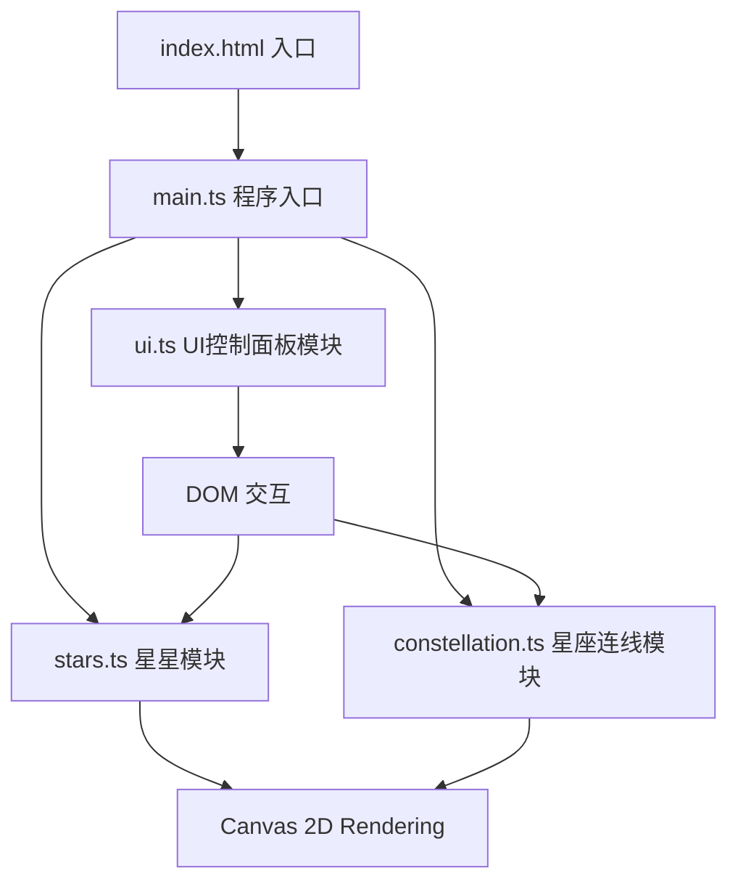

## 1. 架构设计



## 2. 技术描述

- **前端框架**：原生 HTML5 + CSS3 + TypeScript（无框架，Canvas 2D渲染）
- **构建工具**：Vite 5.x
- **开发语言**：TypeScript（strict模式，target esnext）
- **字体**：Google Fonts - Cormorant Garamond
- **依赖包**：vite、typescript、copyfiles

## 3. 项目文件结构

```
├── package.json          # 项目配置与依赖
├── vite.config.js        # Vite构建配置
├── tsconfig.json         # TypeScript配置
├── index.html            # HTML入口
├── src/
│   ├── main.ts           # 程序入口：Canvas初始化、动画循环、模块协调
│   ├── stars.ts          # Star类：星星生成、闪烁动画、位置更新、入场动画
│   ├── constellation.ts  # ConstellationManager：连线管理、光点动画、颜色切换、清除动画
│   └── ui.ts             # UI类：控制面板、按钮事件、响应式布局、SVG导出
└── .trae/documents/      # 项目文档
```

## 4. 核心类与数据结构

### 4.1 Star 类（stars.ts）

```typescript
interface StarData {
  id: number;
  x: number;           // 当前X坐标
  y: number;           // 当前Y坐标
  targetX: number;     // 目标X坐标
  targetY: number;     // 目标Y坐标
  startX: number;      // 入场起始X（画布边缘）
  startY: number;      // 入场起始Y（画布边缘）
  size: number;        // 半径 1-4px
  baseOpacity: number; // 基础透明度
  opacity: number;     // 当前透明度
  twinkleSpeed: number;// 闪烁速度 1-3秒周期
  twinkleOffset: number;// 闪烁相位偏移
  color: string;       // 颜色（白色到淡蓝渐变）
  isEntered: boolean;  // 是否已完成入场动画
  enterProgress: number;// 入场进度 0-1
}
```

### 4.2 ConstellationManager 类（constellation.ts）

```typescript
interface Connection {
  id: number;
  star1Id: number;
  star2Id: number;
  color: string;              // 当前颜色
  targetColor: string;        // 目标颜色（用于闪烁切换）
  colorFlashProgress: number; // 颜色闪烁动画进度
  lightProgress: number;      // 光点位置 0-1
  isDissolving: boolean;      // 是否正在溶解（清除动画）
  dissolveProgress: number;   // 溶解进度 0-1
  dissolveCenterX: number;    // 溶解波纹中心X
  dissolveCenterY: number;    // 溶解波纹中心Y
  createdAt: number;          // 创建时间戳
}

type LineColor = '#A8D8FF' | '#FFD700' | '#FF69B4';
```

### 4.3 UI 类（ui.ts）

```typescript
interface UIElements {
  panel: HTMLElement;
  colorButtons: HTMLButtonElement[];
  clearButton: HTMLButtonElement;
  exportButton: HTMLButtonElement;
  nameInput: HTMLInputElement;
  storyTextarea: HTMLTextAreaElement;
  storyBubble: HTMLElement;
  quillIcon: HTMLElement;
  connectionCount: HTMLElement;
}
```

## 5. 动画系统设计

所有动画统一由 `main.ts` 中的 `requestAnimationFrame` 循环驱动，每帧调用各模块的 `update(deltaTime)` 和 `render(ctx)` 方法。

- **星星闪烁**：基于 `Math.sin(time * twinkleSpeed + offset)` 计算透明度变化
- **入场动画**：基于 `easeOutCubic` 缓动函数从边缘坐标插值到目标位置
- **流动光点**：线性插值从连线起点到终点，周期2秒循环
- **颜色切换闪烁**：短暂高亮脉冲后稳定到新颜色
- **清除波纹动画**：从中心向外扩散的波纹效果，连线分段消失
- **面板拖动**：弹性碰撞物理模拟（velocity + damping + boundary bounce）
- **卷轴展开**：CSS transform + clip-path 动画

## 6. SVG 导出格式

导出包含：
- `<svg>` 根元素，viewBox 匹配画布尺寸
- `<defs>` 定义发光滤镜 filter
- 所有星星的 `<circle>` 元素
- 所有连线的 `<line>` 元素（带发光样式）
- 星座名称 `<text>` 水印（右下角，半透明）
