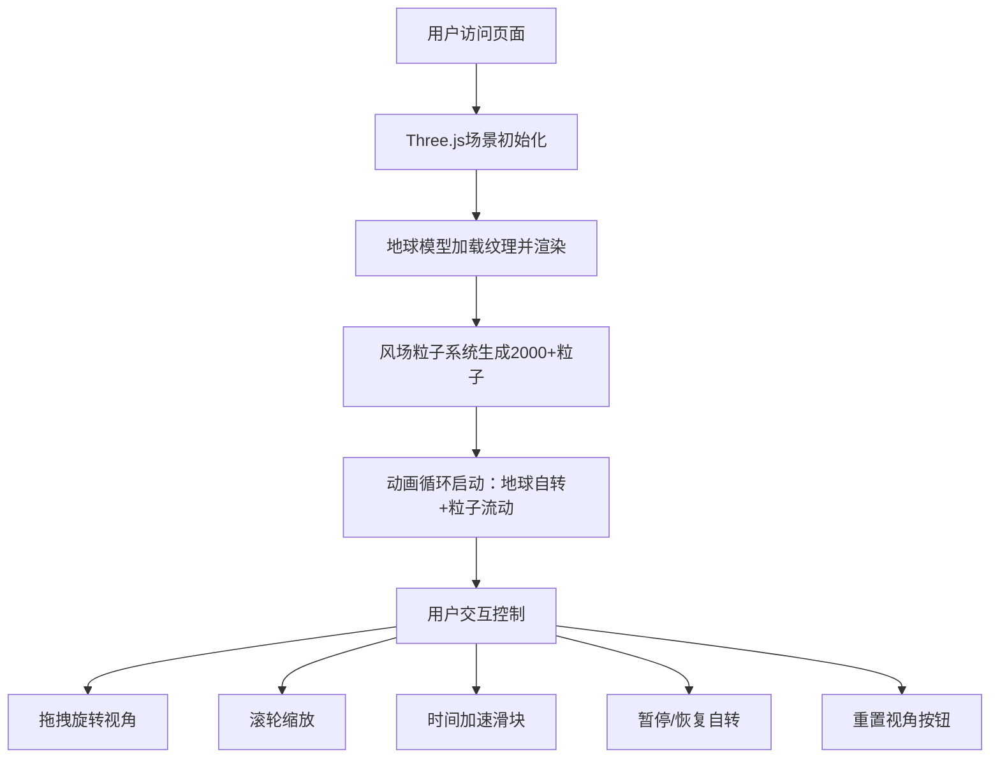

## 1. 产品概述

三维地球风场可视化应用，面向气象研究者，以动态流动线条形式在浏览器中实时呈现全球风场数据（风向、风速、压力梯度），辅助快速识别大气环流模式和极端天气路径。

- 核心价值：将抽象的气象数据转化为直观可交互的三维视觉呈现
- 目标用户：气象研究者、气候分析师、数据可视化爱好者

## 2. 核心功能

### 2.1 用户角色
| 角色 | 注册方式 | 核心权限 |
|------|----------|----------|
| 气象研究者 | 无需注册，直接访问 | 浏览风场、调整参数、控制视角 |

### 2.2 功能模块
1. **三维地球渲染**：带纹理的地球模型、缓慢自转、可暂停/恢复
2. **风场粒子系统**：2000+动态粒子沿流线移动、风速颜色映射
3. **交互控制**：鼠标拖拽旋转、滚轮缩放、时间加速滑块、重置视角按钮
4. **控制面板**：半透明磨砂玻璃效果UI、响应式布局

### 2.3 页面详情
| 页面名称 | 模块名称 | 功能描述 |
|----------|----------|----------|
| 主页面 | 三维场景 | Three.js渲染地球和风场粒子，全屏展示 |
| 主页面 | 控制面板 | 时间加速滑块(1x-10x)、暂停/恢复自转、重置视角按钮 |
| 主页面 | 交互层 | 鼠标拖拽旋转视角、滚轮缩放、平滑动画过渡 |

## 3. 核心流程

用户打开页面 → 三维地球与风场粒子加载并自动渲染 → 用户通过鼠标拖拽旋转地球、滚轮缩放查看 → 拖动时间滑块加速粒子流动 → 点击暂停/恢复按钮控制地球自转 → 点击重置视角按钮回到初始位置

## 4. 用户界面设计

### 4.1 设计风格
- 主色调：深色背景 `#0A0A1A`，营造太空沉浸感
- 强调色：浅蓝 `#87CEEB`、黄绿 `#ADFF2F`、红色 `#FF4500`（风速颜色映射）
- 按钮/控件样式：圆角设计、半透明磨砂玻璃效果、悬停亮度提升20%、点击缩放至0.95
- 字体：现代无衬线字体，清晰可读
- 布局：全屏3D渲染区域 + 左上角固定控制面板
- 视觉氛围：宇宙深空感，地球作为视觉焦点

### 4.2 页面设计概览
| 页面名称 | 模块名称 | UI元素 |
|----------|----------|--------|
| 主页面 | 3D渲染区 | 带纹理地球、流动风场粒子、动态光影 |
| 主页面 | 控制面板 | 半透明白色磨砂玻璃(rgba(255,255,255,0.1))、1px边框rgba(255,255,255,0.3)、圆角12px、时间加速滑块、暂停/恢复按钮、重置视角按钮 |
| 主页面 | 交互反馈 | 控件hover亮度提升、click缩放动画、视角平滑过渡 |

### 4.3 响应式设计
- 桌面优先设计
- 屏幕宽度 < 768px 时：控制面板缩小、控件横向排列
- 触屏设备：支持触摸手势旋转和缩放

### 4.4 3D场景指导
- **环境**：深空黑色背景 `#0A0A1A`，微弱环境光
- **光照**：方向光模拟太阳照射 + 柔和环境光，地球有明暗面区分
- **相机**：PerspectiveCamera，初始位置(经度0,纬度0,距离地球半径3倍)
- **动画**：地球缓慢自转(0.002rad/s)、粒子沿流线流动、视角平滑过渡(1秒)
- **性能优化**：粒子数>3000时自动减半线条宽度、目标帧率≥45fps
