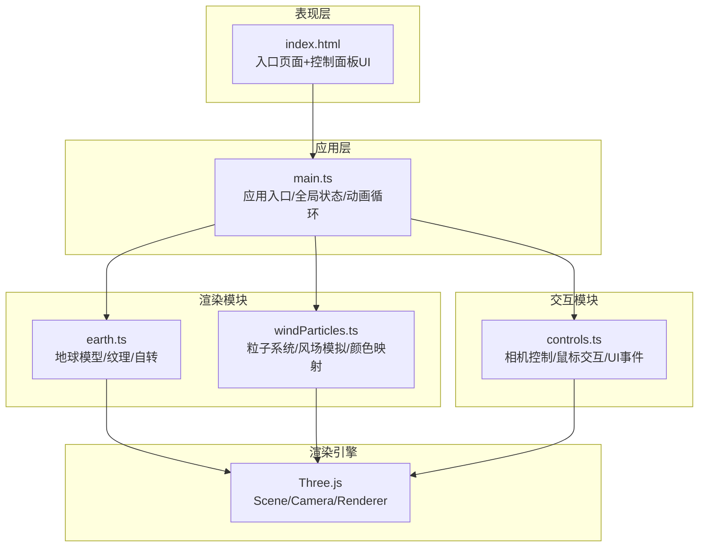

## 1. 架构设计



**数据流向**：
1. `main.ts` 初始化全局状态和Three.js场景，启动requestAnimationFrame循环
2. 每帧：`main.ts` → `earth.update(delta)` 更新地球自转 → `windParticles.update(delta, speedMultiplier)` 更新粒子位置和颜色
3. 用户交互：`controls.ts` 监听鼠标/触摸事件和UI控件，向 `main.ts` 输出视角变换和参数调整指令
4. `main.ts` 接收指令后更新Camera位置和全局状态参数

**调用关系**：
- `main.ts` 持有 `earth`、`windParticles`、`controls` 实例
- `earth.ts` 和 `windParticles.ts` 输出Mesh/Points对象，由 `main.ts` 添加到Scene
- `controls.ts` 接收Camera和DOM元素引用，通过回调与 `main.ts` 通信

## 2. 技术描述

- 前端框架：**原生 TypeScript**（无React/Vue，按用户要求模块化）
- 3D引擎：**Three.js** + @types/three
- 构建工具：**Vite**
- 包管理：npm

## 3. 项目文件结构

| 文件路径 | 职责 |
|----------|------|
| `package.json` | 项目依赖(three、@types/three、typescript、vite)、启动脚本 |
| `vite.config.js` | Vite基础构建配置 |
| `tsconfig.json` | TypeScript严格模式配置 |
| `index.html` | 入口页面，全屏canvas容器 + 左上角半透明控制面板 |
| `src/main.ts` | 应用初始化、Scene/Camera/Renderer创建、动画循环、全局状态管理 |
| `src/earth.ts` | 构建带纹理地球球体、自转逻辑、输出地球网格 |
| `src/windParticles.ts` | 风场粒子系统、2000+粒子、流线运动、风速颜色映射 |
| `src/controls.ts` | 鼠标拖拽旋转、滚轮缩放、UI事件处理、视角变换 |

## 4. 核心数据模型

### 4.1 全局状态 (AppState)
```typescript
interface AppState {
  timeSpeed: number;        // 时间加速倍数 1x-10x
  isRotating: boolean;      // 地球自转是否启用
  targetCameraPos: { x: number; y: number; z: number };  // 相机目标位置
  isResettingCamera: boolean;  // 是否正在重置视角
}
```

### 4.2 风场粒子数据 (WindParticle)
```typescript
interface WindParticle {
  lat: number;              // 纬度 -90 ~ 90
  lon: number;              // 经度 -180 ~ 180
  speed: number;            // 当前风速 m/s
  direction: number;        // 风向角度（弧度）
  altitude: number;         // 距地表高度（相对地球半径）
}
```

### 4.3 风场数据采样 (WindSample)
```typescript
interface WindSample {
  lat: number;
  lon: number;
  u: number;  // 东西向风速分量
  v: number;  // 南北向风速分量
}
```

## 5. 性能优化策略

1. **粒子渲染**：使用 `THREE.Points` + `BufferGeometry` 批量渲染，避免逐粒子Mesh
2. **动态降级**：粒子数 > 3000 时，点大小/线条宽度自动减半
3. **帧率监控**：目标帧率 ≥ 45fps，CPU 占用 ≤ 25%（2000粒子时）
4. **内存控制**：预分配BufferGeometry数组，避免每帧GC，目标内存 ≤ 150MB
5. **纹理优化**：使用压缩纹理格式，合理设置纹理各向异性
6. **动画优化**：使用 `deltaTime` 计算运动，帧率变化时运动速度保持一致
