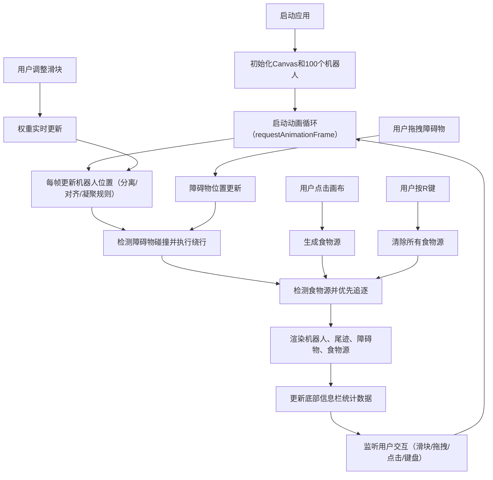

## 1. 产品概述

2D仿生机器人群集运动交互式沙盒应用，用于直观观察和学习群体智能（Swarm Intelligence）中分离、对齐、凝聚三条核心规则对群体行为的影响。通过实时调整参数、拖拽障碍物、放置食物源等交互方式，帮助用户理解复杂系统涌现行为的形成机制。

- 目标用户：人工智能学习者、群体智能研究者、计算机科学教育工作者
- 产品价值：将抽象的群体智能算法具象化为可交互的可视化实验平台，降低学习门槛，提升教学与研究效率

## 2. 核心功能

### 2.1 用户角色
| 角色 | 注册方式 | 核心权限 |
|------|----------|----------|
| 普通用户 | 无需注册，直接访问 | 使用所有仿真功能、调整参数、导出观察结果 |

### 2.2 功能模块
1. **主画布区域**：自适应Canvas画布，渲染机器人、障碍物、食物源、运动轨迹
2. **参数控制面板**：三条规则权重滑块、实时统计数据展示、面板折叠/展开
3. **交互系统**：鼠标点击放置食物源、拖拽障碍物移动、键盘快捷键
4. **底部信息栏**：群体状态指标实时展示（数量、速度、聚类系数、帧率）

### 2.3 页面详情
| 页面名称 | 模块名称 | 功能描述 |
|----------|----------|----------|
| 主页面 | 主画布 | 自适应16:9画布，背景#1B1B2F，渲染100个三角形机器人，支持尾迹效果、发光边框 |
| 主页面 | 参数控制面板 | 宽度280px卡片式面板，分离/对齐/凝聚权重滑块（0-3.0），实时显示当前值，水平滑动动画 |
| 主页面 | 障碍物系统 | 3个半透明圆形障碍物（50-80px），支持鼠标拖拽，机器人自动绕行 |
| 主页面 | 食物源系统 | 点击生成亮绿色脉动食物源（≤5个），机器人优先追逐，R键清除 |
| 主页面 | 底部信息栏 | 高度50px半透明栏，显示机器人总数、平均速度、聚类系数、帧率 |

## 3. 核心流程

用户进入应用后，自动初始化100个机器人开始群集运动。用户可通过右侧滑块调整三条规则权重，实时观察群体行为变化。用户可以拖拽障碍物改变环境，或点击画布放置食物源引导机器人移动。底部信息栏持续更新群体统计指标。

## 4. 用户界面设计

### 4.1 设计风格
- 主色调：深蓝紫（#1B1B2F）营造太空科技感
- 高亮色：青色（#00D4AA）用于界面边框、选中状态、正向指标
- 强调色：橙色（#FF8C42）用于机器人进食状态、警示标识
- 中性色：半透明深色（#0D0D1A、#232340）用于面板背景，浅灰（#888888）用于障碍物，亮绿用于食物源
- 字体：等宽无衬线字体，14px为基础字号
- 视觉效果：发光边框、渐隐尾迹、脉动发光动画、平滑过渡动画

### 4.2 页面设计概述
| 页面名称 | 模块名称 | UI元素 |
|----------|----------|--------|
| 主页面 | 主画布 | 16:9自适应布局、#1B1B2F背景、1px青色发光边框、三角形机器人、渐隐尾迹 |
| 主页面 | 控制面板 | 右侧280px卡片、#232340半透明背景、圆角10px、内边距16px、滑块+标签+实时数值 |
| 主页面 | 障碍物 | 半透明浅灰圆形、鼠标可拖拽、悬停高亮反馈 |
| 主页面 | 食物源 | 亮绿色圆点、脉动发光动画（周期1.5s）、直径12px |
| 主页面 | 底部信息栏 | 50px高度、#0D0D1A半透明背景、#CCCCCC字体、四列指标均匀分布 |

### 4.3 响应式设计
- 采用桌面优先（Desktop-first）设计策略
- 屏幕宽度 ≥ 768px：控制面板固定在右侧，水平展开/收起动画（0.4s ease-out）
- 屏幕宽度 < 768px：控制面板折叠为顶部横向抽屉，点击展开
- Canvas始终自适应窗口尺寸，保持16:9比例优先，不足则填充可用空间
- 触摸设备支持：障碍物拖拽、食物源点击、滑块触控调整

### 4.4 视觉动效规范
- 机器人尾迹：15px长度，透明度从0.6线性渐变至0
- 食物源脉动：1.5秒周期，发光半径8-16px正弦变化
- 面板动画：水平滑动0.4s ease-out
- 性能要求：200个机器人时维持30FPS以上

