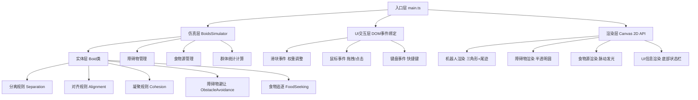

## 1. 架构设计

本项目为纯前端Canvas 2D渲染应用，采用分层架构设计，将业务逻辑与渲染层分离，确保代码可维护性和性能优化空间。



## 2. 技术描述

- **前端框架**：原生 TypeScript + HTML5 Canvas + CSS3，无额外前端框架（用户明确要求）
- **构建工具**：Vite 5.x，启用 HMR 热模块替换，开发端口 8080
- **编程语言**：TypeScript 5.x，严格模式（strict: true），ESNext 模块系统
- **渲染技术**：Canvas 2D Context API，requestAnimationFrame 驱动动画循环
- **样式方案**：原生 CSS3，使用 CSS Variables 管理主题色，CSS Transitions 实现面板动画

### 目录结构
```
auto241/
├── package.json          # 项目依赖配置
├── vite.config.js        # Vite构建配置
├── tsconfig.json         # TypeScript编译配置
├── index.html            # 入口HTML页面
└── src/
    ├── main.ts           # 程序入口：初始化、事件绑定、主循环
    ├── boids.ts          # Boid类：单机器人行为规则
    └── simulator.ts      # BoidsSimulator类：群体管理与统计
```

## 3. 页面路由

单页应用，无前端路由，所有功能在同一页面完成。

| 路径 | 用途 |
|------|------|
| / | 主页面：包含Canvas画布、控制面板、底部信息栏 |

## 4. 核心数据模型

### 4.1 Vector2 二维向量
```typescript
interface Vector2 {
  x: number;
  y: number;
}
```

### 4.2 Boid 机器人实体
```typescript
class Boid {
  position: Vector2;       // 当前位置
  velocity: Vector2;       // 当前速度向量
  heading: number;         // 朝向角度（弧度）
  speed: number;           // 移动速度标量 1-3 px/frame
  viewRadius: number;      // 视野半径 120px
  trail: Vector2[];        // 运动尾迹（最多15个点）
  isEating: boolean;       // 是否正在进食
  eatTimer: number;        // 进食剩余时间（毫秒）
  targetFood: Food | null; // 当前追逐的食物源
}
```

### 4.3 Obstacle 障碍物
```typescript
interface Obstacle {
  x: number;
  y: number;
  radius: number;          // 半径 25-40px（直径50-80px）
  avoidRadius: number;     // 绕行触发半径 30px
  isDragging: boolean;     // 是否正在被拖拽
}
```

### 4.4 Food 食物源
```typescript
interface Food {
  x: number;
  y: number;
  radius: number;          // 6px（直径12px）
  createdAt: number;       // 创建时间戳
  pulsePhase: number;      // 脉动动画相位
}
```

### 4.5 SimulationConfig 仿真配置
```typescript
interface SimulationConfig {
  separationWeight: number;  // 分离权重 默认1.5
  alignmentWeight: number;   // 对齐权重 默认1.0
  cohesionWeight: number;    // 凝聚权重 默认1.0
  maxBoids: number;          // 最大机器人数量
  maxFoods: number;          // 最大食物源数量 5
}
```

### 4.6 GroupStats 群体统计
```typescript
interface GroupStats {
  totalCount: number;       // 机器人总数
  avgSpeed: number;         // 平均速度（标量）
  clusteringCoeff: number;  // 聚类系数（保留两位小数）
  fps: number;              // 当前帧率
}
```

## 5. 核心算法

### 5.1 分离规则 (Separation)
计算机器人与视野内邻居的距离，对过近的邻居施加排斥力，避免碰撞。
```
steer = Σ (position - neighbor.position) / distance  for d < viewRadius/2
```

### 5.2 对齐规则 (Alignment)
计算机器人与视野内邻居的平均速度方向，使机器人趋向与邻居同方向运动。
```
steer = avg(neighbor.velocity) - current.velocity
```

### 5.3 凝聚规则 (Cohesion)
计算机器人视野内邻居的平均位置，使机器人趋向群体中心聚集。
```
steer = avg(neighbor.position) - current.position
```

### 5.4 障碍物避让
检测机器人前方30px范围内是否存在障碍物，若存在则在当前朝向基础上偏转±60度选择更优方向绕行。

### 5.5 食物追逐（优先级最高）
查找距离最近的食物源，直接向其移动。到达后进入进食状态（橙色，停止2秒），进食完成后恢复群集行为。

### 5.6 聚类系数计算
每帧统计每个机器人视野内（120px半径）的邻居数量，取平均值后保留两位小数。

## 6. 性能优化策略

- **空间分区**：使用网格哈希（Spatial Grid）将机器人按位置分区，邻居查询仅检查相邻网格，将时间复杂度从 O(n²) 降为 O(n)
- **轨迹优化**：尾迹使用定长数组（15点），通过 unshift+pop 维护，避免频繁数组重建
- **渲染优化**：Canvas 批量绘制同类元素，减少状态切换开销
- **帧率监控**：使用 performance.now() 计算 FPS，监控性能指标
- **响应式Canvas**：使用 devicePixelRatio 适配高DPI屏幕，同时通过 CSS 尺寸控制显示大小

