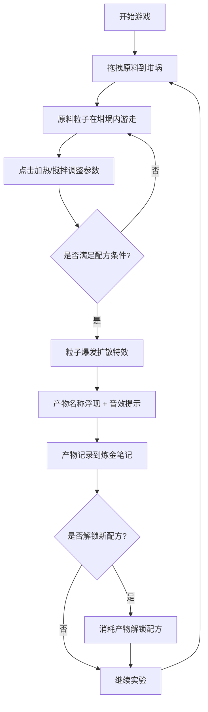

## 1. 产品概述

像素风古代炼金术工坊模拟游戏，玩家扮演炼金术士，通过组合不同属性的原料（硫磺、水银、盐、草药、金属等）在坩埚中加热、搅拌、冷却，尝试炼制出传说中的贤者之石、万能溶剂或点金石。

- 面向对炼金术题材和像素风游戏感兴趣的玩家
- 提供探索、实验和收集配方的核心乐趣，目标是解锁所有隐藏配方

## 2. 核心特性

### 2.1 功能模块

1. **炼金画布区域**：像素风格坩埚、动态火焰动画、原料粒子效果、产物爆发特效
2. **右侧控制面板**：炼金状态显示（加热度、搅拌次数进度条）、原料拖拽槽、操作按钮（加热、搅拌）、炼金笔记
3. **配方系统**：内置10个隐藏配方、配方解锁机制、已发现配方记录
4. **音效系统**：Web Audio生成产物合成音效

### 2.2 页面详情

| 页面名称 | 模块名称 | 功能描述 |
|----------|----------|----------|
| 主游戏界面 | 像素画布 | 自适应4:3比例画布，绘制坩埚、火焰、粒子特效 |
| 主游戏界面 | 控制面板 | 显示加热度/搅拌次数进度条，原料槽，操作按钮 |
| 主游戏界面 | 炼金笔记 | 表格形式展示已发现配方，底部显示未解锁配方 |
| 主游戏界面 | 响应式布局 | 桌面端右侧面板，移动端折叠为底部横条 |

## 3. 核心流程

玩家拖拽原料到坩埚 → 坩埚内生成对应颜色粒子 → 点击加热/搅拌按钮调整参数 → 参数和原料组合满足配方条件时触发合成特效 → 产物名称浮现并记录到炼金笔记 → 可消耗产物解锁新配方

## 4. 用户界面设计

### 4.1 设计风格

- **主色调**：中世纪羊皮纸与铜锈色调（主色 #8B4513、#D2B48C、#2A1A0E）
- **按钮样式**：古典铜质按钮（#B87333），悬浮变 #D4A574，点击下沉2px
- **像素风格**：坩埚及火焰使用4px最小单位绘制
- **面板风格**：羊皮纸底色 #D2B48C，边框 #8B4513，1px暗色描边 #3E2723
- **字体**：像素字体，产物名称 #FFD700

### 4.2 页面设计概述

| 页面名称 | 模块名称 | UI元素 |
|----------|----------|--------|
| 主游戏界面 | 像素画布 | 石质墙壁背景 #2A1A0E，坩埚 #6B4226，火焰6帧循环动画 |
| 主游戏界面 | 控制面板 | 羊皮纸风格面板，深红色渐变进度条 #8B0000→#FF4500 |
| 主游戏界面 | 原料图标 | 5种16x16px图标：硫磺黄色三角、水银银色圆点、盐白色方块、草药绿色十字、金属灰色齿轮 |
| 主游戏界面 | 炼金笔记 | 表格形式，#3E2723分隔线，未解锁配方显示灰色锁头图标 |

### 4.3 响应式设计

- 桌面端（≥768px）：画布居中，右侧200px宽控制面板
- 移动端（<768px）：画布居上，控制面板折叠为底部60px横条，点击展开按钮弹出全高面板
- 画布始终保持4:3比例，最小尺寸320x240px

## 5. 性能指标

- 主循环稳定60FPS
- 粒子数量≤300个，超出时优先销毁最远粒子
- 火焰动画使用requestAnimationFrame驱动
- CPU占用≤30%
- 页面加载时间≤2秒（本地开发）
- 无内存泄漏，连续运行1小时帧率稳定55-60FPS
