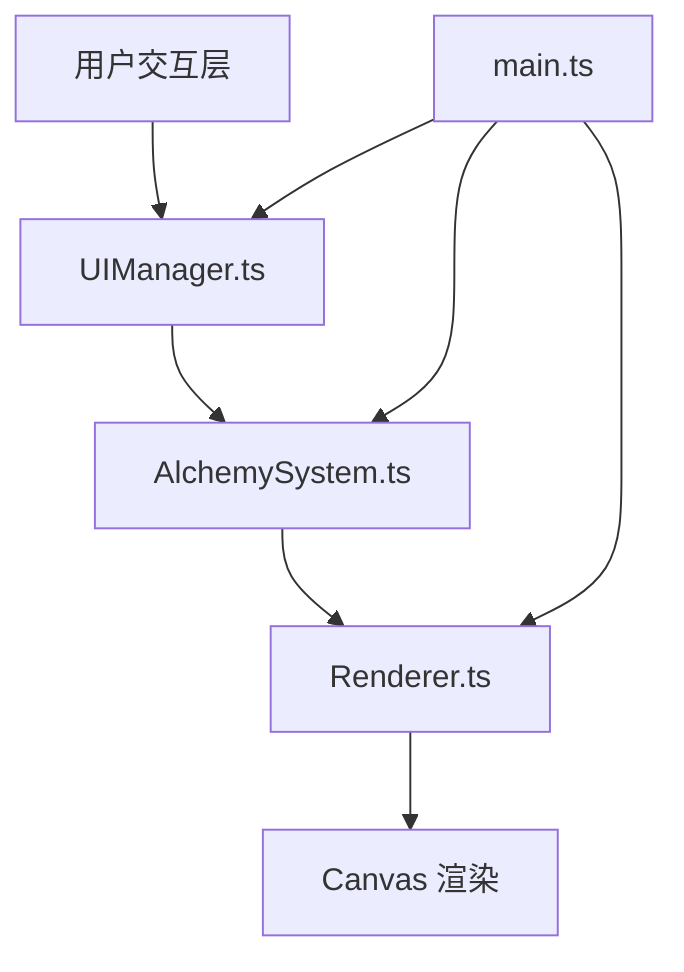

## 1. 架构设计



架构分层说明：
- **main.ts**：程序入口，初始化Canvas、加载游戏状态、启动主循环
- **AlchemySystem.ts**：炼金核心逻辑，管理原料组合表、加热度、搅拌次数计算
- **Renderer.ts**：像素渲染引擎，负责绘制坩埚、火焰、粒子效果、产物特效
- **UIManager.ts**：用户界面管理，处理原料拖拽、按键反馈、状态显示

## 2. 技术描述

- **前端技术栈**：TypeScript + 原生HTML/CSS + Vite
- **构建工具**：Vite，开发服务器端口8080
- **类型系统**：TypeScript严格模式，esnext模块，dom类型包含
- **渲染引擎**：Canvas 2D API，像素风4px最小单位
- **音效**：Web Audio API
- **无后端**：纯前端应用，数据存储在内存中

## 3. 文件结构

| 文件路径 | 说明 |
|-----------|------|
| package.json | 项目依赖配置，包含vite、typescript依赖，启动脚本npm run dev |
| index.html | 入口页面，全屏Canvas + 右侧控制面板DOM锚点 |
| vite.config.js | Vite构建配置，入口指向index.html |
| tsconfig.json | TypeScript配置，严格模式 |
| src/main.ts | 程序入口，初始化Canvas、启动主循环 |
| src/AlchemySystem.ts | 炼金核心逻辑 |
| src/Renderer.ts | 像素渲染引擎 |
| src/UIManager.ts | 用户界面管理 |

## 4. 核心数据模型

### 4.1 原料类型

```typescript
enum MaterialType {
  SULFUR = 'sulfur',
  MERCURY = 'mercury',
  SALT = 'salt',
  HERB = 'herb',
  METAL = 'metal'
}
```

### 4.2 原料配置

```typescript
interface Material {
  type: MaterialType
  name: string
  color: string
  icon: string
}
```

### 4.3 配方定义

```typescript
interface Recipe {
  id: string
  name: string
  rarity: 'common' | 'uncommon' | 'rare' | 'legendary'
  materials: MaterialType[]
  heatRange: [number, number]
  stirRange: [number, number]
  unlocked: boolean
  description: string
}
```

### 4.4 炼金状态

```typescript
interface AlchemyState {
  heat: number
  stirCount: number
  currentMaterials: MaterialType[]
  particles: Particle[]
  discoveredRecipes: string[]
}
```

### 4.5 粒子系统

```typescript
interface Particle {
  x: number
  y: number
  vx: number
  vy: number
  color: string
  size: number
  life: number
  maxLife: number
}
```

## 5. 性能优化策略

1. **粒子数量控制**：上限300个，超出时优先销毁距离坩埚最远的粒子
2. **requestAnimationFrame**：火焰动画和主循环使用RAF驱动
3. **Canvas优化**：离屏渲染静态元素，每帧仅重绘动态元素
4. **对象池**：粒子对象复用，避免频繁GC
5. **节流处理**：拖拽事件使用requestAnimationFrame节流
