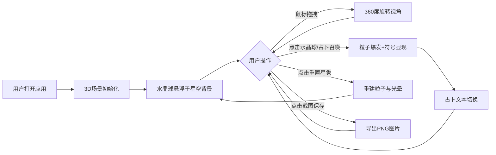

## 1. 产品概述
"魔法水晶球"是一款沉浸式交互式3D占卜应用，通过Three.js构建神秘的水晶球占卜体验。用户可通过旋转视角、点击水晶球触发占卜效果，在深紫色星空背景中探索未来。

- 核心目标：为用户提供富有沉浸感和神秘氛围的占卜视觉体验
- 目标用户：对神秘学、占卜文化感兴趣的普通用户
- 产品价值：通过精美的3D视觉效果和交互设计，模拟真实占卜师窥探未来的神秘体验

## 2. 核心功能

### 2.1 用户角色
| 角色 | 注册方式 | 核心权限 |
|------|----------|----------|
| 普通用户 | 无需注册 | 体验全部占卜交互功能 |

### 2.2 功能模块
1. **3D主场景模块**：水晶球、星空背景、环绕小行星、占卜台
2. **占卜交互模块**：点击水晶球触发粒子爆发、占卜符号显示
3. **占卜文本模块**：占卜文本随机切换与淡入淡出动画
4. **控制面板模块**：占卜召唤、重置星象、截图保存功能

### 2.3 页面详情
| 页面名称 | 模块名称 | 功能描述 |
|----------|----------|----------|
| 主场景 | 水晶球渲染 | 半径2单位半透明球体，Phong材质，透明度0.2，反射强度0.5，随机流动光晕贴图 |
| 主场景 | 星空背景 | 深紫色径向渐变（#1A0030 → #0D0015），营造神秘氛围 |
| 主场景 | 环绕小行星 | 6颗小行星环绕水晶球，半径0.1单位，自转周期2-5秒随机，颜色从#FFD700/#FF6B6B/#00C9FF随机选取 |
| 主场景 | 视角控制 | 鼠标拖拽实现360度视角旋转 |
| 占卜交互 | 粒子爆发 | 点击水晶球触发约200颗粒子流，暖→冷色渐变，大小0.05-0.15，随机方向喷射，3秒内消散于球体内壁 |
| 占卜交互 | 占卜符号 | 球体表面显示贝塞尔曲线构成的发光白色符号，持续2秒后渐隐 |
| 占卜文本 | 占卜台 | 半径1.2单位半透明深蓝圆盘（#0B2D4D），边沿发光动画周期1.5秒 |
| 占卜文本 | 文本切换 | 从20句预设语句中随机选取，每5秒自动切换，带淡入淡出效果 |
| 控制面板 | 占卜召唤按钮 | 触发占卜效果（粒子+符号） |
| 控制面板 | 重置星象按钮 | 重建粒子系统与光晕纹理 |
| 控制面板 | 截图保存按钮 | 将当前画面保存为PNG图片 |

## 3. 核心流程

用户打开应用 → 观赏悬浮水晶球与星空背景 → 鼠标拖拽旋转视角观察 → 点击水晶球或点击"占卜召唤"按钮 → 粒子爆发+占卜符号显现+占卜文本更新 → 可点击"重置星象"刷新视觉效果 → 可点击"截图保存"保存占卜画面

## 4. 用户界面设计

### 4.1 设计风格
- **主色调**：深紫（#1A0030、#0D0015）、深蓝（#0B2D4D）、金色（#FFD700）
- **辅助色**：珊瑚红（#FF6B6B）、青蓝（#00C9FF）
- **视觉主题**：神秘学风格，大量使用发光效果、渐变、透明度层叠
- **按钮风格**：半透明毛玻璃效果（背景#FFFFFF20），圆角，带发光边框
- **字体**：优雅衬线字体，配合发光文字效果
- **动画**：所有元素使用easeInOutCubic缓动函数

### 4.2 页面设计概述
| 页面名称 | 模块名称 | UI元素 |
|----------|----------|--------|
| 主场景 | 水晶球 | 半透明Phong材质球体，流动光晕贴图，中心发光 |
| 主场景 | 星空背景 | 径向渐变深紫色背景，稀疏星点粒子 |
| 主场景 | 小行星带 | 6颗彩色小球环绕旋转，带自发光效果 |
| 主场景 | 占卜台 | 半透明深蓝圆盘，边沿脉动发光动画 |
| 主场景 | 占卜文本 | 台面上居中显示，金色发光文字，淡入淡出切换 |
| 控制面板 | 控制栏 | 右下角毛玻璃面板，三个按钮竖向排列，按钮带悬停发光效果 |

### 4.3 响应式设计
- 桌面优先设计，最小视口1280x720
- Canvas自适应全屏，保持场景比例
- 控制面板位置固定于右下角，尺寸根据窗口大小微调
- 触控设备支持手势旋转视角

### 4.4 3D场景指引
- **环境氛围**：深紫色星空，低亮度环境光配合点光源营造神秘感
- **光照设置**：环境光（低强度紫色）+ 水晶球内部点光源 + 占卜台面光源
- **相机设置**：PerspectiveCamera，初始距离约8单位，支持OrbitControls拖拽旋转
- **构图焦点**：水晶球位于画面中心，占卜台在下方，控制面板不遮挡主体
- **交互动画**：粒子喷射、符号渐显渐隐、文本切换、小行星自转公转
- **性能要求**：稳定60FPS，同时存在粒子数≤300
