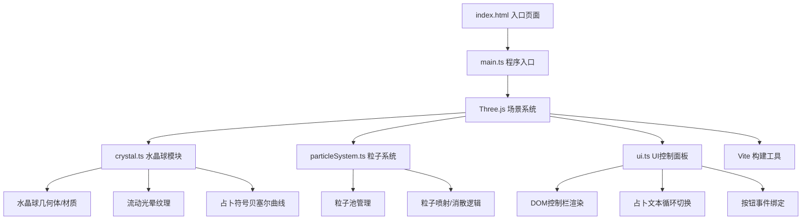

## 1. 架构设计



## 2. 技术说明
- **前端框架**：原生 TypeScript + Three.js（无React/Vue框架，按用户需求）
- **构建工具**：Vite 5.x
- **3D引擎**：Three.js 最新版本
- **类型支持**：@types/three
- **开发服务器**：Vite Dev Server，端口8080

## 3. 文件结构

| 文件路径 | 职责说明 |
|----------|----------|
| `package.json` | 项目依赖与脚本配置（three、@types/three、typescript、vite） |
| `index.html` | 入口HTML页面，包含全屏Canvas与DOM控制栏锚点 |
| `vite.config.js` | Vite构建配置，入口index.html，开发服务器端口8080 |
| `tsconfig.json` | TypeScript严格模式配置，esnext模块，dom类型 |
| `src/main.ts` | 程序入口：初始化场景、相机、渲染器、灯光、OrbitControls、启动动画循环 |
| `src/crystal.ts` | 水晶球模块：创建球体几何体/材质、流动光晕纹理动画、占卜符号生成与贝塞尔曲线绘制、小行星系统、占卜台 |
| `src/particleSystem.ts` | 粒子系统模块：管理粒子池，实现点击后的粒子喷射与消散逻辑 |
| `src/ui.ts` | UI模块：控制面板DOM交互、按钮事件绑定、占卜文本循环切换与淡入淡出动画、截图导出功能 |

## 4. 模块详细设计

### 4.1 crystal.ts 模块
```typescript
// 核心导出
export class CrystalBallSystem {
  constructor(scene: THREE.Scene)
  createCrystalBall(): THREE.Mesh           // 创建水晶球主体
  createGlowTexture(): THREE.Texture        // 创建流动光晕贴图
  createAsteroids(): THREE.Group            // 创建6颗环绕小行星
  createDivinationPlatform(): THREE.Mesh    // 创建占卜台
  showDivinationSymbol(): void              // 显示占卜符号（贝塞尔曲线）
  update(delta: number): void               // 每帧更新（光晕流动、小行星、台边发光）
  dispose(): void                           // 资源释放
}
```

### 4.2 particleSystem.ts 模块
```typescript
export class ParticleSystem {
  constructor(scene: THREE.Scene, maxParticles: number = 300)
  burst(origin: THREE.Vector3, count: number = 200): void  // 触发粒子爆发
  update(delta: number): void                                // 每帧更新粒子位置/透明度/生命周期
  reset(): void                                               // 重置所有粒子
  getActiveCount(): number                                    // 获取当前活跃粒子数
  dispose(): void                                             // 资源释放
}
```

### 4.3 ui.ts 模块
```typescript
export class UIController {
  constructor(container: HTMLElement)
  onDivination(callback: () => void): void      // 占卜召唤回调
  onReset(callback: () => void): void            // 重置星象回调
  onScreenshot(callback: () => void): void       // 截图保存回调
  setText(text: string): void                    // 设置占卜文本
  startTextRotation(texts: string[]): void       // 启动文本循环切换
  dispose(): void                                 // 事件解绑与DOM清理
}
```

### 4.4 main.ts 主程序
```typescript
// 核心流程
// 1. 初始化 THREE.Scene, PerspectiveCamera, WebGLRenderer
// 2. 设置灯光（AmbientLight + PointLight）
// 3. 初始化 OrbitControls（鼠标拖拽旋转）
// 4. 实例化 CrystalBallSystem、ParticleSystem、UIController
// 5. 绑定射线检测（点击水晶球触发占卜）
// 6. 启动 requestAnimationFrame 循环
// 7. 响应窗口 resize
```

## 5. 关键技术点
1. **流动光晕纹理**：使用Canvas动态生成噪声纹理，每帧偏移UV实现流动效果
2. **贝塞尔曲线符号**：使用THREE.Shape + THREE.ShapeGeometry绘制随机贝塞尔路径，配合发光材质
3. **粒子池优化**：预分配300颗粒子BufferGeometry，通过visible控制活跃状态，避免频繁GC
4. **毛玻璃UI**：CSS backdrop-filter: blur(10px) + rgba背景
5. **截图导出**：renderer.domElement.toDataURL('image/png') 触发下载
6. **easeInOutCubic**：`t => t<0.5 ? 4*t*t*t : 1 - Math.pow(-2*t+2,3)/2`
