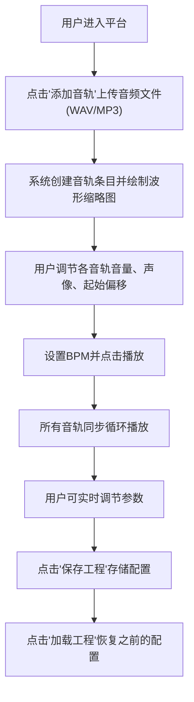

## 1. 产品概述

"节奏工坊"是一个面向独立音乐制作人和音乐爱好者的在线多轨循环音乐创作平台，提供简化版的数字音频工作站(DAW)功能，让用户能够轻松创作、混音并分享简短的多轨循环音乐片段。

- 目标用户：独立音乐制作人、音乐爱好者、学生
- 核心价值：降低音乐创作门槛，提供即时反馈的多轨混音体验

## 2. 核心功能

### 2.1 功能模块

1. **主界面**：音轨列表、混音面板、传输控制条
2. **音轨管理**：添加音轨、删除音轨、波形预览
3. **混音控制**：音量调节、声像调节、VU表动画
4. **播放控制**：播放、暂停、停止、BPM调节
5. **工程管理**：保存工程、加载工程

### 2.2 页面详情

| 页面名称 | 模块名称 | 功能描述 |
|-----------|-------------|---------------------|
| 主工作台 | 音轨列表区域 | 显示所有音轨、波形缩略图、偏移滑块、删除按钮，可折叠(280px) |
| 主工作台 | 混音面板 | 每条音轨独立的音量滑块(0-100)、声像旋钮(L100-R100)、VU表动画 |
| 主工作台 | 传输控制条 | 播放/暂停/停止按钮、BPM滑块(60-180)、保存/加载按钮，固定高度70px |

## 3. 核心流程

## 4. 用户界面设计

### 4.1 设计风格

- **主色调**：深色主题，背景 `#1A1A2E`，卡片 `#16213E`，控件 `#0F3460`，高亮 `#E94560`
- **按钮风格**：圆角矩形，hover时显示 `#E94560` 边框/阴影微光效果
- **字体**：现代无衬线字体，清晰的层级结构
- **布局**：三栏布局 - 左侧音轨列表、中间混音面板、底部传输控制条
- **动效**：滑块过渡动画 `transition: all 0.1s ease`，VU表动态响应

### 4.2 页面设计概览

| 页面名称 | 模块名称 | UI元素 |
|-----------|-------------|-------------|
| 主工作台 | 音轨列表 | 深色卡片(#16213E)、Canvas波形、水平偏移滑块、删除按钮、选中高亮(#E94560) |
| 主工作台 | 混音面板 | 垂直音量滑块、圆形声像旋钮、微型VU表动画、参数数值实时显示 |
| 主工作台 | 传输控制 | 播放/暂停/停止图标按钮、BPM水平滑块、保存/加载按钮、固定底部 |

### 4.3 响应式设计

- 桌面端优先(Desktop-first)
- 视口宽度 < 768px 时：音轨列表折叠为汉堡菜单，混音面板自适应宽度
- 触控设备优化：滑块触控区域放大，按钮最小触控面积 44px

### 4.4 性能指标

- 音频播放延迟 ≤ 50ms
- 波形缩略图绘制 ≤ 100ms
- UI操作响应时间 ≤ 16ms (60fps)
