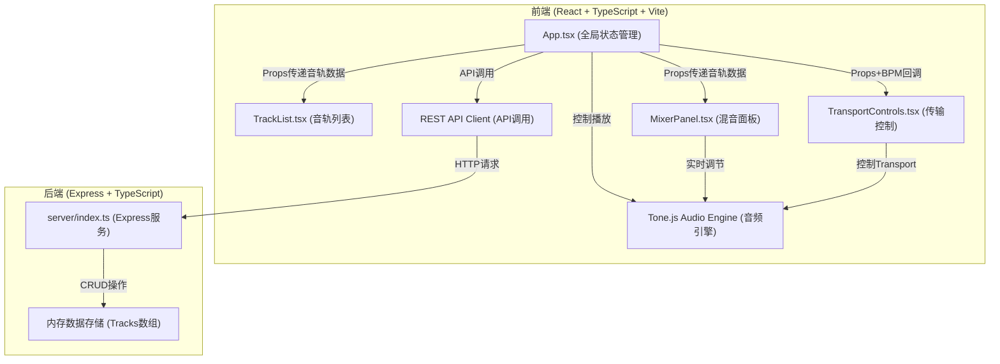
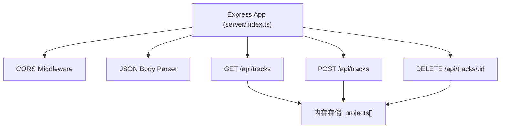
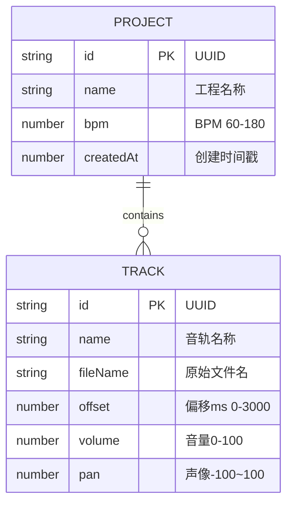

## 1. 架构设计



## 2. 技术说明

- **前端**: React 18 + TypeScript + Vite 5
- **音频引擎**: Tone.js (Web Audio API封装)
- **状态管理**: React useState/useEffect (局部状态，无需全局状态库)
- **后端**: Express 4 + TypeScript
- **数据存储**: 内存数组存储 (服务端运行时)
- **构建工具**: Vite 5 (@vitejs/plugin-react)
- **开发端口**: 前端 5173，后端 3001
- **API代理**: Vite 代理 `/api` 到后端服务

## 3. 路由定义

| 路由 | 用途 |
|-------|---------|
| / | 主工作台页面 (单页应用) |
| GET /api/tracks | 获取所有音轨/工程配置列表 |
| POST /api/tracks | 保存新的音轨/工程配置 |
| DELETE /api/tracks/:id | 删除指定的音轨/工程配置 |

## 4. API定义

```typescript
// 音轨数据类型
interface Track {
  id: string;           // UUID
  name: string;         // 文件名
  fileName: string;     // 原始文件名
  offset: number;       // 起始偏移 (ms, 0-3000)
  volume: number;       // 音量 (0-100, 默认75)
  pan: number;          // 声像 (-100到100, 0=Center)
  bpm: number;          // 全局BPM (60-180, 默认120)
  waveformData: number[]; // 波形采样数据 (前1000个采样点)
  audioBuffer?: AudioBuffer; // 解码后的音频缓冲 (前端内存)
}

// 工程配置类型
interface ProjectConfig {
  id: string;
  name: string;
  bpm: number;
  tracks: Track[];
  createdAt: number;
}

// GET /api/tracks 响应
type GetTracksResponse = ProjectConfig[];

// POST /api/tracks 请求体
interface SaveProjectRequest {
  name: string;
  bpm: number;
  tracks: Track[];
}

// POST /api/tracks 响应
type SaveProjectResponse = ProjectConfig;

// DELETE /api/tracks/:id 响应
interface DeleteResponse {
  success: boolean;
  deletedId: string;
}
```

## 5. 服务端架构图



## 6. 数据模型

### 6.1 数据模型定义



### 6.2 文件结构说明

```
.
├── package.json
├── tsconfig.json
├── vite.config.ts
├── index.html
├── server/
│   └── index.ts              # Express后端服务
└── src/
    ├── main.tsx              # React入口
    ├── App.tsx               # 主布局 + 全局状态
    ├── types/
    │   └── index.ts          # 共享类型定义
    ├── hooks/
    │   └── useAudioEngine.ts # Tone.js音频引擎Hook
    ├── utils/
    │   └── waveform.ts       # 波形绘制工具
    └── components/
        ├── TrackList.tsx     # 音轨列表组件
        ├── MixerPanel.tsx    # 混音面板组件
        └── TransportControls.tsx # 传输控制组件
```

**数据流向说明：**
1. 用户在 `TransportControls` 点击播放 → 回调通知 `App.tsx`
2. `App.tsx` 调用 `useAudioEngine` Hook 的 `play()` 方法
3. `useAudioEngine` 通过 Tone.js 控制所有音轨的 `Player` 节点同步播放
4. 用户在 `MixerPanel` 拖动滑块 → 实时更新 `useAudioEngine` 中对应音轨的 `Gain` 和 `Pan`
5. 用户在 `TrackList` 上传文件 → `App.tsx` 解码音频并添加到 tracks 数组
6. 保存工程 → `App.tsx` 通过 API Client POST 到后端
7. 加载工程 → `App.tsx` GET 获取列表，用户选择后恢复 tracks 状态
