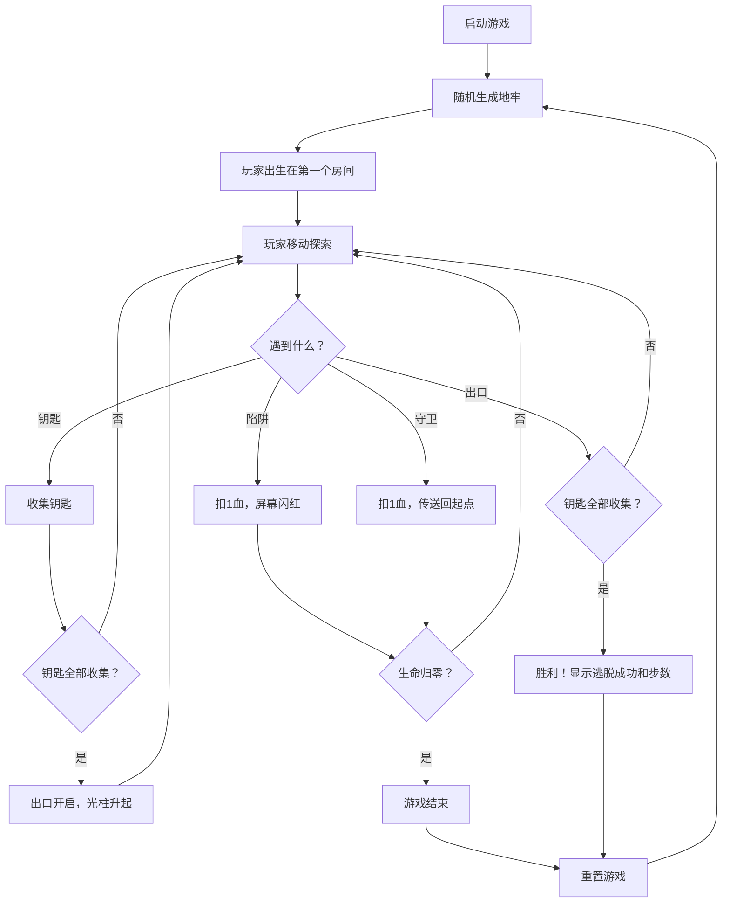

## 1. 产品概述
像素风地牢迷宫生成器与解谜游戏，玩家在随机生成的地牢中收集钥匙、躲避陷阱、击败守卫，最终找到出口逃脱。
- 面向所有喜欢像素风格、解谜探索类游戏的玩家
- 提供可重玩性高的随机地牢体验

## 2. 核心功能

### 2.1 功能模块
1. **随机地牢生成**：采用深度优先递归分割算法生成25x25的地牢地图，包含房间、走廊、陷阱、钥匙、守卫、出口
2. **玩家系统**：8x8像素绿色小人，上下左右移动，钥匙收集，生命值管理，步数统计
3. **守卫AI系统**：红色像素守卫，沿路径巡逻，3格视野内追击玩家
4. **陷阱系统**：红色三角闪烁陷阱，踩中扣血
5. **渲染系统**：像素风格绘制，各类动画效果（出口光效、陷阱闪烁、守卫足迹等）
6. **HUD信息栏**：底部显示生命值、钥匙数、步数
7. **游戏状态管理**：胜利/失败判定，重置功能

### 2.2 功能详情
| 模块名称 | 功能描述 |
|---------|---------|
| 地牢生成 | 25x25格子，至少5个房间，走廊连接，确保路径可达 |
| 玩家移动 | WASD/方向键控制，每次一格，0.15秒间隔，不能穿墙 |
| 钥匙收集 | 3把黄色钥匙，收集后HUD显示，全部收集后出口开启 |
| 陷阱机制 | 4个红色陷阱，踩中扣1血，屏幕闪红 |
| 守卫系统 | 2个守卫巡逻，3格视野追击，碰撞扣血传送回起点 |
| 出口系统 | 金色闪烁光效，收集所有钥匙后升起光柱 |
| 胜利/失败 | 到达出口显示胜利画面，生命归零显示游戏结束 |

## 3. 核心流程
玩家启动游戏 → 随机生成地牢 → 玩家探索地牢 → 收集钥匙 → 躲避陷阱和守卫 → 出口开启 → 到达出口胜利 / 生命归零失败 → 重置游戏

## 4. 用户界面设计
### 4.1 设计风格
- 像素复古风格，老旧显示器质感
- 主色调：深灰#2C2C2C（墙壁）、浅灰#4A4A4A（地板）、黑色#000000（背景）
- 强调色：金色#FFD700/#FFA500（出口）、绿色（玩家）、红色（陷阱/守卫）、黄色（钥匙）
- 1px边框模拟显示器边框

### 4.2 页面设计
| 区域 | 模块 | UI元素 |
|------|------|--------|
| 主区域 | 地牢地图 | 25x25格子，每格24px，边框1px #3A3A3A |
| 底部 | HUD栏 | 高60px，背景#1A1A2E，红心生命图标、黄色钥匙图标、步数文字 |
| 全屏 | 胜利画面 | #FFD700色"逃脱成功！"文字，步数显示，重置按钮 |
| 全屏 | 失败画面 | 游戏结束文字，重置按钮 |

### 4.3 动画效果
- 出口闪烁：#FFD700和#FFA500交替，周期0.5秒
- 陷阱闪烁：红色三角闪烁效果
- 出口开启：光柱从底部升起动画，0.5秒
- 踩陷阱：屏幕红色遮罩闪烁0.1秒，不透明度0.5
- 守卫追击：红色足迹小点向外扩散，0.3秒消失
- 玩家移动：格子间平滑移动

### 4.4 响应式
固定800x600px游戏窗口，居中显示，不支持响应式缩放
