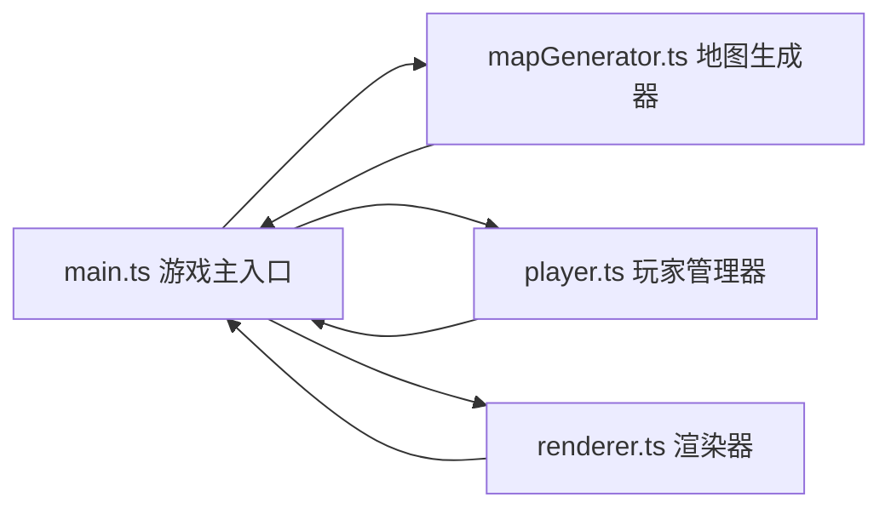

## 1. 架构设计



## 2. 技术描述
- 前端：TypeScript + 原生HTML/CSS + Canvas 2D API
- 构建工具：Vite
- 初始化方式：手动创建项目结构
- 无后端，纯前端游戏

## 3. 文件结构
| 文件路径 | 用途 |
|---------|------|
| package.json | 项目依赖与脚本配置 |
| index.html | 入口页面，Canvas与HUD容器 |
| vite.config.js | Vite构建配置，端口8080 |
| tsconfig.json | TypeScript配置，严格模式 |
| src/main.ts | 游戏主入口，初始化、游戏循环、事件绑定 |
| src/mapGenerator.ts | 地牢地图生成，深度优先递归分割算法 |
| src/player.ts | 玩家状态管理，移动、碰撞、生命值 |
| src/renderer.ts | Canvas渲染，像素风格绘制、动画效果 |

## 4. 数据模型

### 4.1 瓦片类型定义
```typescript
enum TileType {
  WALL = 0,      // 墙壁 #2C2C2C
  FLOOR = 1,     // 地板 #4A4A4A
  TRAP = 2,      // 陷阱
  KEY = 3,       // 钥匙
  EXIT = 4,      // 出口
}
```

### 4.2 房间定义
```typescript
interface Room {
  x: number;        // 左上角x坐标
  y: number;        // 左上角y坐标
  width: number;    // 房间宽度
  height: number;   // 房间高度
  centerX: number;  // 中心点x
  centerY: number;  // 中心点y
}
```

### 4.3 守卫定义
```typescript
interface Guard {
  x: number;              // 当前x格坐标
  y: number;              // 当前y格坐标
  patrolPath: {x: number, y: number}[];  // 巡逻路径点
  pathIndex: number;      // 当前巡逻路径索引
  isChasing: boolean;     // 是否追击状态
  renderX: number;        // 渲染x像素坐标
  renderY: number;        // 渲染y像素坐标
}
```

### 4.4 玩家定义
```typescript
interface PlayerState {
  x: number;          // 当前x格坐标
  y: number;          // 当前y格坐标
  renderX: number;    // 渲染x像素坐标（用于平滑移动）
  renderY: number;    // 渲染y像素坐标
  health: number;     // 生命值，初始3
  keys: number;       // 已收集钥匙数
  steps: number;      // 步数
  lastMoveTime: number; // 上次移动时间戳
  startX: number;     // 出生点x
  startY: number;     // 出生点y
}
```

### 4.5 游戏状态
```typescript
interface GameState {
  map: TileType[][];        // 地图二维数组
  rooms: Room[];            // 房间列表
  traps: {x: number, y: number}[];  // 陷阱位置
  keyPositions: {x: number, y: number}[];  // 钥匙位置（未收集）
  guards: Guard[];          // 守卫列表
  exitOpen: boolean;        // 出口是否开启
  exitAnimationProgress: number;  // 出口光柱动画进度 0-1
  gameStatus: 'playing' | 'won' | 'lost';  // 游戏状态
  damageFlashTime: number;  // 受伤闪烁剩余时间
}
```

## 5. 核心算法

### 5.1 地牢生成算法（深度优先递归分割）
1. 初始化25x25全墙地图
2. 递归分割区域，生成至少5个房间
3. 每个房间内部设为地板
4. 用走廊连接相邻房间中心点
5. 在房间内随机放置陷阱、钥匙、守卫、出口

### 5.2 碰撞检测
- 玩家移动前检查目标格是否为墙壁
- 守卫碰撞检测（与玩家距离）
- 陷阱触发检测（玩家坐标匹配）

### 5.3 守卫AI
- 巡逻模式：沿patrolPath点依次移动
- 追击模式：检测玩家距离≤3格，直线追击
- 每0.3秒移动一格

### 5.4 渲染优化
- 使用requestAnimationFrame，目标60FPS
- 所有绘制操作在离屏Canvas完成后一次性drawImage
- 动画状态基于时间戳计算，避免帧率影响
