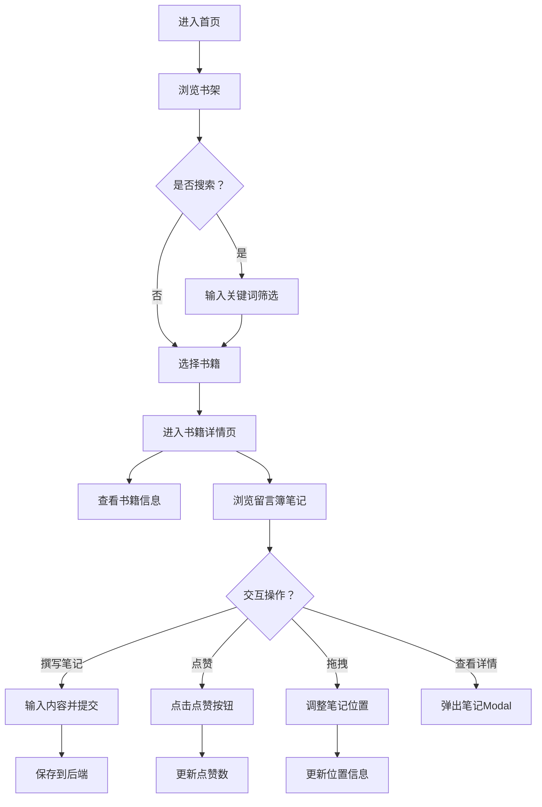

## 1. 产品概述

"书事"是一个面向小型书店的在线阅读社群平台，让读者能像在真实书店留言簿一样，在特定书籍的虚拟页面上留下手写风格的笔记与感想，形成独特的阅读社群氛围。

- 核心目标：为读者提供沉浸式的书籍笔记分享体验，模拟真实书店留言簿的温暖感
- 目标用户：热爱阅读、喜欢分享阅读感想的读者群体
- 市场价值：通过社群化的阅读笔记分享，增强读者粘性，打造独特的书店文化品牌

## 2. 核心功能

### 2.1 功能模块

1. **首页书架**：书籍列表展示、实时搜索过滤、响应式书架布局
2. **书籍详情页**：书籍信息展示、留言簿画布、笔记撰写与交互

### 2.2 页面详情

| 页面名称 | 模块名称 | 功能描述 |
|---------|---------|---------|
| 首页书架 | 搜索框 | 支持按书名或作者名实时过滤书籍 |
| 首页书架 | 书籍卡片 | 书脊样式展示，悬停前倾放大，点击跳转详情 |
| 首页书架 | 书架布局 | CSS Grid响应式布局，模拟真实木纹背景 |
| 书籍详情页 | 书籍信息区 | 展示封面、标题、作者、简介等元数据 |
| 书籍详情页 | 留言簿画布 | 可滚动区域，展示手写风格笔记卡片 |
| 书籍详情页 | 笔记撰写 | 文本输入框（200字限制），提交后生成便签样式卡片 |
| 书籍详情页 | 笔记交互 | 拖拽调整位置、点赞、查看详情弹窗 |
| 书籍详情页 | 笔记详情Modal | 放大展示完整内容、点赞数、发布时间 |

## 3. 核心流程

用户进入首页，浏览书架上的书籍卡片，通过搜索框筛选感兴趣的书籍，点击书籍卡片进入详情页。在详情页查看书籍信息和其他读者的笔记，可以撰写并提交自己的笔记，对喜欢的笔记点赞，拖拽调整笔记位置，点击查看笔记完整内容。

## 4. 用户界面设计

### 4.1 设计风格

- **主色调**：#F5E6D3（暖米色）作为背景主色
- **辅助色**：#8B4513（栗色）和#A0522D（赭色）用于重点突出
- **笔记卡片**：#FDF5E6（微黄纸张色），随机2-5度旋转偏移
- **字体方案**：
  - 标题：Georgia，28px
  - 正文：14px，行高1.8
  - 手写笔记：Caveat或Dancing Script，24px，深蓝色
  - 加载字体：Roboto Mono
- **按钮样式**：圆角4px，0.2-0.3秒平滑过渡，点赞按钮弹跳动画
- **布局风格**：卡片式布局，柔和投影，木纹纹理背景
- **动效设计**：悬停前倾放大1.05倍、点赞弹跳1.2倍、过渡动画0.2s

### 4.2 页面设计概览

| 页面名称 | 模块名称 | UI元素 |
|---------|---------|---------|
| 首页书架 | 搜索框 | 圆角输入框，木纹背景上方居中 |
| 首页书架 | 书籍卡片 | 1:3长宽比书脊，最小80px宽，悬停前倾放大 |
| 首页书架 | 书架背景 | CSS渐变木纹纹理 |
| 书籍详情页 | 封面区 | 220x330px，内阴影，圆角4px，柔和投影 |
| 书籍详情页 | 信息区 | 左封面向右标题作者简介 |
| 书籍详情页 | 留言簿区域 | #E0D8C8线条边框，可滚动 |
| 书籍详情页 | 笔记卡片 | 微黄纸张，随机旋转，手写字体 |
| 书籍详情页 | 输入框 | 底部文本框，"留下笔记"按钮 |

### 4.3 响应式

- **桌面优先**：最小宽度1024px
- **断点适配**：768px（平板）和480px（手机）
- **书架响应式**：CSS Grid自动调整列数
- **详情页布局**：移动端改为上下布局

## 5. 性能约束

- 首页书架渲染时间 < 1秒（50本书以内）
- 笔记列表滚动FPS ≥ 55帧
- 后端API响应时间 < 200ms（除跨域外）
