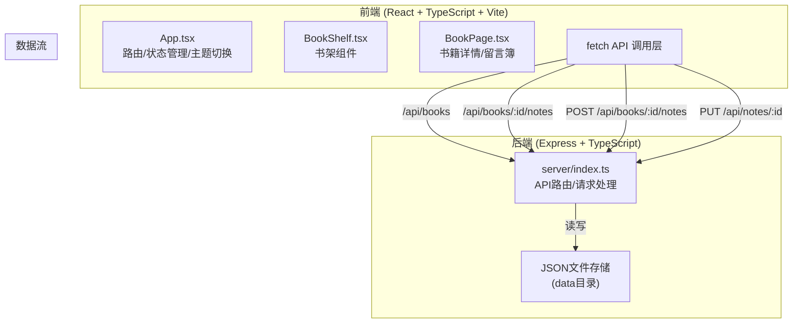
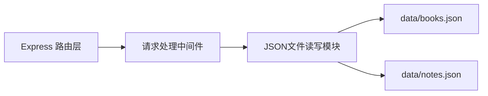

## 1. 架构设计



## 2. 技术描述

- **前端**：React 18 + TypeScript + Vite
- **构建工具**：Vite（前端构建配置，端口3000，代理/api到后端）
- **后端**：Express 4 + TypeScript
- **数据存储**：JSON文件（data目录下）
- **状态管理**：React useState/useEffect（轻量级场景）
- **路由**：前端Hash路由（无需额外依赖，简化实现）
- **工具库**：uuid（生成唯一ID）、date-fns（时间格式化）

## 3. 路由定义

| 路由 | 用途 |
|------|------|
| / | 首页书架，展示所有书籍 |
| /book/:id | 书籍详情页，展示书籍信息和留言簿 |

## 4. API 定义

### 4.1 TypeScript 类型定义

```typescript
interface Book {
  id: string;
  title: string;
  author: string;
  description: string;
  coverUrl: string;
  color: string;
}

interface Note {
  id: string;
  bookId: string;
  content: string;
  likes: number;
  createdAt: number;
  rotation: number;
  offsetX: number;
  offsetY: number;
}
```

### 4.2 API 接口

| 方法 | 路径 | 请求体 | 响应 | 描述 |
|------|------|--------|------|------|
| GET | /api/books | - | Book[] | 获取所有书籍列表 |
| GET | /api/books/:id/notes | - | Note[] | 获取指定书籍的所有笔记 |
| POST | /api/books/:id/notes | { content: string } | Note | 为指定书籍创建新笔记 |
| PUT | /api/notes/:id | { likes?: number; offsetX?: number; offsetY?: number } | Note | 更新笔记（点赞/位置） |

## 5. 服务端架构



- **Controller层**：Express路由处理函数，负责请求解析、参数校验、响应格式化
- **数据层**：直接操作JSON文件，提供CRUD功能
- **数据文件**：
  - `data/books.json` - 书籍列表数据
  - `data/notes.json` - 笔记数据

## 6. 文件结构与调用关系

```
项目根目录
├── package.json              # 项目依赖与脚本
├── vite.config.ts            # Vite前端构建配置
├── tsconfig.json             # TypeScript配置
├── index.html                # 入口HTML
├── server/
│   └── index.ts              # Express后端服务
│                           职责：API路由、JSON数据读写
├── data/                     # 数据存储目录
│   ├── books.json            # 书籍数据
│   └── notes.json            # 笔记数据
└── src/
    └── components/
        ├── App.tsx           # React主组件
        │                     职责：路由管理、全局状态、主题切换
        │                     调用：fetch API → BookShelf/BookPage
        ├── BookShelf.tsx     # 书架组件
        │                     职责：书籍列表展示、搜索过滤、卡片交互
        │                     被调用：App.tsx
        └── BookPage.tsx      # 书籍详情页
                              职责：书籍信息、留言簿、笔记CRUD交互
                              被调用：App.tsx
                              调用：fetch API → 后端
```

### 数据流向

1. **首页加载**：App.tsx → GET /api/books → server/index.ts → data/books.json → 返回Book[] → BookShelf.tsx渲染
2. **详情页加载**：App.tsx → GET /api/books/:id/notes → server/index.ts → data/notes.json → 返回Note[] → BookPage.tsx渲染
3. **创建笔记**：BookPage.tsx → POST /api/books/:id/notes → server/index.ts → 写入data/notes.json → 返回新Note → 本地状态更新
4. **更新笔记**：BookPage.tsx → PUT /api/notes/:id → server/index.ts → 更新data/notes.json → 返回更新Note → 本地状态更新
