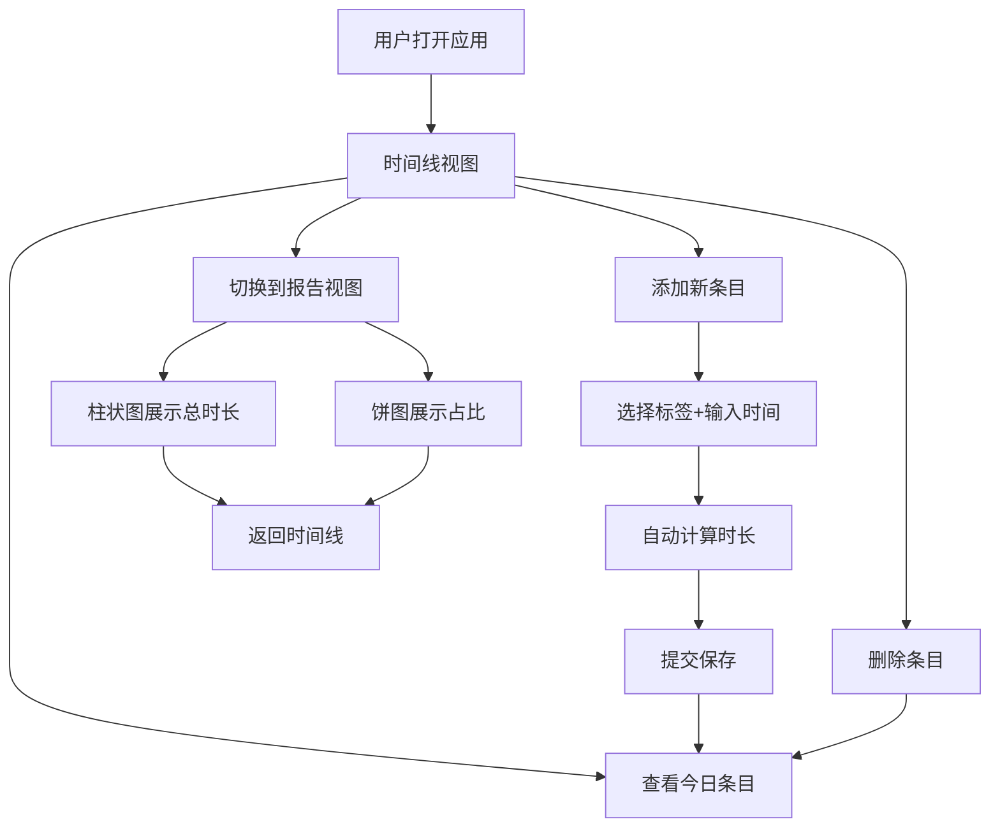

## 1. 产品概述

个人每日时间追踪应用，帮助用户通过标签化方式记录每日时间消耗，并生成可视化时间分布报告进行复盘分析。

- 主要目的：提供简洁高效的时间记录工具，让用户清晰了解自己的时间分配，提升时间管理能力
- 目标用户：需要管理个人时间、进行自我复盘的个人用户
- 产品价值：通过数据可视化帮助用户发现时间浪费点，优化日常时间安排

## 2. 核心功能

### 2.1 功能模块

1. **时间线视图**：添加时间条目、按日期筛选、展示今日时间块、删除条目
2. **报告视图**：柱状图展示各标签累计时长、饼图展示占比分布、统计总记录天数

### 2.2 页面详情

| 页面名称 | 模块名称 | 功能描述 |
|---------|---------|---------|
| 时间线页面 | 添加表单 | 选择标签、输入开始/结束时间，自动计算时长并提交 |
| 时间线页面 | 条目列表 | 按时间倒序展示所有条目，支持删除操作 |
| 时间线页面 | 日期筛选 | 选择查看指定日期的时间记录 |
| 报告页面 | 柱状图 | 展示各标签总时长，带动画效果 |
| 报告页面 | 环形饼图 | 展示各标签时长占比，中心显示总天数 |
| 全局 | 导航栏 | 时间线与报告视图切换，带下划线滑动动画 |

## 3. 核心流程

用户打开应用后默认进入时间线视图，查看今日时间记录。可通过顶部表单添加新的时间条目，选择标签后输入起止时间即可保存。切换到报告视图可查看所有历史数据的可视化分析，包括柱状图和饼图展示。

## 4. 用户界面设计

### 4.1 设计风格

- **主色调**：蓝色 #4A90D9
- **标签颜色**：工作#4A90D9、学习#50C878、健身#FF6B6B、阅读#FFD93D、娱乐#C084FC、家务#FB923C
- **背景色**：浅灰 #F5F7FA，卡片白色 #FFFFFF
- **按钮风格**：圆角按钮，主色调填充，点击缩小反馈
- **字体**：系统默认字体，深灰色 #333
- **布局**：卡片式布局，居中最大宽度900px，圆角阴影
- **图标风格**：使用 emoji 作为标签图标（💼📚💪📚🎮🧹）

### 4.2 页面设计概览

| 页面名称 | 模块名称 | UI 元素 |
|---------|---------|---------|
| 时间线 | 顶部表单 | 下拉选择、时间输入框、主色提交按钮、悬停/点击动画 |
| 时间线 | 条目卡片 | 横向布局、标签emoji、时间范围、时长、删除按钮、悬停背景变浅蓝+上移 |
| 报告 | 柱状图 | 柱体按标签着色、数值标签从底部升起动画 |
| 报告 | 环形饼图 | 扇区旋转入场动画、悬停显示详情、中心显示总天数 |
| 全局 | 导航栏 | 白色背景、链接下划线滑动动画、激活态蓝色 |

### 4.3 响应式设计

- 桌面优先设计，自适应移动端
- 屏幕宽度 < 600px 时：表单元素纵向堆叠，卡片文字缩小至14px，导航链接字号缩小至16px
- 所有卡片、图表均使用百分比宽度自适应容器
