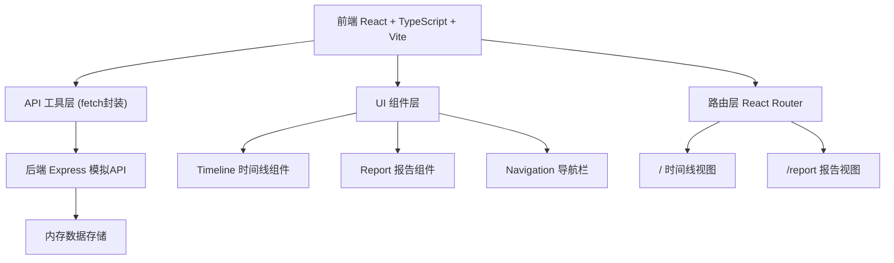
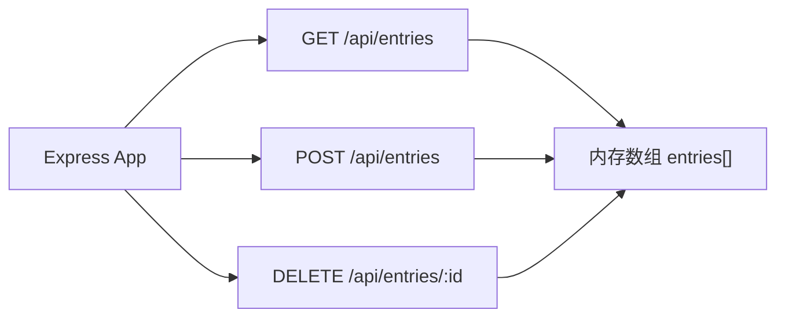
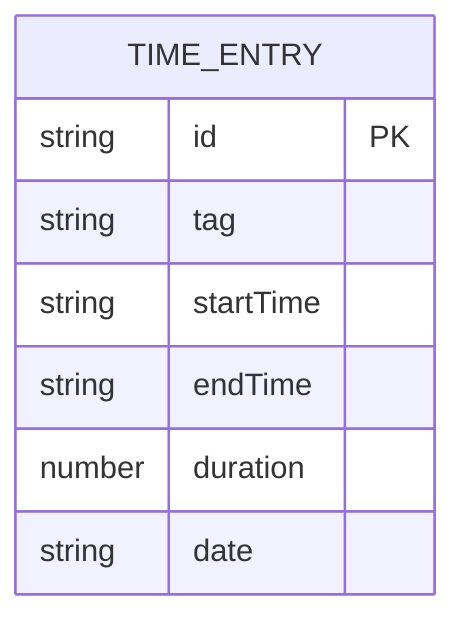

## 1. 架构设计



## 2. 技术说明

- **前端**：React 18 + TypeScript + Vite 5
- **路由**：react-router-dom 6
- **图表**：recharts 2
- **后端**：Express 4（Node.js 模拟 API）
- **唯一ID**：uuid
- **数据存储**：后端内存数组（含至少20条预置数据、5天以上记录）

## 3. 路由定义

| 路由路径 | 用途 |
|---------|------|
| / | 时间线视图，默认首页 |
| /report | 报告视图，展示可视化图表 |

## 4. API 定义

### 类型定义

```typescript
interface TimeEntry {
  id: string;
  tag: 'work' | 'study' | 'fitness' | 'reading' | 'entertainment' | 'housework';
  startTime: string; // ISO 格式
  endTime: string;   // ISO 格式
  duration: number;  // 分钟
  date: string;      // YYYY-MM-DD
}
```

### 接口列表

| 方法 | 路径 | 请求体 | 响应 |
|-----|------|-------|------|
| GET | /api/entries | - | TimeEntry[] 返回所有条目 |
| POST | /api/entries | { tag, startTime, endTime } | TimeEntry 返回新创建条目 |
| DELETE | /api/entries/:id | - | { success: boolean } |

## 5. 服务器架构



## 6. 数据模型

### 6.1 数据定义



### 6.2 预置数据

后端启动时初始化至少20条数据，覆盖至少5个不同日期，包含所有6种标签类型，用于报告视图展示。

## 7. 项目文件结构

```
├── package.json
├── vite.config.js
├── tsconfig.json
├── index.html
├── server.js              # 后端 Express API
└── src/
    ├── App.tsx            # 主应用+路由
    ├── components/
    │   ├── Timeline.tsx   # 时间线组件
    │   └── Report.tsx     # 报告组件
    └── utils/
        └── api.ts         # API 请求封装
```
