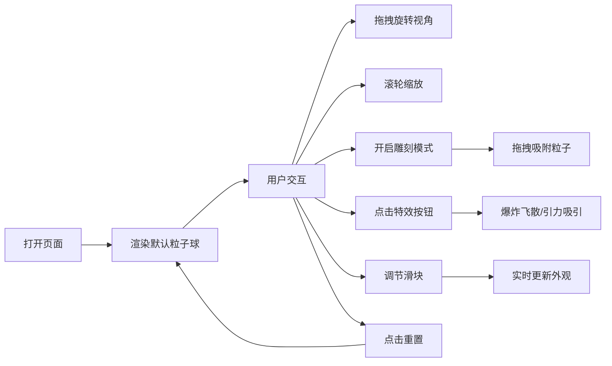

## 1. 产品概述

"星尘雕塑"是一款基于WebGL的交互式3D粒子雕塑工具，让用户通过鼠标/触摸在三维空间中操控成千上万的发光粒子，创造梦幻的粒子艺术造型。

- 面向数字艺术爱好者、创意工作者，提供沉浸式的粒子雕塑体验
- 通过直观的交互方式（拖拽、点击）实现复杂的粒子造型，降低3D创作门槛

## 2. 核心功能

### 2.1 功能模块

1. **3D粒子场景**: 星空渐变背景、5000粒子球形雕塑、距离连线网络
2. **视角控制**: OrbitControls轨道控制、阻尼旋转、滚轮缩放
3. **雕刻模式**: 红色半透明球体光标、粒子吸附塑形
4. **特效系统**: 爆炸飞散、引力吸引、重置还原
5. **参数调节**: 粒子大小滑块、连线距离阈值滑块
6. **状态监控**: 粒子总数显示、实时FPS计数

### 2.2 页面详情

| 页面名称 | 模块名称 | 功能描述 |
|-----------|-------------|---------------------|
| 主场景 | 星空背景 | 三层径向渐变（#0B0B1A → #1A1A2E）全屏Canvas渲染 |
| 主场景 | 粒子球体 | 5000粒子球体，半径3单位，粒子大小0.02-0.08随机，颜色#FF6B6B到#4ECDC4渐变 |
| 主场景 | 连线网络 | 粒子距离<0.5时绘制#FFFFFF10颜色、1px厚度的连线 |
| 主场景 | 雕刻光标 | 红色半透明球体（半径0.5），跟随鼠标移动 |
| 控制面板 | 雕刻模式按钮 | 切换雕刻模式开关 |
| 控制面板 | 爆炸按钮 | 触发粒子向外飞散动画（1.5单位/秒，2秒后回弹） |
| 控制面板 | 引力按钮 | 在光标位置产生引力场（半径2单位，加速至2单位/秒） |
| 控制面板 | 重置按钮 | 粒子恢复初始球体形态 |
| 控制面板 | 粒子大小滑块 | 范围0.01-0.15，步长0.005，默认0.05，实时更新 |
| 控制面板 | 连线阈值滑块 | 范围0-2单位，步长0.1，默认0.5，实时更新 |
| 控制面板 | 状态信息 | 显示粒子总数与FPS，颜色#8A8A8A，字号12px |

## 3. 核心流程

用户打开页面 → 看到默认悬浮的粒子球雕塑 → 鼠标拖拽旋转视角 / 滚轮缩放 → 开启雕刻模式 → 按住左键拖拽吸附粒子塑形 → 点击爆炸/引力按钮触发特效 → 调节滑块实时改变外观 → 点击重置恢复初始状态。

## 4. 用户界面设计

### 4.1 设计风格

- **主色调**: 深邃宇宙色系，背景渐变#0B0B1A → #1A1A2E
- **粒子配色**: #FF6B6B（珊瑚红）到#4ECDC4（青绿）渐变
- **控制面板**: #1E1E2E底色，透明度0.85，圆角8px，毛玻璃效果backdrop-filter: blur(8px)
- **文字**: 状态信息#8A8A8A，12px
- **按钮**: 所有交互带有0.2-0.4s ease-out平滑过渡
- **光标**: 雕刻模式下红色半透明球体（#FF000050）

### 4.2 页面布局

| 区域 | 位置 | UI元素 |
|-----------|-------------|-------------|
| 主场景 | 全屏Canvas | 星空背景、粒子球体、连线网络、雕刻光标 |
| 控制面板 | 右侧固定，宽度240px | 四个功能按钮（雕刻模式、爆炸、引力、重置）、两个滑块、状态信息 |

### 4.3 响应式与触摸

- 桌面端：鼠标拖拽旋转视角，左键按住雕刻
- 移动端：单指拖拽旋转，触摸按住雕刻，双指缩放
- 触摸操作与鼠标操作行为等效

### 4.4 3D场景指导

- **环境**: 深邃星空径向渐变背景，营造宇宙梦幻氛围
- **光照**: 粒子自发光效果，无需额外光源
- **相机**: PerspectiveCamera，OrbitControls控制，阻尼0.1，缩放范围0.5-10
- **构图**: 粒子球居中悬浮，控制面板右侧悬浮不遮挡主场景
- **动画**: 爆炸用指数衰减，引力用缓入加速，回弹出ease-out
- **性能**: 60FPS目标，10000粒子时不低于30FPS，使用BufferGeometry优化
