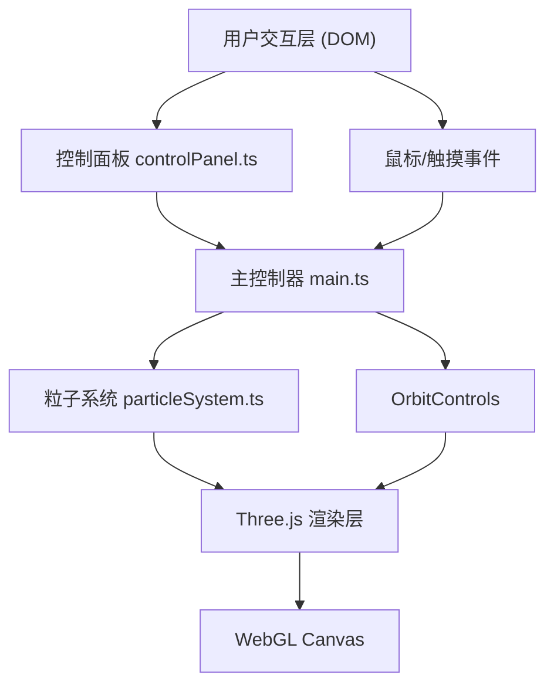

## 1. 架构设计



## 2. 技术说明

- **前端框架**: Three.js r160 + TypeScript 5.x + Vite 5.x
- **构建工具**: Vite（原生ESM，HMR热更新）
- **后端**: 无（纯前端项目）
- **数据库**: 无
- **核心依赖**:
  - `three`: WebGL 3D渲染引擎
  - `@types/three`: Three.js TypeScript类型定义
  - `typescript`: 类型系统
  - `vite`: 构建与开发服务器

## 3. 文件结构

| 文件路径 | 职责 |
|-------|---------|
| `/package.json` | 项目依赖与脚本配置 |
| `/index.html` | 入口HTML，全屏Canvas容器 |
| `/vite.config.js` | Vite构建配置，开发端口8080 |
| `/tsconfig.json` | TypeScript严格模式配置 |
| `/src/main.ts` | 初始化场景/相机/渲染器/控制器，启动渲染循环，整合所有模块 |
| `/src/particleSystem.ts` | 粒子系统核心：几何体创建、位置更新、爆炸、引力、吸附、连线渲染 |
| `/src/controlPanel.ts` | 右侧控制面板DOM创建、按钮/滑块事件绑定、状态分发、FPS/粒子数显示 |

## 4. 数据模型

### 4.1 粒子数据结构

```typescript
interface ParticleData {
  originalPositions: Float32Array;   // 初始位置（用于重置/回弹）
  currentPositions: Float32Array;    // 当前位置
  velocities: Float32Array;          // 运动速度
  colors: Float32Array;              // 顶点颜色
  sizes: Float32Array;               // 粒子大小
  baseSize: number;                  // 基础大小（受滑块控制）
}

interface AnimationState {
  isExploding: boolean;
  explodeTime: number;               // 爆炸已持续时间
  explodeDuration: number;           // 爆炸总时长
  isReturning: boolean;              // 是否回弹中
  returnTime: number;
  returnDuration: number;
  isGravity: boolean;
  gravityTime: number;
  gravityDuration: number;
  gravityCenter: THREE.Vector3;
}
```

### 4.2 控制面板配置

```typescript
interface ControlConfig {
  isSculptMode: boolean;
  particleSize: number;              // 0.01 - 0.15
  linkDistance: number;              // 0 - 2
  sculptRadius: number;              // 0.5
  sculptStrength: number;            // 0.8
}
```

## 5. 性能优化策略

1. **BufferGeometry**: 使用Float32Array存储所有粒子属性，避免每帧GC
2. **Points + LineSegments**: 粒子用THREE.Points渲染，连线用LineSegments动态更新
3. **距离连线优化**: 仅对每帧可见的附近粒子计算距离，使用空间网格或限制最大连线数
4. **deltaTime**: 所有动画基于时间增量计算，保证帧率独立
5. **自适应连线**: 粒子数超阈值时自动降低连线采样率
6. **requestAnimationFrame**: 标准渲染循环，仅在页面可见时渲染
