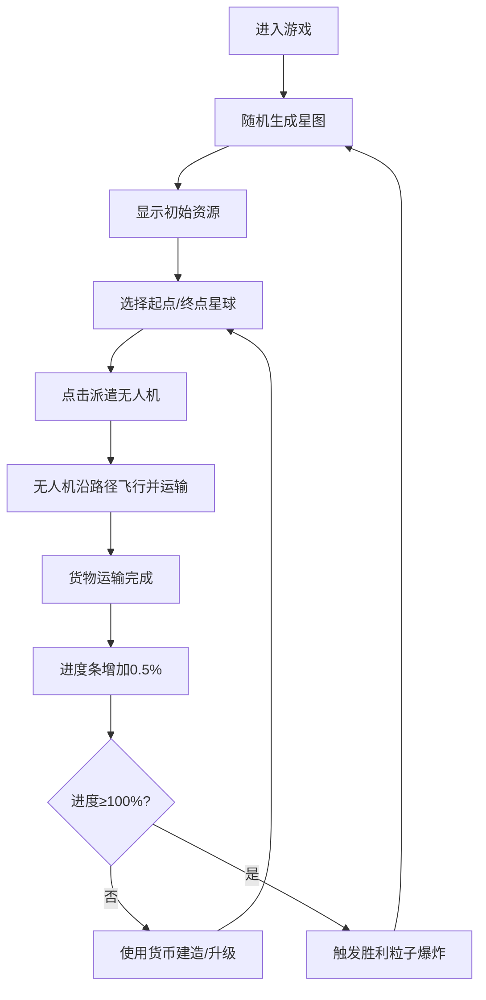

## 1. 产品概述

像素风星际物流塔管理游戏，玩家在随机生成的星球网络中通过建造传送矩阵、分配无人机运输货物，优化物流效率以点亮星图。目标用户为休闲策略游戏爱好者，核心价值在于提供轻量级的资源管理与路径优化策略体验。

## 2. 核心功能

### 2.1 功能模块
1. **星图系统**：随机星球网络生成、航线连通、最短路径计算
2. **无人机物流**：无人机集群管理、自动寻路、货物装载/卸载
3. **资源与建造**：货币增长、星门建造、无人机速度升级、无人机数量扩充
4. **UI交互**：控制面板、起点/终点选择、派遣操作、底部资源栏实时显示
5. **胜利与重置**：星图点亮进度、粒子爆炸胜利效果、星图重新生成

### 2.2 页面详情
| 页面名称 | 模块名称 | 功能描述 |
|---------|---------|---------|
| 游戏主界面 | Canvas星图区 | 渲染星球、航线、无人机、星门、粒子效果、轨迹动画 |
| 游戏主界面 | 左侧控制面板 | 星球选择（起点/终点）、派遣按钮、建造星门、升级速度、增加无人机 |
| 游戏主界面 | 底部资源栏 | 无人机数量、累计货物数、星图进度条、货币显示、货币飘出动画 |

## 3. 核心流程

玩家进入游戏后，系统自动生成随机星球网络和初始资源。玩家在左侧面板选择起点和终点星球，点击派遣按钮后无人机从星门出发，沿最短路径飞往起点装货，再飞往终点卸货，完成后进度条增加。玩家通过货币建造新星门缩短路径、升级无人机速度、增加无人机数量以提升物流效率。当星图进度达到100%时触发胜利粒子爆炸，随后重新生成新星图。

## 4. 用户界面设计

### 4.1 设计风格
- **主色调**：深空紫黑渐变背景（#0E0B1A → #1A1528），赛博朋克暗色主题
- **点缀色**：科技蓝#4FC3F7、黄金#FFD54F、橙铜#FF8A65、霓虹绿#00E676、金色#FFD700
- **按钮风格**：圆角矩形，hover时背景从#2A2A3E渐变至#3A3A5E，点击时scale(0.95)缩放0.1s
- **字体**：使用等宽像素风格字体，大小12-16px
- **布局风格**：全屏Canvas居中，左侧280px半透明控制面板，底部60px资源栏
- **视觉效果**：毛玻璃backdrop-filter、星球光晕、无人机阴影、轨迹亮线

### 4.2 页面设计概述
| 页面名称 | 模块名称 | UI元素 |
|---------|---------|--------|
| 主界面 | Canvas星图 | 深空渐变背景、圆形星球带光晕、航线线段、三角形无人机、八角星门、脉动光圈、粒子系统 |
| 主界面 | 左侧控制面板 | 半透明毛玻璃面板、星球下拉选择器、派遣按钮、建造/升级按钮（资源不足时灰色） |
| 主界面 | 底部资源栏 | 深色横条、图标+数值标签、进度百分比条、绿色货币飘出动画 |
| 主界面 | 悬停提示 | #0D0D1A背景圆角12px提示框，显示星球名称和货物积压量，0.2s淡入 |

### 4.3 响应性
桌面端优先设计，Canvas自适应窗口（16:9比例），控制面板与资源栏固定尺寸，不支持移动端触控。

## 5. 性能要求
- Canvas渲染帧率稳定60fps
- 所有动画（粒子爆炸、星门飞入、货币飘出）流畅无卡顿
- 鼠标/按钮响应时间≤50ms
- 无人机寻路计算≤100ms
