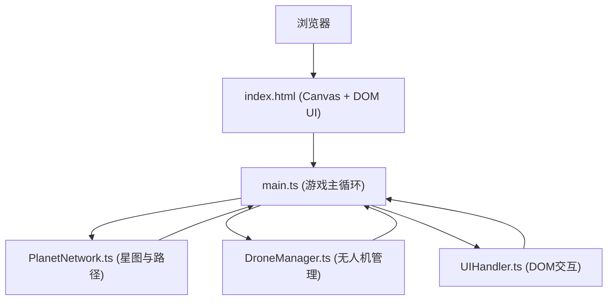

## 1. 架构设计



## 2. 技术描述
- **前端框架**：TypeScript + 原生HTML/CSS（无框架）
- **构建工具**：Vite
- **渲染方式**：HTML5 Canvas 2D API（游戏场景）+ DOM/CSS（控制面板与资源栏）
- **动画系统**：requestAnimationFrame驱动60fps帧循环
- **状态管理**：各子模块内部状态，主循环统一调度更新

## 3. 文件结构
```
├── package.json          # 依赖与脚本
├── index.html            # 入口页面
├── vite.config.js        # Vite构建配置
├── tsconfig.json         # TypeScript配置
└── src/
    ├── main.ts           # 游戏主循环、初始化、帧调度、Canvas渲染
    ├── PlanetNetwork.ts  # 星图生成、航线连通、Dijkstra最短路径
    ├── DroneManager.ts   # 无人机实体、寻路跟随、货物状态
    └── UIHandler.ts      # 控制面板事件、DOM更新、悬停提示
```

## 4. 核心数据模型

### 4.1 星球 (Planet)
```typescript
interface Planet {
  id: string;
  name: string;
  x: number;
  y: number;
  radius: number;
  color: string;
  cargoBacklog: number;
  maxBacklog: number;
  isCentral: boolean;
}
```

### 4.2 航线 (Route)
```typescript
interface Route {
  from: string;
  to: string;
  hasGate: boolean;
}
```

### 4.3 无人机 (Drone)
```typescript
interface Drone {
  id: string;
  x: number;
  y: number;
  speed: number;
  path: string[];
  currentPathIndex: number;
  hasCargo: boolean;
  cargoColor: string;
  state: 'idle' | 'moving' | 'loading' | 'unloading';
  trail: { x: number; y: number; alpha: number }[];
}
```

### 4.4 星门 (Stargate)
```typescript
interface Stargate {
  planetId: string;
  routeIndex?: number;
  x: number;
  y: number;
  animProgress: number;
  isCentral: boolean;
}
```

### 4.5 粒子 (Particle)
```typescript
interface Particle {
  x: number;
  y: number;
  vx: number;
  vy: number;
  color: string;
  life: number;
  maxLife: number;
  size: number;
}
```

## 5. 核心算法

### 5.1 星图生成
1. 在画布范围内随机生成5-8个不重叠的星球坐标
2. 选择最靠近中心的星球作为中央星门位置
3. 使用Delaunay三角剖分或最近邻连接生成初始航线图
4. 确保图连通性，必要时补充跨边

### 5.2 最短路径计算
- Dijkstra算法：以星球为节点、航线为边（权重=欧氏距离，星门航线权重减半）
- 无人机从最近星门出发，计算到起点→终点的完整路径

### 5.3 路径跟随
- 每帧根据无人机当前位置与下一路径节点的向量差计算位移
- 携带货物时速度减半
- 到达节点时切换到下一个，到达终点触发卸货逻辑

## 6. 性能优化策略
- Canvas脏矩形渲染：仅重绘变化区域
- 对象池复用粒子与无人机轨迹点
- 路径计算结果缓存，星图变化时失效
- requestAnimationFrame配合时间增量确保帧率稳定
