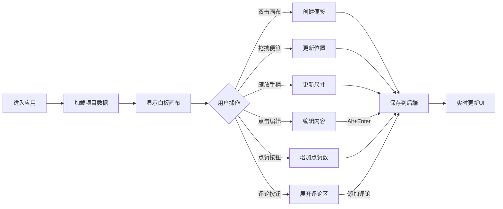

# 灵感碰撞板 - 产品需求文档 (PRD)

## 1. 产品概述

"灵感碰撞板"是一款面向独立游戏工作室的在线团队协作白板工具，让成员可以像在实体白板上一样，通过便签纸自由表达创意，并立即对他人想法进行投票或评论，快速迭代出游戏原型设计方案。

- **核心价值**：降低团队创意协作门槛，将物理白板体验数字化，支持实时互动和快速迭代
- **目标用户**：独立游戏工作室、创意团队、产品设计小组

## 2. 核心功能

### 2.1 用户角色
| 角色 | 注册方式 | 核心权限 |
|------|----------|----------|
| 团队成员 | 无需注册，直接使用 | 创建/编辑便签、点赞、评论、管理项目 |

### 2.2 功能模块
1. **无限画布白板**：支持便签自由放置、拖拽、缩放
2. **便签系统**：内容编辑、创建时间显示、点赞、评论
3. **项目管理**：创建新项目、切换项目
4. **侧边栏面板**：便签缩略列表、创建按钮、排序筛选

### 2.3 页面详情
| 页面名称 | 模块名称 | 功能描述 |
|----------|----------|----------|
| 主页面 | 无限画布 | 双击创建便签、拖拽移动、缩放操作 |
| 主页面 | 便签组件 | 内容编辑（Alt+Enter保存）、点赞按钮、评论展开 |
| 主页面 | 侧边栏 | 便签列表、创建项目按钮、按点赞排序开关、可折叠 |

## 3. 核心流程

用户进入应用 → 查看默认项目白板 → 双击画布创建便签 → 编辑便签内容 → 拖拽调整位置/大小 → 点赞或评论其他便签 → 通过侧边栏查看和管理便签

## 4. 用户界面设计

### 4.1 设计风格
- **主色调**：暗色主题背景 `#0D1117`，蓝灰主色 `#58A6FF`，琥珀强调色 `#FFB74D`
- **便签样式**：黄色背景 `#FFEB3B`，深灰文字 `#333`，圆角8px，阴影 `#00000020`
- **侧边栏**：宽度320px，半透明深色背景 `#1E1E2E`，圆角12px
- **交互过渡**：所有元素 `transition: all 0.2s cubic-bezier`
- **字体**：使用现代无衬线字体，保持深色主题下的可读性

### 4.2 页面设计概览
| 页面名称 | 模块名称 | UI元素 |
|----------|----------|--------|
| 主页面 | 画布背景 | 棋盘格图案（16x16px方格，`#1E1E2E`和`#2A2A3A`），放大时显示10x10虚线网格 |
| 主页面 | 便签组件 | 可拖拽区域、缩放手柄、编辑textarea、点赞按钮（蓝色`#1976D2`激活）、评论按钮 |
| 主页面 | 侧边栏 | 折叠按钮、项目列表、便签缩略图、排序开关、"+"创建按钮 |

### 4.3 响应式设计
- **桌面端（>768px）**：侧边栏固定在右侧，宽度320px
- **移动端（≤768px）**：侧边栏改为底部滑动抽屉，高度40vh，圆角左上右上16px

### 4.4 性能要求
- 拖拽和缩放便签时FPS ≥ 55
- 同时容纳30张便签时初始渲染 < 500ms
- 使用CSS transform和GPU加速保证流畅体验
