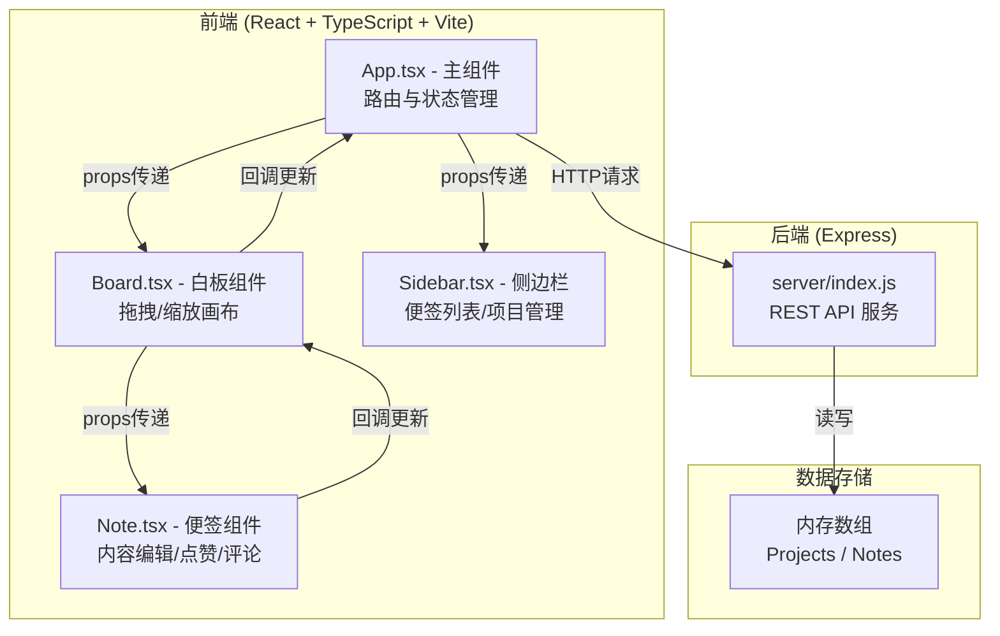
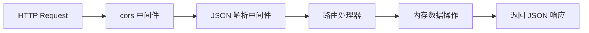
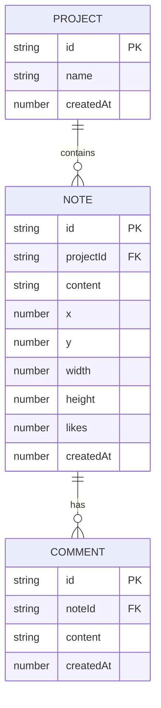

# 灵感碰撞板 - 技术架构文档

## 1. 架构设计



## 2. 技术栈描述

- **前端框架**：React 18 + TypeScript
- **构建工具**：Vite 5.x，开发端口 3000
- **后端框架**：Express 4.x
- **跨域处理**：cors 中间件
- **辅助库**：
  - `uuid`：生成唯一ID
  - `date-fns`：日期格式化
  - `lucide-react`：图标库

## 3. 项目结构与调用关系

```
auto256/
├── package.json              # 项目依赖与脚本
├── index.html                # HTML入口
├── vite.config.ts            # Vite配置
├── tsconfig.json             # TypeScript配置
├── src/
│   ├── App.tsx               # 主组件：管理全局状态，调用API
│   ├── Board.tsx             # 白板组件：渲染画布，处理便签交互
│   ├── Note.tsx              # 便签组件：单张便签渲染与交互
│   └── Sidebar.tsx           # 侧边栏组件：便签列表与项目管理
└── server/
    └── index.js              # Express服务器：提供REST API
```

**数据流向**：
1. `App.tsx` → 调用后端API获取数据 → 通过props传递给 `Board.tsx` 和 `Sidebar.tsx`
2. `Board.tsx` → 渲染便签列表 → 将单条便签数据传递给 `Note.tsx`
3. `Note.tsx` → 用户交互触发回调 → 冒泡到 `Board.tsx` → 冒泡到 `App.tsx` → 发送API请求更新后端
4. 后端更新成功后 → `App.tsx` 更新本地状态 → 重新渲染子组件

## 4. API 定义

### 类型定义

```typescript
interface Comment {
  id: string;
  content: string;
  createdAt: number;
}

interface Note {
  id: string;
  projectId: string;
  content: string;
  x: number;
  y: number;
  width: number;
  height: number;
  likes: number;
  comments: Comment[];
  createdAt: number;
}

interface Project {
  id: string;
  name: string;
  createdAt: number;
}
```

### REST API 端点

| 方法 | 路径 | 说明 | 请求体 | 响应 |
|------|------|------|--------|------|
| GET | `/api/projects` | 获取所有项目 | - | `Project[]` |
| POST | `/api/projects` | 创建新项目 | `{ name: string }` | `Project` |
| GET | `/api/projects/:id/notes` | 获取项目便签 | - | `Note[]` |
| POST | `/api/notes` | 创建便签 | `{ projectId, content, x, y, width, height }` | `Note` |
| PUT | `/api/notes/:id` | 更新便签 | `Partial<Note>` | `Note` |
| PUT | `/api/notes/:id/like` | 点赞便签 | - | `Note` |
| POST | `/api/notes/:id/comments` | 添加评论 | `{ content: string }` | `Note` |

## 5. 服务端架构



## 6. 数据模型

### 6.1 实体关系



### 6.2 内存存储结构

```javascript
// 服务端内存数据
let projects = [
  { id: 'default', name: '默认项目', createdAt: Date.now() }
];

let notes = [
  // { id, projectId, content, x, y, width, height, likes, comments, createdAt }
];
```
