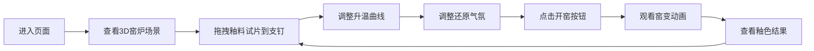

## 1. 产品概述

数字瓷窑是一款交互式3D窑变釉色模拟器，让用户体验宋代匠人烧制瓷器的过程。用户在虚拟馒头窑中摆放釉料试片，通过控制升温曲线和还原气氛，实时见证釉面在高温下的流动、结晶、开片等窑变效果。

- 目标用户：陶瓷爱好者、艺术创作者、教育领域用户
- 产品价值：以数字化方式还原传统窑变工艺的魅力，让用户直观理解釉色变化与烧制参数的关系

## 2. 核心功能

### 2.1 功能模块
1. **3D窑炉场景**：半剖馒头窑3D模型，12个支钉放置位
2. **釉料试片系统**：12种釉料配方，可拖拽放置最多6个试片
3. **升温曲线控制**：可交互折线图，自定义升温/恒温/降温阶段
4. **还原气氛控制**：滑块调节0-100%，影响最终釉色
5. **窑变动画系统**：点击开窑后，釉色演变、流动效果、裂纹生成

### 2.2 功能详情

| 模块名称 | 功能描述 |
|---------|---------|
| 窑炉3D模型 | 半剖馒头窑（内径4单位，穹顶高3单位），泥灰色内壁#5C4033，12个柱状支钉 |
| 釉料配方面板 | 右上角半透明面板（#2A1F14，圆角10px），12种配方：铁锈红、影青、铜绿、紫金土等 |
| 试片拖拽系统 | 每个试片20x20x1扁立方体，初始颜色从#8B4513到#2F4F4F，带随机纹理，支持拖拽排序（弹性动画，阻尼0.6） |
| 升温曲线图表 | 左下方折线图，横轴0-12小时，纵轴0-1300°C，圆形手柄(6px)拖拽节点，默认升温150°C/小时，恒温2小时，降温-120°C/小时 |
| 还原气氛滑块 | 0-100%滑块，默认30%，背景光晕从暖橙#FF8C00过渡到青灰#708090 |
| 开窑按钮 | 图表下方120x40px，底色#8B0000，悬停#A52A2A，按下#5B0000，0.2s过渡 |
| 窑变动画 | 3秒内顶点正弦波偏移(振幅0.01-0.03)，颜色演变为最终釉色，生成随机裂纹（线框，长度0.1-0.5，颜色#1A1A1A，透明度0.3-0.6） |
| 结果展示 | 试片上方弹出釉色名称标签（serif字体，24px，#FFD700，0.5s淡入），最终颜色±5%随机偏差 |

## 3. 核心流程

用户进入页面后看到3D窑炉场景，从右上角面板拖拽釉料试片到支钉上，通过左下方图表调整升温曲线，滑动滑块调整还原气氛，点击开窑按钮观看窑变动画，最终查看每个试片的窑变结果。

## 4. 用户界面设计

### 4.1 设计风格
- **主色调**：暗色调背景#0D0B0A，UI面板#1A1410
- **点缀色**：金色#C9A96E，瓷青色#5D8A8A
- **按钮/滑块**：圆形磨砂金属质感，径向渐变#3A2A1A到#1A140A
- **过渡动画**：所有交互元素0.2-0.3s柔和过渡，悬停缩放1.05倍
- **字体**：标签使用serif字体，整体优雅古典

### 4.2 页面布局

| 区域 | 位置 | 元素 |
|-----|------|------|
| 主场景 | 全屏中央 | 3D半剖馒头窑，OrbitControls相机控制 |
| 釉料面板 | 右上角 | 半透明面板，12种釉料配方卡片，可拖拽 |
| 升温曲线 | 左下方 | 折线图，可拖拽节点调节 |
| 还原气氛 | 左侧 | 垂直滑块，带光晕效果 |
| 开窑按钮 | 图表下方 | 红色按钮 |

### 4.3 响应性
- 桌面端优先设计
- Canvas自适应窗口大小
- UI面板固定定位，适配不同分辨率

### 4.4 3D场景指导
- **环境与氛围**：暗色调环境，暖色点光源模拟窑火，环境光提供基础照明
- **光照设置**：AmbientLight基础光+DirectionalLight主光+PointLight窑火效果光
- **相机设置**：PerspectiveCamera，OrbitControls允许旋转缩放观察窑炉内部
- **动画效果**：顶点位移模拟釉面流动，颜色渐变模拟窑变，线框叠加模拟开片
- **性能要求**：FPS稳定在30以上，优化几何体和材质数量
