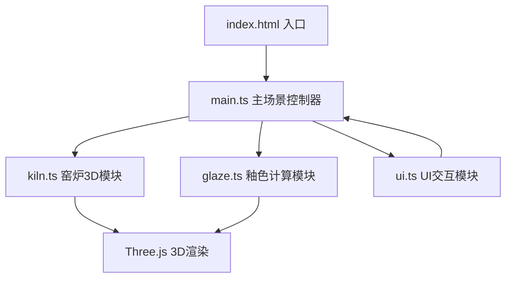

## 1. 架构设计



## 2. 技术描述
- **前端框架**：原生TypeScript + Three.js（无React/Vue）
- **构建工具**：Vite
- **3D引擎**：three + @types/three
- **样式方案**：原生HTML/CSS
- **模块划分**：
  - `src/main.ts`：场景初始化、相机、光照、动画循环
  - `src/kiln.ts`：馒头窑3D模型构建、支钉系统
  - `src/glaze.ts`：釉料配方、颜色演变、裂纹生成
  - `src/ui.ts`：DOM控制面板、事件绑定、与场景通信

## 3. 模块与文件结构

| 文件 | 职责 |
|-----|------|
| package.json | 依赖：three、@types/three、typescript、vite；脚本：dev |
| index.html | 全屏Canvas容器、UI面板DOM锚点 |
| vite.config.js | 入口index.html，开发端口8080 |
| tsconfig.json | 严格模式，esnext模块，dom类型 |
| src/main.ts | Three.js场景、相机、光照、OrbitControls、渲染循环 |
| src/kiln.ts | 窑炉几何体、内壁材质、穹顶、支钉、试片放置逻辑 |
| src/glaze.ts | 12种釉料配方数据、温度/气氛→颜色函数、裂纹线框生成 |
| src/ui.ts | 配方面板、升温曲线、滑块、按钮的DOM创建与事件 |

## 4. 数据模型

### 4.1 釉料配方类型
```typescript
interface GlazeRecipe {
  id: string;
  name: string;          // 中文名如"影青"、"铁锈红"
  initialColor: string;  // 初始hex颜色
  // 最终颜色计算函数参数
  reductionThreshold: number;  // 还原气氛阈值
  reducedColor: string;        // 还原>阈值时的颜色
  oxidizedColor: string;       // 还原<=阈值时的颜色
  flowAmount: number;          // 流动强度系数
  crackDensity: number;        // 裂纹密度系数
}
```

### 4.2 升温曲线节点
```typescript
interface CurvePoint {
  time: number;      // 0-12小时
  temperature: number; // 0-1300°C
}
```

### 4.3 试片状态
```typescript
interface TestPiece {
  id: string;
  recipeId: string;
  mesh: THREE.Mesh;
  positionIndex: number; // 支钉索引0-11
  animationProgress: number; // 0-1
  finalColor: THREE.Color;
}
```

## 5. 核心算法

### 5.1 釉色演变算法
- 输入：釉料配方、升温曲线积分(总热量)、还原气氛值
- 输出：最终RGB颜色，在reducedColor与oxidizedColor之间插值，叠加±5%随机偏差

### 5.2 流动动画
- 顶点着色器级别的正弦波偏移：`y += sin(x*freq + time) * amplitude * recipe.flowAmount`
- 振幅范围0.01-0.03单位，频率随机

### 5.3 裂纹生成
- 在试片表面随机生成线段，长度0.1-0.5
- 使用LineSegments + EdgesGeometry实现
- 透明度0.3-0.6随机，颜色#1A1A1A
