## 1. 产品概述

皮匠工坊是一家手工皮具工作室的在线定制平台，让用户通过组合不同的皮料、颜色、五金配件和刻字内容，实时预览并下单独一无二的个性化皮具作品。

- 核心价值：为用户提供沉浸式的皮具定制体验，打破实体店铺的时空限制
- 目标用户：追求个性化、高品质手工皮具的消费者

## 2. 核心功能

### 2.1 功能模块

1. **首页**：产品展示、导航栏、品牌介绍
2. **定制页面**：3D实时预览、定制面板（皮料颜色/纹理/五金/刻字）、加入购物车
3. **订单确认弹窗**：Canvas截图预览、定制参数、价格计算、确认下单
4. **订单历史页面**：订单卡片列表、状态展示、时间倒序

### 2.2 页面详情

| 页面名称 | 模块名称 | 功能描述 |
|---------|---------|---------|
| 首页 | 产品选择区 | 三个产品卡片（钱包、手环、钥匙扣），点击进入定制界面 |
| 首页 | 顶部导航 | 固定高度50px，包含首页/定制/我的订单三个链接 |
| 定制页面 | 3D预览画布 | 占70%宽度，Three.js渲染，支持鼠标拖拽旋转/滚轮缩放 |
| 定制页面 | 定制面板 | 占30%宽度，底色#2A2A2A，包含颜色/纹理/五金/刻字选择控件 |
| 定制页面 | 加入购物车按钮 | 底部固定，渐变背景#D4A373到#C38D5F，点击弹出确认弹窗 |
| 订单确认弹窗 | 产品预览 | 从Canvas截图展示最终产品图片 |
| 订单确认弹窗 | 价格计算 | 基础价+皮料加价+五金加价+刻字加价 |
| 订单历史页面 | 订单卡片列表 | 按时间倒序，大屏3列/中屏2列/小屏1列网格布局 |

## 3. 核心流程

用户打开首页 → 选择产品类型（钱包/手环/钥匙扣） → 进入定制界面 → 选择皮料颜色（深棕/酒红/墨绿/靛蓝/黑色） → 选择纹理（光面/荔枝纹/十字纹） → 选择五金（金色/银色/古铜色） → 输入刻字内容（最多8字符） → 实时预览3D效果 → 点击加入购物车 → 弹出确认弹窗（预览图+参数+总价） → 确认下单 → POST提交到后端 → 显示订单ID → 可跳转到订单历史页面查看

```mermaid
flowchart LR
    A["用户打开首页"] --> B["选择产品类型"]
    B --> C["进入定制界面"]
    C --> D["选择皮料颜色"]
    D --> E["选择纹理"]
    E --> F["选择五金"]
    F --> G["输入刻字"]
    G --> H["实时3D预览"]
    H --> I["点击加入购物车"]
    I --> J["弹出确认弹窗"]
    J --> K["确认下单"]
    K --> L["POST提交到后端"]
    L --> M["显示订单ID"]
    M --> N["订单历史页面"]
```

## 4. 用户界面设计

### 4.1 设计风格

- 主背景色：#121212（深黑色）
- 卡片背景色：#1E1E1E / #2A2A2A
- 文字颜色：#E0E0E0（浅灰）
- 强调色：#D4A373（暖金色）
- 按钮风格：圆角、渐变背景、悬停亮度提升、点击缩放0.95
- 字体：Macondo（刻字展示用）、系统字体（正文）
- 布局风格：卡片式、分栏布局、顶部固定导航
- 设计调性：高端奢华、工匠精神、暗色主题

### 4.2 页面设计概述

| 页面名称 | 模块名称 | UI元素 |
|---------|---------|---------|
| 首页 | 产品选择区 | 3个产品卡片，悬浮微上移5px，卡片背景#1E1E1E，圆角12px |
| 定制页面 | 3D预览画布 | Three.js Canvas，OrbitControls阻尼0.1，白模展示 |
| 定制页面 | 定制面板 | 色块网格（60x60px，选中高亮边框）、纹理图标（选中放大1.2倍）、五金圆形按钮、刻字输入框（Macondo字体，≤8字符） |
| 订单确认弹窗 | 弹窗容器 | 居中，底色#1E1E1E，圆角16px，阴影#00000080 |
| 订单历史页面 | 订单卡片 | 宽320px，背景#2A2A2A，圆角12px，滑入动画slideInRight 0.4s |

### 4.3 响应式设计

- 大屏（>1024px）：定制面板在右侧，占30%宽度；订单卡片3列
- 中屏（768-1024px）：定制面板折叠为底部抽屉（点击展开，高度40%）；订单卡片2列
- 小屏（<768px）：3D预览全屏，定制面板通过悬浮按钮触发全屏覆盖层；订单卡片1列
- 桌面优先，移动端自适应，触摸优化

### 4.4 3D场景设计

- 环境：柔和环境光 + 方向光，模拟工作室灯光
- 光照：AmbientLight(0xffffff, 0.6) + DirectionalLight(0xffffff, 0.8)
- 相机：PerspectiveCamera，初始距离适中，能完整展示产品
- 交互：OrbitControls，阻尼0.1，支持拖拽旋转和滚轮缩放
- 动画：颜色渐变0.5秒平滑过渡，翻盖动画（钱包）
- 材质：MeshStandardMaterial，金属度/粗糙度根据纹理调整
- 性能：帧率≥45FPS，渲染响应<100ms
