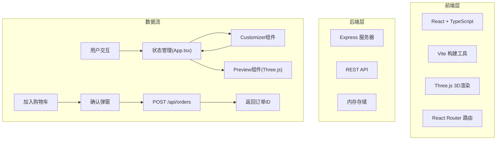
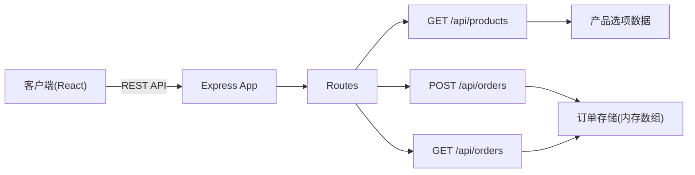
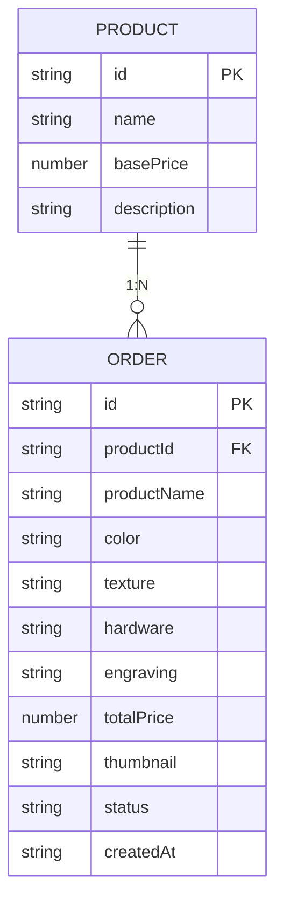

## 1. 架构设计



## 2. 技术描述

- 前端框架：React@18 + TypeScript
- 构建工具：Vite@5
- 前端路由：简单状态切换（无react-router，使用App.tsx状态管理）
- 3D渲染：three@0.160 + @types/three
- UI组件库：原生CSS，无UI框架
- 颜色选择器：react-color
- ID生成：uuid
- 后端：Express@4 + cors
- 数据存储：内存存储（orders数组）
- 开发服务器端口：前端8080，后端3001

## 3. 路由与页面定义

| 页面（状态） | 触发条件 | 说明 |
|-------|---------|------|
| home | 初始状态 | 首页，展示三个产品卡片 |
| customizer | 点击产品卡片 | 定制页面，左侧3D预览+右侧定制面板 |
| orders | 点击导航"我的订单" | 订单历史列表页面 |

## 4. API 定义

### 4.1 GET /api/products
获取产品选项数据

**响应**：
```typescript
interface ProductOption {
  id: string;
  name: string;
  basePrice: number;
  description: string;
}

interface ProductsResponse {
  products: ProductOption[];
  colors: { id: string; name: string; hex: string; price: number }[];
  textures: { id: string; name: string; price: number }[];
  hardware: { id: string; name: string; hex: string; price: number }[];
}
```

### 4.2 POST /api/orders
提交订单

**请求体**：
```typescript
interface OrderRequest {
  productId: string;
  productName: string;
  color: string;
  texture: string;
  hardware: string;
  engraving: string;
  totalPrice: number;
  thumbnail: string;
}
```

**响应**：
```typescript
interface OrderResponse {
  id: string;
  status: 'pending' | 'processing' | 'shipped';
  createdAt: string;
  message: string;
}
```

### 4.3 GET /api/orders
获取订单列表

**响应**：
```typescript
interface Order {
  id: string;
  productId: string;
  productName: string;
  color: string;
  texture: string;
  hardware: string;
  engraving: string;
  totalPrice: number;
  thumbnail: string;
  status: 'pending' | 'processing' | 'shipped';
  createdAt: string;
}

type OrdersResponse = Order[];
```

## 5. 服务器架构图



## 6. 数据模型

### 6.1 数据模型定义



### 6.2 前端类型定义

```typescript
// 定制状态
interface CustomizationState {
  productId: string | null;
  color: string;
  texture: string;
  hardware: string;
  engraving: string;
}

// 产品类型
type ProductType = 'wallet' | 'bracelet' | 'keychain';

// 订单状态
type OrderStatus = 'pending' | 'processing' | 'shipped';
```

## 7. 文件结构与调用关系

```
皮匠工坊/
├── package.json              # 依赖与脚本配置
├── vite.config.js            # Vite构建配置
├── tsconfig.json             # TypeScript配置
├── index.html                # HTML入口
└── src/
    ├── App.tsx               # 主组件：状态管理、页面路由调度
    │   ├── 数据流向：用户选择 → App状态 → Customizer + Preview
    │   └── 调用：Customizer.tsx、Preview.tsx、NavBar、OrderHistory、OrderModal
    ├── types.ts              # 全局TypeScript类型定义
    │   └── 被所有组件引用
    ├── constants.ts          # 常量数据（产品、颜色、纹理、五金、价格）
    │   └── 被App.tsx、Customizer.tsx、Preview.tsx引用
    ├── components/
    │   ├── NavBar.tsx        # 顶部导航栏
    │   ├── Customizer.tsx    # 定制面板（接收App状态+setState回调）
    │   │   └── 输出用户选择 → 调用App的setState
    │   ├── Preview.tsx       # 3D预览（接收定制参数 → Three.js渲染）
    │   │   └── 依赖：three、OrbitControls
    │   ├── ProductCard.tsx   # 产品卡片
    │   ├── OrderModal.tsx    # 订单确认弹窗
    │   └── Toast.tsx         # Toast提示组件
    ├── pages/
    │   ├── HomePage.tsx      # 首页（产品列表）
    │   │   └── 使用：ProductCard
    │   ├── CustomizerPage.tsx # 定制页面
    │   │   └── 使用：Preview + Customizer
    │   └── OrderHistoryPage.tsx # 订单历史页面
    ├── server/
    │   └── index.ts          # Express服务器
    │       ├── GET /api/products → 返回产品选项
    │       ├── POST /api/orders → 存储并返回订单
    │       └── GET /api/orders → 返回订单列表
    └── styles/
        └── index.css         # 全局样式与动画
```

## 8. 性能优化策略

- Three.js：启用抗锯齿(antialias: true)，合理设置pixelRatio
- 材质颜色过渡：使用requestAnimationFrame实现0.5秒线性插值
- 响应式布局：CSS媒体查询，避免JS监听resize
- 动画性能：优先使用CSS transform和opacity动画
- 初始加载：代码分割，Three.js按需导入
