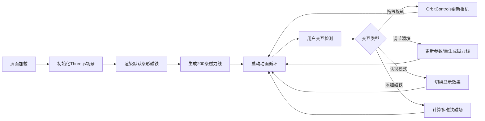

## 1. 产品概述

3D磁力线交互式可视化工具，通过Three.js在浏览器中直观呈现磁体周围磁场线分布、密度与方向变化，解决物理学习者和教学者难以直观理解磁场空间结构的问题。

- 目标用户：物理教师、学生、科学爱好者
- 产品价值：将抽象的磁场概念转化为可交互、可调节的3D可视化体验

## 2. 核心功能

### 2.1 用户角色
| 角色 | 注册方式 | 核心权限 |
|------|----------|----------|
| 访客用户 | 无需注册 | 使用所有可视化功能，调节参数，添加磁铁 |

### 2.2 功能模块
1. **主3D场景**：Three.js渲染的深空背景、条形磁铁、磁力线可视化、OrbitControls交互
2. **控制面板**：磁力线数量滑块、磁场强度滑块、显示模式切换
3. **多磁铁交互**：拖拽添加第二块磁铁（条形/马蹄形）、网格吸附、异极/同极磁场计算
4. **状态栏**：实时显示磁力线数量、FPS帧率、交互模式

### 2.3 页面详情
| 页面名称 | 模块名称 | 功能描述 |
|----------|----------|----------|
| 主界面 | 3D渲染场景 | 径向渐变深空背景、条形磁铁默认显示、200条贝塞尔曲线磁力线、红色到蓝色渐变、动态流动高光、鼠标旋转/缩放 |
| 主界面 | 右侧控制面板 | 磁力线条数(50-500)、磁场强度(0.5-3.0)、显示模式切换(静态/动态流动/粒子轨迹) |
| 主界面 | 磁铁添加功能 | 下拉选择条形/马蹄形、拖拽放置、网格吸附、自动计算磁场线更新 |
| 主界面 | 底部状态栏 | 磁力线数量、FPS、交互模式实时显示 |

## 3. 核心流程

## 4. 用户界面设计

### 4.1 设计风格
- **主色调**：深空蓝黑渐变 (#0A0E27 → #1A1A2E)，控制面板深色 (#1E1E2E)
- **强调色**：高亮蓝 #4FC3F7、警告红 #FF6B6B、成功绿 #4ECDC4、悬停金 #FFD700
- **磁极色**：N极红 #FF4444、S极蓝 #4488FF
- **字体**：现代无衬线字体，白色半透明文字
- **布局**：左侧全屏3D场景 + 右侧280px固定控制面板 + 底部40px状态栏
- **动效**：滑块渐变(#4A90D9)、淡入动画(0.5s)、模式切换过渡(0.3s缓动)

### 4.2 页面设计概览
| 页面名称 | 模块名称 | UI元素 |
|----------|----------|--------|
| 主界面 | 3D场景 | 径向渐变背景、光泽材质磁铁、贝塞尔曲线磁力线、半透明动态流动光点 |
| 主界面 | 控制面板 | 卡片式布局、圆角12px、白色#FFFFFF圆形滑块、悬停外发光#4FC3F7、数值实时显示 |
| 主界面 | 磁铁交互 | 拖拽放置、网格吸附、悬停边框高亮#FFD700 |
| 主界面 | 状态栏 | 深色背景#0D1117、白色半透明文字、FPS计数器 |

### 4.3 响应式
- 桌面端优先设计
- 控制面板宽度固定280px，高度自适应滚动
- 3D场景随窗口尺寸响应式调整
- 底部状态栏高度固定40px

### 4.4 3D场景指南
- **环境**：径向渐变深空蓝黑背景，营造宇宙空间氛围
- **光照**：环境光 + 方向光，磁铁表面带光泽材质
- **相机**：PerspectiveCamera，OrbitControls阻尼0.15，支持拖拽旋转/滚轮缩放
- **磁力线渲染**：每条线约60个顶点的贝塞尔曲线，颜色从N极红到S极蓝渐变，线宽0.03，半透明
- **动画**：高亮光点沿线方向以0.2单位/秒移动；粒子轨迹模式下500粒子沿路径运动
- **性能**：100条磁力线动态模式≥60FPS，粒子模式≥30FPS
