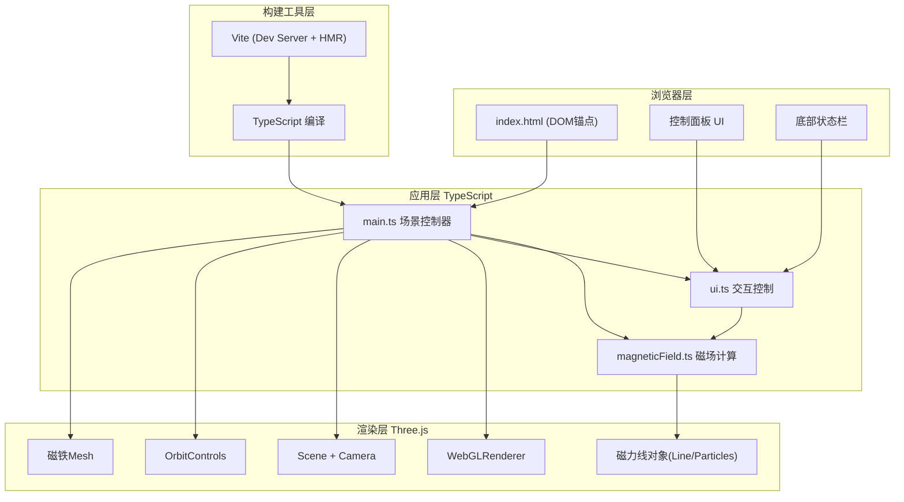

## 1. 架构设计



## 2. 技术选型

- **前端框架**: 原生 TypeScript (无额外UI框架，直接操作DOM)
- **3D渲染**: three@^0.160.0 + @types/three
- **构建工具**: vite@^5.0.0
- **开发辅助**: dat.gui@^0.7.9 (UI控制面板可选)
- **初始化方式**: 手动配置 package.json + Vite

## 3. 目录结构

| 路径 | 说明 |
|------|------|
| `package.json` | 项目依赖与启动脚本 (npm run dev) |
| `index.html` | 入口页面：3D容器、控制面板DOM、状态栏 |
| `vite.config.js` | Vite配置：入口index.html，端口8080 |
| `tsconfig.json` | TypeScript严格模式，esnext模块，bundler解析 |
| `src/main.ts` | 场景初始化、渲染器/相机/控制器、生命周期 |
| `src/magneticField.ts` | 核心模块：磁力线计算、贝塞尔曲线、对象管理 |
| `src/ui.ts` | UI逻辑：滑块事件、下拉菜单、切换按钮、状态栏 |

## 4. 核心类与接口定义

```typescript
// magneticField.ts
interface MagnetConfig {
  type: 'bar' | 'horseshoe';
  position: THREE.Vector3;
  rotation: THREE.Euler;
  length: number;
  strength: number;
}

interface FieldLinePoint {
  position: THREE.Vector3;
  color: THREE.Color;
}

class MagneticFieldSystem {
  magnets: Magnet[] = [];
  fieldLines: FieldLine[] = [];
  params: { lineCount: number; strength: number; mode: 'static' | 'flow' | 'particles' };
  
  addMagnet(config: MagnetConfig): Magnet;
  removeMagnet(index: number): void;
  regenerateLines(): void;
  updateAnimation(time: number): void;
  dispose(): void;
}

// ui.ts
interface UIControls {
  lineCount: number;
  fieldStrength: number;
  displayMode: 'static' | 'flow' | 'particles';
  magnetType: 'bar' | 'horseshoe';
}

class UIHandler {
  controls: UIControls;
  onChange(callback: (controls: UIControls) => void): void;
  updateStatus(fps: number, lineCount: number, mode: string): void;
}
```

## 5. 性能优化策略

1. **磁力线复用**: 参数变更时尽量复用已有Line对象，仅更新顶点buffer
2. **贝塞尔曲线预计算**: 曲线顶点一次生成存入BufferGeometry，动画仅更新uniform
3. **粒子池化**: 粒子模式下使用Points + InstancedBuffer，避免频繁GC
4. **材质共享**: 同类型磁力线共享LineMaterial，仅通过vertexColors区分
5. **帧率控制**: requestAnimationFrame自然同步，动态模式60FPS目标
6. **LOD策略**: 远处磁力线减少顶点数（可选）
