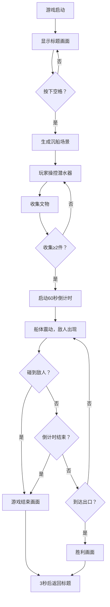

## 1. 产品概述

深海沉船探险游戏是一款基于浏览器端的像素风格探险游戏，玩家操控潜水器在随机生成的沉船残骸中收集文物、躲避障碍并最终逃离崩塌的船体。

- 主要目的：提供紧张刺激的海底探险体验，考验玩家的反应和策略能力
- 目标用户：休闲游戏爱好者，像素风格游戏爱好者
- 目标价值：提供轻量化、易上手的浏览器端游戏体验

## 2. 核心功能

### 2.1 用户角色
| 角色 | 注册方式 | 核心权限 |
|------|----------|----------|
| 玩家 | 无需注册，直接访问 | 游戏游玩、重新开始 |

### 2.2 功能模块
1. **标题画面**：游戏标题展示、开始提示、背景渐变
2. **游戏场景**：随机沉船生成、玩家潜水器控制、文物收集、敌人AI、探照灯系统
3. **游戏状态管理**：倒计时、船体崩塌、胜利/失败判定
4. **HUD界面**：文物计数、剩余时间显示
5. **粒子系统**：气泡粒子、闪光效果、船体碎片

### 2.3 页面详情
| 页面名称 | 模块名称 | 功能描述 |
|----------|----------|----------|
| 标题画面 | 标题展示 | 显示"深海沉船"和"按空格开始"像素文字，深蓝到黑垂直渐变背景 |
| 游戏主场景 | 沉船生成 | 随机生成20格长船体，4-6个舱室，1-3件文物/舱室，外部残骸装饰 |
| 游戏主场景 | 潜水器控制 | 360度移动，速度2px/帧，空格开关探照灯 |
| 游戏主场景 | 文物收集 | 距离<6px自动拾取，HUD更新计数 |
| 游戏主场景 | 崩塌倒计时 | 拾取2件文物后启动60秒倒计时，船体震动，敌人出现 |
| 游戏主场景 | 敌人系统 | 红色敌人随机游走，触碰即游戏结束 |
| 胜利/失败画面 | 结果展示 | 显示结果文字，统计信息，3秒后返回标题 |

## 3. 核心流程

## 4. 用户界面设计

### 4.1 设计风格
- **主色调**：深蓝色(#001F3F)到黑色(#000B18)垂直渐变背景
- **强调色**：蓝色潜水器(#00BFFF)、金色文物(#FFD700)、红色敌人(#FF4444)、绿色出口(#00FF00)
- **字体**：等宽像素字体(monospace)
- **整体风格**：复古像素风，Canvas 2x缩放，image-rendering: pixelated

### 4.2 页面设计概览
| 页面名称 | 模块名称 | UI元素 |
|----------|----------|---------|
| 标题画面 | 标题区 | 居中"深海沉船"24px像素文字，"按空格开始"提示文字 |
| 标题画面 | 背景 | #001F3F到#000B18垂直渐变 |
| 游戏主场景 | HUD顶栏 | 左侧文物计数，右侧倒计时（激活时显示），半透明黑底，圆角6px |
| 游戏主场景 | 潜水器 | 6x8px蓝色像素，带圆形窗口，尾部气泡粒子 |
| 游戏主场景 | 沉船 | #8B4513到#A0522D渐变，矩形三角形拼接，海葵藤壶装饰 |
| 游戏主场景 | 探照灯 | 锥形黄色半透明光线，30度角，长度80px |
| 游戏结束画面 | 遮罩层 | #FF000040全红遮罩，白色20px"游戏结束"文字 |
| 胜利画面 | 遮罩层 | #00FF0040绿色遮罩，金色"逃脱成功"文字，统计信息 |

### 4.3 响应式设计
- Canvas始终保持16:9纵横比并自适应窗口大小
- 桌面端键盘操作（方向键/WASD移动，空格探照灯）
- 游戏内容居中显示

## 5. 性能要求

- 目标帧率：60FPS
- 粒子上限：每帧不超过50个
- 实体上限：文物和敌人总数不超过30个
- 探照灯优化：仅对屏幕可见区域逐像素计算
