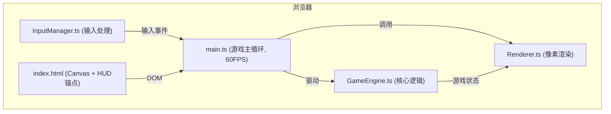

## 1. 架构设计



## 2. 技术描述

- **前端框架**：无框架，原生 TypeScript + HTML/CSS
- **构建工具**：Vite
- **渲染方式**：HTML5 Canvas 2D API
- **字体**：monospace 等宽像素字体
- **像素渲染**：Canvas 2x 缩放，`image-rendering: pixelated`

## 3. 文件结构

| 文件路径 | 用途 |
|---------|------|
| `/package.json` | 项目依赖配置（vite, typescript） |
| `/index.html` | 入口页面，全屏Canvas + HUD锚点 |
| `/vite.config.js` | Vite构建配置，端口8080 |
| `/tsconfig.json` | TypeScript配置（严格模式，esnext，dom） |
| `/src/main.ts` | 游戏主循环，requestAnimationFrame 60FPS，状态管理 |
| `/src/GameEngine.ts` | 船体生成算法、物理碰撞、文物拾取、倒计时管理 |
| `/src/Renderer.ts` | 像素风格渲染、粒子效果、HUD绘制 |
| `/src/InputManager.ts` | 键盘鼠标输入映射（移动、探照灯） |

## 4. 核心数据模型

```typescript
// 游戏状态枚举
enum GameState { TITLE, PLAYING, WIN, LOSE }

// 玩家潜水器
interface Player {
  x: number;
  y: number;
  angle: number;
  speed: number;
  spotlightOn: boolean;
  flashTimer: number;
}

// 文物
interface Artifact {
  x: number;
  y: number;
  collected: boolean;
  flashPhase: number;
}

// 敌人
interface Enemy {
  x: number;
  y: number;
  vx: number;
  vy: number;
  speed: number;
}

// 粒子
interface Particle {
  x: number;
  y: number;
  vx: number;
  vy: number;
  life: number;
  maxLife: number;
  color: string;
  size: number;
}

// 船体结构
interface ShipSection {
  x: number;
  y: number;
  w: number;
  h: number;
  shape: 'rect' | 'triangle';
  falling: boolean;
  vy: number;
}
```

## 5. 游戏逻辑说明

### 5.1 船体生成
- 船体总长度约20格（每格16px）
- 4-6个随机舱室，每个舱室1-3件文物
- 船体由矩形和三角形拼接构成
- 外部随机分布残骸碎木片
- 上下分布海葵和藤壶装饰

### 5.2 碰撞检测
- 点-矩形碰撞检测（潜水器vs船体）
- 圆-点距离检测（潜水器vs文物，阈值6px）
- 矩形-矩形碰撞（潜水器vs敌人，6x6px）

### 5.3 探照灯
- 从潜水器前方射出锥形光线
- 角度范围：30度
- 长度：80px
- 颜色：半透明黄色 `#FFD70040`
- 仅对可见区域进行像素级照明计算

### 5.4 状态机
- TITLE（标题）→ PLAYING（游戏中）：按空格键
- PLAYING → LOSE（失败）：碰到敌人或倒计时结束
- PLAYING → WIN（胜利）：到达出口
- LOSE/WIN → TITLE：3秒后自动返回
