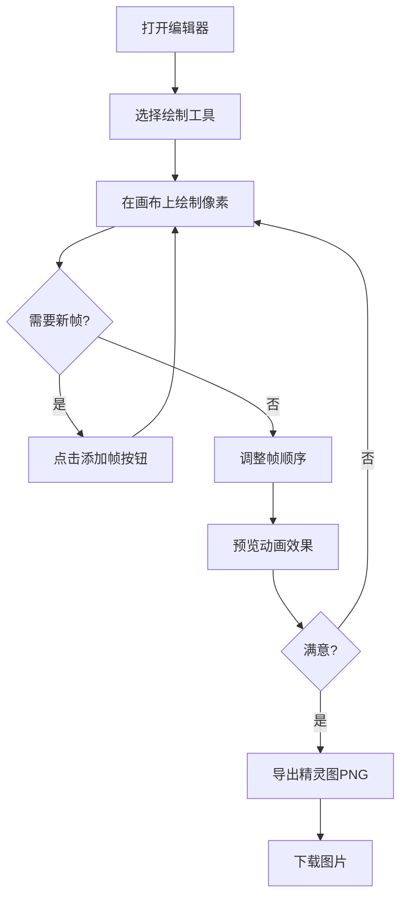

## 1. 产品概述

像素精灵编辑器是一款面向独立游戏工作室美术师的2D像素角色与动画设计工具，让用户可以在浏览器中像专业像素编辑器一样绘制、预览和导出动作序列。

- 目标用户：独立游戏工作室的美术设计师、像素艺术爱好者
- 核心价值：无需安装软件，浏览器端即可完成像素精灵的创作与动画导出

## 2. 核心功能

### 2.1 功能模块

1. **主画布区域**：32x32像素网格绘制区，支持铅笔、橡皮、填充、取色笔工具
2. **工具面板**：颜色选择、笔刷大小切换、翻转/旋转操作
3. **动画帧管理**：帧的添加/删除/排序/缩略图预览
4. **动画预览**：循环播放、速度调节、洋葱皮效果
5. **导出功能**：将所有帧水平拼接为PNG精灵图导出

### 2.2 功能详情

| 页面/模块 | 子模块 | 功能描述 |
|-----------|--------|----------|
| 主画布 | 像素网格 | 32x32网格，浅灰网格线(#333333)，黑色背景(#000000) |
| 主画布 | 悬停高亮 | 鼠标悬停像素时显示半透明白色高亮边框(#FFFFFF40) |
| 主画布 | 铅笔工具 | 左键绘制当前颜色像素 |
| 主画布 | 橡皮擦 | 左键将像素置为背景色 |
| 主画布 | 填充工具 | 点击区域替换所有连通同色像素 |
| 主画布 | 取色笔 | 点击像素获取其颜色 |
| 工具面板 | 颜色选择 | 12种预设颜色 + 自定义取色器 |
| 工具面板 | 笔刷大小 | 1x1/3x3/5x5三种，实时半透明预览 |
| 工具面板 | 翻转旋转 | 水平翻转、垂直翻转、旋转90度，带平滑过渡 |
| 帧管理 | 添加/删除 | 绿色按钮添加空白帧，红色按钮删除当前帧 |
| 帧管理 | 缩略图 | 64x64px缩略图，水平排列，灰色边框，间距4px |
| 帧管理 | 选中状态 | 当前帧亮蓝色边框(#2196F3)，帧编号白色12px字体 |
| 帧管理 | 拖拽排序 | 支持拖拽调整帧顺序 |
| 动画预览 | 播放控制 | 播放/暂停按钮，速度滑块0.5x-3x步长0.5x |
| 动画预览 | 洋葱皮 | 显示前后帧半透明轮廓 |
| 导出 | 精灵图导出 | 所有帧水平拼接，帧间距2px，新标签页打开PNG |

## 3. 核心流程

## 4. 用户界面设计

### 4.1 设计风格
- 主题：深色专业创作工具风格
- 主背景：#121218（近黑色）
- 面板背景：#1E1E2E（半透明深紫灰，圆角12px）
- 预览区域：#2A2A2A（深灰色）
- 主色按钮：绿色#4CAF50（添加）、红色#E53935（删除）、蓝色#2196F3（选中）
- 交互过渡：all 0.2s ease，按钮圆角8px
- 控件间距：面板内12px

### 4.2 页面布局
| 区域 | 位置 | 尺寸/样式 |
|------|------|-----------|
| 主画布 | 左侧 | 占窗口剩余宽度，居中显示 |
| 工具面板 | 右侧 | 固定宽度220px，圆角12px |
| 帧列表 | 右下 | 深灰背景，水平滚动 |
| 动画控制 | 底部 | 播放按钮+速度滑块 |

### 4.3 响应式设计
- 桌面端（≥900px）：左右布局，画布在左，面板在右
- 移动端（<900px）：上下布局，画布在上，面板在下
- 触控优化：增大按钮点击区域，支持触摸绘制

### 4.4 动效设计
- 工具切换：0.2s缩放过渡动画
- 翻转操作：0.15s平滑过渡
- 当前选中工具：2px白色边框(#FFFFFF)
- 绘制预览：当前颜色50%透明度的方形笔刷预览
