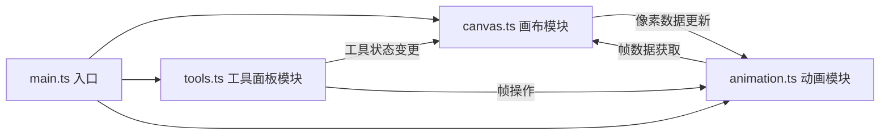

## 1. 架构设计



架构采用模块化分层设计，各模块职责单一，通过显式函数调用和事件回调进行通信。

## 2. 技术描述

- **前端框架**：原生 TypeScript + HTML5 Canvas API + CSS3
- **构建工具**：Vite 5.x
- **编程语言**：TypeScript（严格模式）
- **模块系统**：ESNext
- **开发服务器端口**：8080

## 3. 文件结构与职责

| 文件路径 | 职责描述 | 调用关系 |
|----------|----------|----------|
| `package.json` | 项目依赖与脚本配置（vite、typescript） | 被 npm 读取 |
| `vite.config.js` | Vite 构建配置，入口 index.html，端口 8080 | 被 vite 读取 |
| `tsconfig.json` | TypeScript 配置（严格模式、ESNext、DOM） | 被 tsc 读取 |
| `index.html` | 入口页面，DOM 结构：左侧画布 + 右侧面板 | 加载 main.ts |
| `src/main.ts` | 应用入口，初始化各模块，绑定全局事件 | 调用 canvas.ts / tools.ts / animation.ts |
| `src/canvas.ts` | 核心绘制：像素网格、渲染、铅笔/橡皮/填充/取色工具 | 被 main.ts 调用，接收 tools.ts 状态 |
| `src/tools.ts` | 工具面板：颜色选择、笔刷大小、翻转、帧操作UI | 被 main.ts 调用，通知 canvas.ts |
| `src/animation.ts` | 动画模块：帧管理、播放、洋葱皮、导出精灵图 | 被 main.ts 调用，获取 canvas.ts 像素数据 |
| `src/style.css` | 全局样式：深色主题、布局、响应式、动效 | 被 index.html 引入 |

## 4. 数据流向

### 4.1 绘制操作数据流向
```
用户鼠标事件 → canvas.ts 事件监听
  → 识别像素坐标
  → 根据当前工具（铅笔/橡皮/填充/取色）处理
  → 更新 PixelMatrix（二维数组 32x32）
  → requestAnimationFrame 触发重渲染
  → Canvas API 绘制到屏幕
```

### 4.2 工具切换数据流向
```
用户点击工具按钮 → tools.ts 事件监听
  → 更新 ToolState（currentTool, color, brushSize）
  → 通过回调通知 canvas.ts 更新内部状态
  → canvas.ts 更新光标预览样式
```

### 4.3 动画帧数据流向
```
用户添加/删除/排序帧 → tools.ts UI 事件
  → animation.ts 操作 FrameList
  → animation.ts 通知 canvas.ts 切换当前帧像素数据
  → canvas.ts 重渲染主画布
  → animation.ts 更新缩略图列表
```

### 4.4 导出数据流向
```
用户点击导出按钮 → animation.ts 处理
  → 遍历 FrameList 获取每帧 PixelMatrix
  → 创建离屏 Canvas，水平拼接所有帧（帧间距2px）
  → toDataURL('image/png') 生成 Base64
  → window.open() 在新标签页打开图片
```

## 5. 核心数据模型

### 5.1 PixelMatrix
```typescript
type PixelMatrix = string[][];  // 32x32，存储每个像素的颜色（CSS颜色字符串或null表示透明）
```

### 5.2 Frame
```typescript
interface Frame {
  id: number;
  pixels: PixelMatrix;
  thumbnail?: HTMLCanvasElement;
}
```

### 5.3 ToolState
```typescript
interface ToolState {
  currentTool: 'pencil' | 'eraser' | 'fill' | 'picker';
  color: string;
  brushSize: 1 | 3 | 5;
  symmetricX: boolean;
  symmetricY: boolean;
}
```

### 5.4 AnimationState
```typescript
interface AnimationState {
  frames: Frame[];
  currentFrameIndex: number;
  isPlaying: boolean;
  playbackSpeed: number;  // 0.5 - 3.0
  showOnionSkin: boolean;
}
```

## 6. 性能约束实现方案

| 约束 | 实现方案 |
|------|----------|
| 绘制响应 < 30ms | 使用 requestAnimationFrame 批量渲染，像素矩阵直接操作内存数组，避免 DOM 回流 |
| 60fps 帧率 | 所有视觉更新通过 requestAnimationFrame，CSS 动画使用 transform / opacity |
| 导出 < 200ms | 使用离屏 Canvas + ImageData 批量像素写入，避免逐像素 fillRect |
| 内存占用 | 每帧仅存储 32x32 字符串数组，缩略图按需生成并缓存 |
