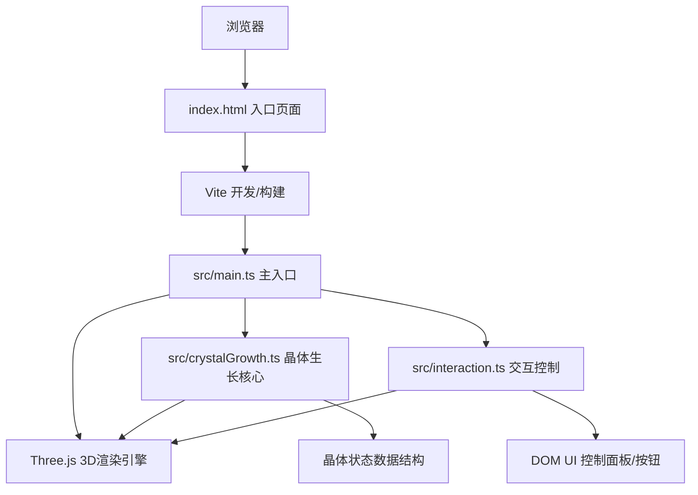

## 1. 架构设计



## 2. 技术说明
- **前端框架**：纯 TypeScript + Three.js（无React/Vue，按用户需求使用原生TS）
- **构建工具**：Vite 5.x
- **3D引擎**：three@0.160.x，@types/three
- **参数面板底层库**：dat.gui@0.4.0（被自定义UI替代）
- **初始化方式**：vite vanilla-ts 模板

## 3. 路由定义
| 路由 | 用途 |
|------|------|
| / | 主页面，包含3D场景和所有交互控件 |

## 4. 文件结构
```
├── index.html              # 入口页面
├── package.json            # 依赖与脚本
├── vite.config.js          # Vite配置
├── tsconfig.json           # TypeScript配置
└── src/
    ├── main.ts             # 主入口，初始化场景和UI
    ├── crystalGrowth.ts    # 晶体生长核心逻辑
    ├── interaction.ts      # 交互控制（鼠标、面板、按钮）
    └── style.css           # 全局样式
```

## 5. 核心数据模型

### 5.1 晶体状态
```typescript
interface CrystalState {
  phase: 'nucleus' | 'growth' | 'ripening' | 'polyhedron';
  nucleusRadius: number;
  temperature: number;       // 0-100 °C
  supersaturation: number;   // 1.0-5.0
  growthRate: number;        // 0.1-3.0
  prisms: Prism[];
  growthLayers: number;
  lastLayerTime: number;
  isPaused: boolean;
}

interface Prism {
  id: string;
  direction: '+x' | '-x' | '+y' | '-y' | '+z' | '-z';
  position: Vector3;
  size: number;              // 0.1-0.5
  layerIndex: number;
  formationTime: number;
  mesh: Mesh;
  edgeLines: LineSegments;
}
```

### 5.2 生长算法
- 立方晶系沿x/y/z正负六个方向生长
- 每0.5秒新增一层，每层厚度0.08单位，层间间隙0.02单位
- 棱柱体颜色按方向区分：±x#FF6B6B, ±y#4ECDC4, ±z#FFE66D
- 熟化触发条件：棱柱≥150 或 晶核半径≥1.8
- 熟化阶段：棱柱收缩合并，饱和度降低20%，明度提高10%
- 最终多面体面数：8-26面（长方体→菱形十二面体渐变）

## 6. 性能优化
- 使用InstancedMesh批量渲染相同几何的棱柱体
- 熟化阶段动态合并几何体
- Raycaster交互优化，限制检测对象列表
- 材质复用，避免重复创建Shader
- requestAnimationFrame节流，使用deltaTime计算动画
