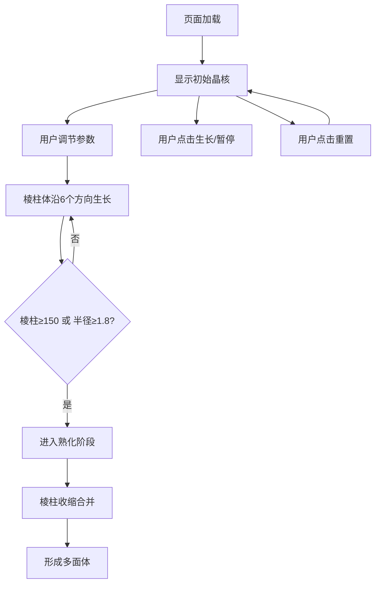

## 1. 产品概述
3D晶体生长交互式可视化工具，用于帮助用户直观理解晶体在不同温度和过饱和度条件下从溶液中析出并形成规则几何多面体的动态过程。
- 主要面向材料科学学习者、化学教育工作者及晶体生长研究爱好者
- 提供沉浸式3D交互体验，将抽象的晶体生长过程转化为可观测、可调节的可视化展示

## 2. 核心功能

### 2.1 用户角色
| 角色 | 注册方式 | 核心权限 |
|------|----------|----------|
| 访客用户 | 无需注册，直接访问 | 浏览3D场景、调节参数、交互操作 |

### 2.2 功能模块
1. **主3D场景**：Three.js渲染的晶体生长可视化区域
2. **参数控制面板**：温度、过饱和度、生长速率三个滑块调节
3. **交互控制系统**：OrbitControls视角控制、悬停高亮、生长/暂停、重置
4. **生长阶段管理**：晶核阶段→棱柱生长阶段→熟化阶段→多面体成型

### 2.3 页面详情
| 页面名称 | 模块名称 | 功能描述 |
|----------|----------|----------|
| 主页面 | 3D渲染画布 | 全屏展示晶体生长过程，深空渐变背景 |
| 主页面 | 参数控制面板 | 右下侧半透明毛玻璃面板，三个滑块实时调节参数 |
| 主页面 | 生长/暂停按钮 | 左下角圆形按钮，控制生长过程启停 |
| 主页面 | 重置按钮 | 右侧圆形按钮，重置为初始晶核状态 |
| 主页面 | 悬浮信息框 | 鼠标悬停时显示晶面法线方向、尺寸和形成时间 |

## 3. 核心流程
用户打开页面后，中央显示初始晶核。调节参数后晶核沿立方晶系六个方向生长棱柱体。当棱柱数量达到150或晶核半径超过1.8时自动进入熟化阶段，棱柱合并收缩最终形成多面体。用户可随时暂停/继续或重置整个过程。

## 4. 用户界面设计

### 4.1 设计风格
- **主色调**：科技蓝紫调，主色 #4FC3F7，点缀色 #7B68EE
- **背景**：深空渐变 #0B0B1A → #1A1A2E
- **控制面板**：半透明毛玻璃效果 #1E1E2E，backdrop-filter: blur(8px)，圆角14px，透明度0.85
- **按钮**：圆形直径36px，底色 #2A2A4A（生长暂停）/ #4A2A2A（重置），悬停弹性动画 scale 0.95→1.05，0.2s transition
- **字体**：现代无衬线字体，深浅对比明显

### 4.2 页面设计概览
| 页面名称 | 模块名称 | UI元素 |
|----------|----------|----------|
| 主页面 | 3D场景 | 全屏Canvas，深空渐变背景，晶体半透明发光材质 |
| 主页面 | 参数面板 | 毛玻璃卡片，三个滑块带数值显示，滑块带颜色标识 |
| 主页面 | 控制按钮 | 圆形悬浮按钮，图标简洁，弹性hover效果 |
| 主页面 | 悬浮提示 | 白色半透明信息框，展示法线方向、尺寸、形成时间 |

### 4.3 响应式设计
- 宽屏(>1200px)：控制面板横向布局，按钮分置两侧
- 中等屏幕(768-1200px)：控制面板保持右侧位置
- 窄屏(<768px)：控制面板纵向堆叠，可折叠，按钮集中到下方
- 触控设备：支持触摸拖拽旋转、双指缩放

### 4.4 3D场景指引
- **环境/光照**：深空渐变背景，多光源设置（环境光+方向光+点光源）营造体积感
- **光照布置**：环境光强度0.4，主方向光带阴影，两盏补光从不同角度照射
- **相机设置**：PerspectiveCamera，fov 60，OrbitControls阻尼0.12，旋转速度1.0，缩放范围1-10倍
- **构图与焦点**：晶体位于场景中心，相机初始距离适中，始终可见全貌
- **交互与动画**：棱柱体生长动画、熟化阶段收缩合并动画、悬停发光高亮
- **后处理**：可选轻微辉光效果提升科技感
- **性能预算**：400个棱柱时FPS≥55，200个棱柱时FPS≥60
