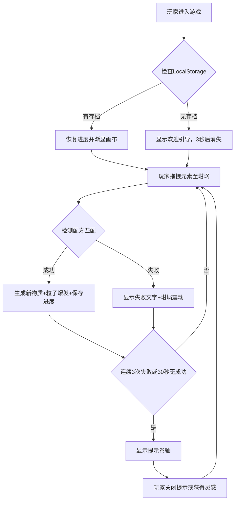

## 1. 产品概述

炼金术士元素融合模拟器是一款在浏览器中运行的交互式游戏，玩家扮演古代炼金术师，通过拖拽四种基本元素（火、水、土、气）到坩埚中按特定比例和顺序混合，发现并创造新物质。

- **核心问题解决**：帮助玩家直观理解元素间的化学反应逻辑，通过可视化的粒子效果和物质形态展示元素融合的奥秘
- **目标用户**：对炼金术、化学、益智游戏感兴趣的玩家，教育场景下的师生
- **产品价值**：寓教于乐，通过游戏化方式传递物质转化概念，提供探索发现的乐趣

## 2. 核心特性

### 2.1 功能模块

1. **熔炉主画布**：Canvas渲染的16:9自适应实验区域，包含128x128网格熔炉、中央坩埚、粒子效果系统
2. **元素池**：左侧可拖拽的四种基本元素图标（火、水、土、气）
3. **信息面板**：右侧已发现物质列表，支持分类/稀有度筛选、配方查看
4. **资源管理**：四种元素资源计数器，自动恢复机制，主动采集按钮
5. **提示系统**：连续失败后自动浮出的古旧卷轴式提示框
6. **进度保存**：LocalStorage自动保存与恢复，首次引导界面

### 2.2 页面详情

| 页面名称 | 模块名称 | 功能描述 |
|---------|---------|---------|
| 游戏主界面 | 熔炉画布 | 16:9自适应Canvas，128x128网格背景，中央坩埚，拖拽融合交互 |
| 游戏主界面 | 元素池 | 左侧15%区域，4个圆形元素图标，支持HTML5拖拽 |
| 游戏主界面 | 信息面板 | 右侧240px，已发现物质列表，支持筛选，点击查看配方 |
| 游戏主界面 | 资源状态栏 | 左上角4个资源计数器（当前/最大），30秒自动恢复+采集按钮 |
| 游戏主界面 | 提示系统 | 右下角古卷轴样式提示，失败触发，支持关闭 |
| 游戏主界面 | 引导界面 | 首次进入时欢迎文字，3秒渐变消失 |

## 3. 核心流程

玩家从左侧元素池拖拽元素至中央坩埚，系统根据坩埚内元素的种类、数量和放入顺序检测是否匹配已知配方。匹配成功则生成新物质并触发粒子爆发动画，失败则显示红色"失败"提示。连续失败3次或30秒无成功融合时，右下角出现提示卷轴。每次成功发现新物质时自动保存进度。

## 4. 用户界面设计

### 4.1 设计风格

- **主色调**：#1A0F0A（昏暗实验室背景）、#2D1F1A（熔炉网格底色）、#3E2723（坩埚填充/按钮底色）
- **强调色**：#FFD700（金色，文字高亮/边框）、#8B7355（选中态按钮/次级强调）、#5C4033（边框）
- **元素色**：火#FF4500、水#1E90FF、土#8B4513、气#E6E6FA
- **稀有度色**：普通#C0C0C0、稀有#FFD700、传说#FF6B6B
- **按钮风格**：圆角按钮，悬停放大1.05（0.2s过渡），点击压入0.95
- **字体**：采用像素/复古风格字体，标题24px/20px，正文16px，小字12px
- **布局**：桌面端三栏布局（15%元素池 / 60%熔炉 / 25%信息面板），移动端右侧面板折叠为底部抽屉
- **整体氛围**：中世纪暗色调炼金实验室，古旧卷轴、神秘光晕、粒子魔法效果

### 4.2 页面设计概览

| 页面名称 | 模块名称 | UI元素 |
|---------|---------|---------|
| 游戏主界面 | 熔炉画布 | 16:9 Canvas，网格纹理，中央圆形坩埚（半透明），融合时粒子爆发，成功时背景短暂变亮 |
| 游戏主界面 | 元素池 | 4个发光圆形元素图标，边缘半透明光晕，拖拽时光标跟随小光晕 |
| 游戏主界面 | 信息面板 | 深棕色面板，圆角8px，1px边框，按钮组筛选，物质列表（图标+名称+稀有度色） |
| 游戏主界面 | 资源状态栏 | 左上角4个资源计数器，数字恢复动画，底部采集按钮（压入效果+冷却倒计时） |
| 游戏主界面 | 提示系统 | 右下角古卷轴（米黄底色+暗纹），悬停金色脉冲发光，关闭按钮缩放消失动画 |
| 游戏主界面 | 物质发现弹窗 | 坩埚上方半透明白色漩涡动画，金色名称文字2秒渐变消失 |

### 4.3 响应式设计

- **桌面端（≥1024px）**：三栏固定布局，元素池15%、熔炉60%、信息面板25%
- **平板端（768px-1023px）**：元素池100px宽，熔炉自适应，信息面板可折叠
- **移动端（<768px）**：元素池横向排列于顶部，熔炉居中占满，信息面板折叠为底部抽屉（点击图标展开）
- **触摸优化**：元素图标增大至40px，拖拽区域热区扩大，按钮最小44x44px

### 4.4 动画与性能

- 所有动画目标60FPS，Canvas渲染使用requestAnimationFrame
- 粒子同时存在上限500个，单个融合爆发50粒子
- 坩埚漩涡旋转0.01rad/帧，提示发光脉冲周期2s
- 资源恢复数字缓动动画、按钮hover/active过渡
- 内存消耗控制在50MB以内
