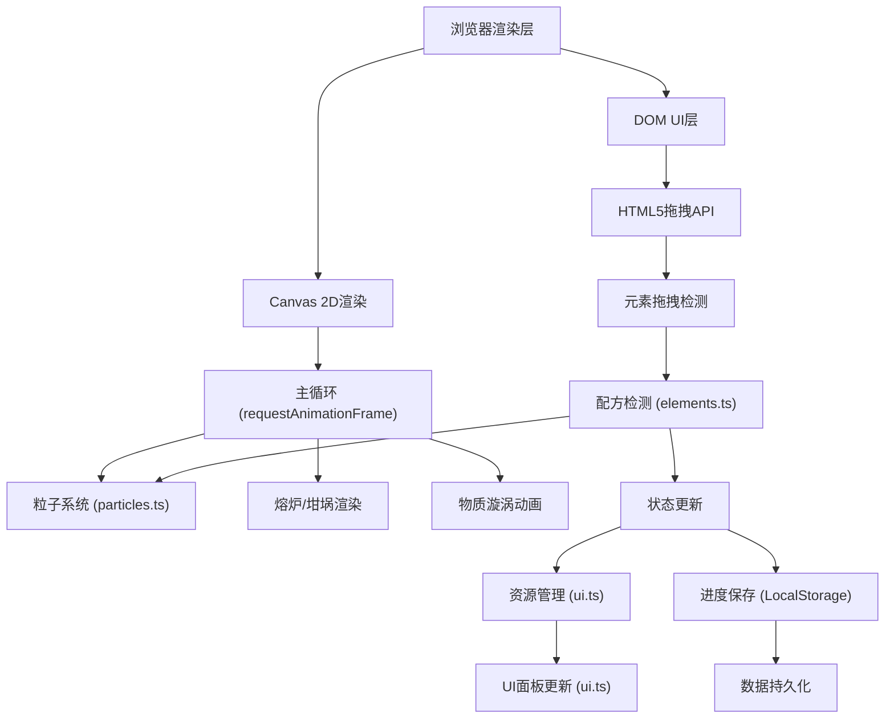
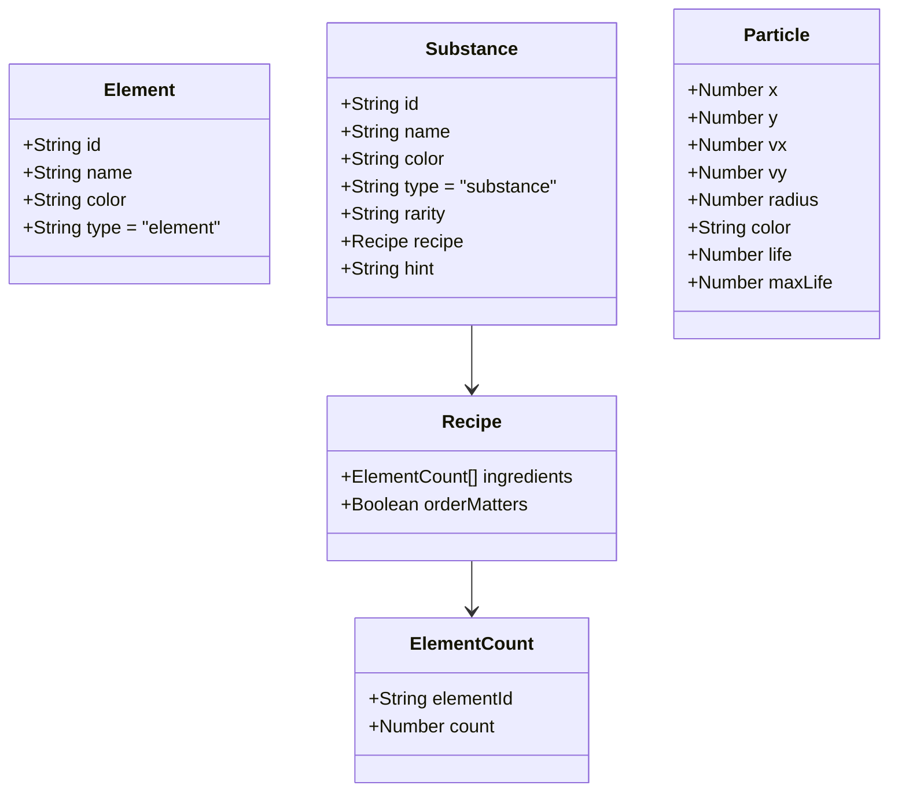

## 1. 架构设计



## 2. 技术说明

- **前端**：TypeScript + 原生 HTML/CSS + Vite 5.x（无框架依赖，纯Canvas + DOM操作）
- **初始化工具**：Vite官方 vanilla-ts 模板
- **后端**：无，纯前端游戏
- **数据库**：浏览器 LocalStorage 进行进度持久化

### 文件结构
```
.
├── package.json          # 项目依赖和脚本配置
├── index.html            # 入口HTML，包含Canvas和DOM锚点
├── vite.config.js        # Vite构建配置，端口8080
├── tsconfig.json         # TypeScript严格模式配置
└── src/
    ├── main.ts           # 游戏主循环、Canvas渲染、顶层协调
    ├── elements.ts       # 元素/物质类型定义、配方、检测函数
    ├── ui.ts             # DOM交互、元素池、提示系统、面板、按钮
    └── particles.ts      # 粒子系统、动画效果、漩涡、缓动函数
```

## 3. 路由定义

| 路由 | 用途 |
|-----|------|
| / | 游戏主界面（单页应用，无路由） |

## 4. API 定义

本项目为纯前端应用，无后端API。LocalStorage存储接口如下：

```typescript
// 存档数据结构
interface GameSaveData {
  discoveredSubstances: string[];   // 已发现物质ID列表
  resources: {                      // 资源存量
    fire: number;
    water: number;
    earth: number;
    air: number;
  };
  recipeHistory: string[];          // 配方尝试历史（成功的融合记录）
  lastSaveTime: number;             // 最后保存时间戳
}
```

## 5. 数据模型

### 5.1 元素与物质模型



### 5.2 核心类型定义

```typescript
type ElementId = 'fire' | 'water' | 'earth' | 'air';
type Rarity = 'common' | 'rare' | 'legendary';

interface BaseItem {
  id: string;
  name: string;
  color: string;
  type: 'element' | 'substance';
}

interface ElementItem extends BaseItem {
  type: 'element';
}

interface RecipeIngredient {
  elementId: ElementId;
  count: number;
}

interface SubstanceItem extends BaseItem {
  type: 'substance';
  rarity: Rarity;
  recipe: RecipeIngredient[];
  hint: string;
  swirlColor: string;
}

interface CrucibleState {
  contents: ElementId[];
  currentSubstance: SubstanceItem | null;
}

interface GameState {
  resources: Record<ElementId, number>;
  maxResource: number;
  discovered: Set<string>;
  recipeHistory: string[];
  failureStreak: number;
  lastSuccessTime: number;
}
```
