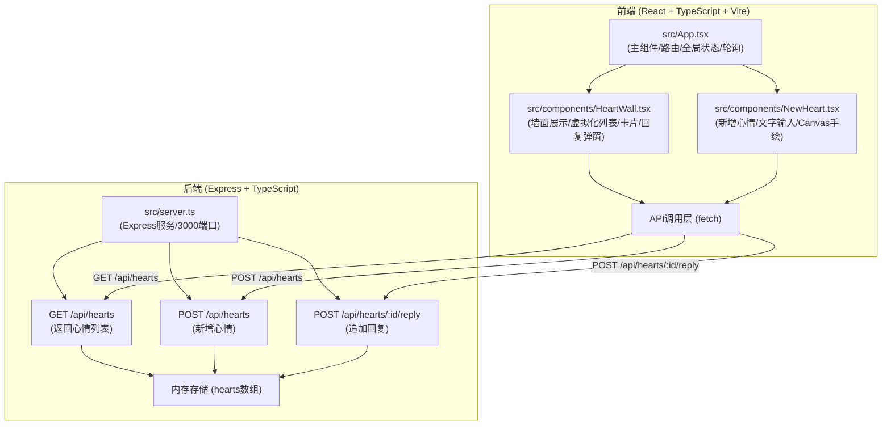
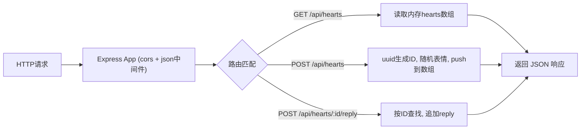

## 1. 架构设计



## 2. 技术描述

- **前端框架**：React@18 + TypeScript@5
- **构建工具**：Vite@5 + @vitejs/plugin-react
- **后端框架**：Express@4 + TypeScript
- **跨域处理**：cors中间件
- **辅助库**：uuid（ID生成）、date-fns（相对时间格式化）
- **初始化方式**：使用 `react-express-ts` 模板
- **状态管理**：React Hooks（useState, useEffect, useRef），无需全局状态管理库

## 3. 路由定义

| 路由 | 用途 |
|------|------|
| / | 心情墙首页（HeartWall组件） |
| /new | 新增心情页（NewHeart组件） |

前端使用简单的状态切换实现路由（无需react-router-dom，按用户要求由App.tsx管理视图切换）。

## 4. API 定义

### 4.1 数据类型定义

```typescript
// shared types
interface Reply {
  id: string;
  content: string;
  createdAt: number;
}

interface Heart {
  id: string;
  text: string;
  drawing?: string; // base64 data URL
  emoji: string;
  createdAt: number;
  replies: Reply[];
}
```

### 4.2 接口列表

| 方法 | 路径 | 请求体 | 响应 | 说明 |
|------|------|--------|------|------|
| GET | `/api/hearts` | - | `Heart[]` | 返回所有心情数组 |
| POST | `/api/hearts` | `{ text: string, drawing?: string }` | `Heart` | 创建新心情，后端生成id/emoji/createdAt/replies |
| POST | `/api/hearts/:id/reply` | `{ content: string }` | `Heart` | 追加回复到指定心情，返回更新后的完整对象 |

### 4.3 后端配置

- 端口：3000
- CORS：允许所有来源（`cors()` 中间件）
- 数据存储：进程内存数组（重启清空）
- Vite 代理：`/api` → `http://localhost:3000`

## 5. 服务器架构图



## 6. 文件结构与调用关系

```
auto269/
├── package.json              # 统一依赖管理，npm run dev 启动前后端
├── vite.config.js            # Vite构建配置 + /api代理到3000
├── tsconfig.json             # TypeScript严格模式配置
├── index.html                # 入口HTML，暖木色背景，手写体标题
└── src/
    ├── App.tsx               # 主组件：视图状态切换（wall/new）、hearts数据、30s轮询、滚动位置保持
    │   ↑ 调用 fetch('/api/hearts') 拉取列表
    │   ↑ 传递 hearts 给 HeartWall
    │   ↑ 传递 onSubmit 给 NewHeart
    │
    ├── server.ts             # Express后端：3000端口，3个API，内存hearts数组
    │   ↑ 被 npm run dev 脚本同时启动
    │
    ├── components/
    │   ├── HeartWall.tsx     # 墙面：两列网格布局、虚拟化渲染、便签卡片、回复弹窗
    │   │   ↑ 从 props 接收 hearts 数组
    │   │   ↑ 调用 fetch POST /api/hearts/:id/reply 提交回复
    │   │
    │   └── NewHeart.tsx      # 新增：textarea + Canvas手绘 + 提交
    │       ↑ 调用 props.onSubmit 回调
    │       ↑ props.onSubmit 调用 fetch POST /api/hearts
    │
    └── hooks/ (可选)
        └── useVirtualScroll.ts  # 虚拟化滚动hook（IntersectionObserver）
```

**数据流向说明**：
1. App.tsx → useEffect → `GET /api/hearts` → server.ts → 内存数组 → 返回 Heart[] → App.setState(hearts) → 传给 HeartWall
2. NewHeart.tsx → 用户输入 → 调用 props.onSubmit({text, drawing}) → App.tsx → `POST /api/hearts` → server.ts → push到内存 → 返回新建 Heart → App追加到列表 → 切换回wall视图
3. HeartWall.tsx → 点击卡片 → 弹窗 → 用户输入回复 → `POST /api/hearts/:id/reply` → server.ts → 追加reply → 返回更新Heart → App更新列表 → 关闭弹窗
4. App.tsx → setInterval 30s → `GET /api/hearts` → 对比差异更新 hearts（使用useRef保存上次scrollTop，更新后恢复）
