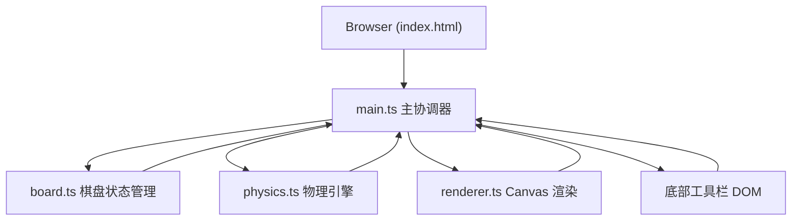

## 1. 架构设计



## 2. 技术说明

- **前端框架**：原生 TypeScript + HTML5 Canvas 2D
- **构建工具**：Vite 5.x
- **语言**：TypeScript（严格模式）
- **样式**：原生 CSS，内联于 index.html
- **无后端**：纯前端单页应用，无数据持久化

### 文件结构

```
project-root/
├── package.json
├── vite.config.js
├── tsconfig.json
├── index.html
└── src/
    ├── main.ts      # 入口，事件绑定，游戏循环
    ├── board.ts     # 16x16 网格，落子，合并逻辑
    ├── physics.ts   # 引力/斥力计算，位置速度更新
    └── renderer.ts  # Canvas 绘制（棋盘、星星、棋子、连线、动画）
```

## 3. 数据模型

### 3.1 棋子数据结构

```typescript
interface Stone {
  id: number;
  x: number;          // 像素坐标 X
  y: number;          // 像素坐标 Y
  vx: number;         // 速度 X
  vy: number;         // 速度 Y
  radius: number;     // 半径（初始 14px）
  merged: boolean;    // 是否处于合并脉冲动画
  mergeTime: number;  // 合并动画开始时间戳
}
```

### 3.2 物理参数

```typescript
interface PhysicsConfig {
  gravityStrength: number;   // 引力强度倍数 0-5，默认 1.0
  repulsionStrength: number; // 斥力强度倍数 0-5，默认 1.5
  damping: number;           // 阻尼系数 0.9-1.0，默认 0.98
}
```

### 3.3 棋盘配置

```typescript
const GRID_SIZE = 16;        // 16x16 网格
const CELL_SIZE = 40;        // 每格 40x40px
const BOARD_PIXEL = 640;     // 棋盘像素尺寸 16*40
const MAX_STONES = 80;       // 棋子数量上限
```

## 4. 核心算法

### 4.1 力场计算（physics.ts）

- **斥力**：距离 < 60px，力度 = repulsionStrength * k / distance
- **引力**：60px ≤ 距离 ≤ 120px，力度 = gravityStrength * k * distance
- **无作用力**：距离 > 120px
- **速度更新**：v *= damping 每帧衰减
- **位置更新**：x += vx, y += vy

### 4.2 碰撞合并（board.ts）

- 检测两颗棋子距离 < 28px
- 合并：radius = r1 + r2，渐变切换为 #F59E0B → #EF4444
- 触发 0.5 秒脉冲动画（放大缩小）

### 4.3 渲染管线（renderer.ts）

每帧绘制顺序：
1. 页面背景 #111827 + 随机闪烁星星
2. 棋盘底色 #0B0E14
3. 棋盘光晕边框（8px 渐变）
4. 16x16 网格线 #2A3A5C
5. 引力场连线（距离<120px）
6. 棋子（径向渐变 + 阴影）
7. 合并脉冲动画

## 5. 性能要求

- 帧率：≥ 60 FPS
- 单帧计算时间（落子+物理）：≤ 3ms
- 棋子上限：80 颗（超过时先合并最近的两颗再落子）
- 渲染策略：Canvas 2D 全屏重绘，利用 requestAnimationFrame
