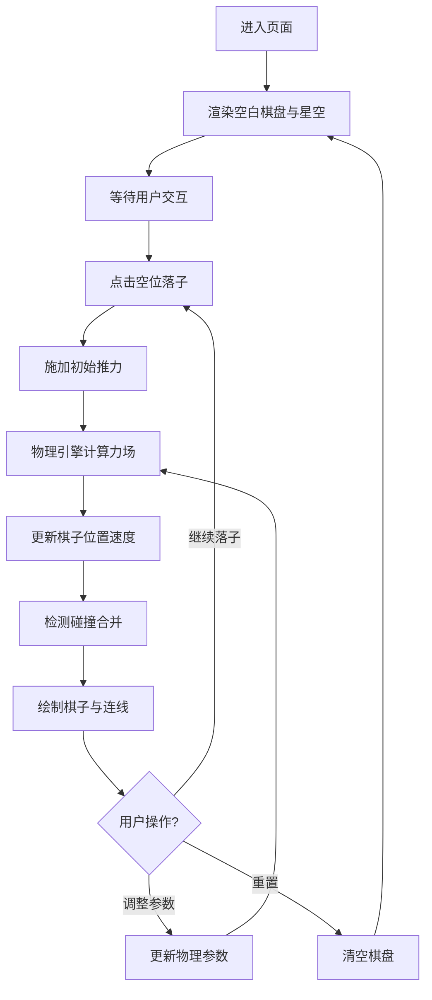

## 1. 产品概述

星轨棋局是一款将围棋落子策略与行星引力场物理效果相结合的创意互动可视化项目。玩家在 16x16 网格棋盘上放置棋子，每颗棋子如同小行星般对周围棋子产生引力与斥力，棋子在力场作用下缓缓移动，最终形成动态的星轨图案。

- 目标用户：对物理模拟、视觉艺术、互动体验感兴趣的用户
- 产品价值：通过直观的物理模拟展现天体力学美感，提供创意休闲体验

## 2. 核心功能

### 2.1 功能模块

1. **棋盘系统**：16x16 网格棋盘，支持点击落子，棋子上限 80 颗
2. **物理引擎**：实时计算棋子间引力/斥力，位置速度帧更新，阻尼衰减
3. **渲染系统**：Canvas 绘制星空背景、棋子、发光连线、合并脉冲动画
4. **控制面板**：引力强度、斥力强度、阻尼系数滑块，重置棋盘按钮

### 2.2 页面详情

| 页面名称 | 模块名称 | 功能描述 |
|---------|---------|---------|
| 主页面 | 星空背景 | 随机分布闪烁星星，亮度周期 2-4 秒随机变化 |
| 主页面 | 16x16 棋盘 | 网格线 #2A3A5C，底色 #0B0E14，柔和光晕边框 |
| 主页面 | 棋子系统 | 白色径向渐变棋子，落子初始推力，碰撞合并变大 |
| 主页面 | 引力场连线 | 距离<120px 显示半透明发光连线，线宽随距离变化 |
| 主页面 | 底部工具栏 | 三个参数滑块 + 重置按钮，淡入淡出过渡动画 |

## 3. 核心流程

用户进入页面 → 看到空白棋盘与闪烁星空 → 点击空位落子 → 新棋子对 100px 内棋子施加初始推力 → 棋子间持续引力/斥力作用 → 棋子移动并显示引力连线 → 距离<28px 时碰撞合并（脉冲动画）→ 可调整参数滑块实时改变物理效果 → 点击重置清空棋盘。

## 4. 用户界面设计

### 4.1 设计风格

- **主色调**：深蓝星空主题，底色 #111827，棋盘底色 #0B0E14
- **强调色**：棋子渐变 #E0E7FF → #6B7280，合并态 #F59E0B → #EF4444，连线 #6366F1 → #8B5CF6
- **布局**：棋盘居中占页面 70% 区域，底部工具栏高 60px，左右留白点缀星空
- **动效**：所有过渡使用 ease-out 曲线，持续 0.3-0.5s，60FPS 流畅动画
- **视觉细节**：棋子发光阴影、棋盘 8px 柔和渐变边框、连线透明度动态变化

### 4.2 页面设计概览

| 页面名称 | 模块名称 | UI 元素 |
|---------|---------|---------|
| 主页面 | 棋盘区域 | 16x16 网格、棋子（径向渐变+阴影）、发光连线、脉冲合并动画 |
| 主页面 | 星空背景 | 随机小圆点、亮度闪烁动画（2-4s 周期） |
| 主页面 | 底部工具栏 | #1E2433 底色、顶部圆角 12px、三个滑块、重置按钮 |
| 主页面 | 光晕边框 | #1E3A5F → 透明渐变，厚度 8px |

### 4.3 响应式

桌面端优先设计，Canvas 自适应页面尺寸，棋盘始终保持正方形居中显示。
