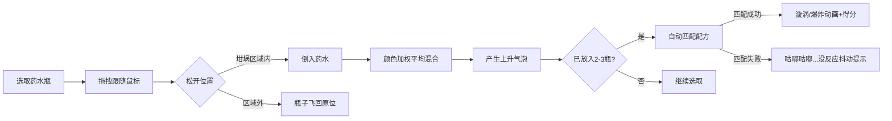

## 1. 产品概述

魔药炼成 - 魔法学院炼金模拟器，一个交互式炼药Web应用。用户通过将不同颜色的药水倒入坩埚中观察反应、练习炼金术。

- 主要功能：药水瓶选取与拖拽、坩埚反应动画系统、配方匹配与得分机制

- 产品价值：通过趣味交互帮助魔法学院学生以娱乐性互动体验

## 2. 核心功能

### 2.2 功能模块

1. **首页（唯一页面**：顶部配方提示栏、中央坩埚动画区、底部药水瓶货架、得分显示、重置按钮

### 2.3 页面详情

| 页面名称 | 模块名称 | 功能描述 |
|-----------|-------------|---------------------|
| 首页 | 配方提示栏 | 显示本局目标配方（金色边框提示框、药水数量进度条 |
| 首页 | 坩埚动画区 | Canvas绘制坩埚、液体颜色混合、气泡上升动画、漩涡/爆炸特效 |
| 首页 | 药水瓶货架 | 6种颜色药水瓶、悬停浮动、点击拖拽、飞行动画 |
| 首页 | 得分系统 | 基础100分/次、连击奖励50分、金色monospace字体显示 |
| 首页 | 重置按钮 | 清空坩埚、刷新目标配方 |

## 3. 核心流程

用户从底部货架拖拽/点击药水瓶 → 药水瓶跟随鼠标 → 松开时判断是否在坩埚区域内 → 在坩埚内则倒入药水 → 坩埚液体颜色加权平均变色 → 产生上升气泡 → 放入2-3瓶后自动匹配配方 → 匹配成功触发漩涡/爆炸动画+得分 → 匹配失败显示文字抖动提示

## 4. 用户界面设计

### 4.1 设计风格

- 主色调：暗紫色魔法主题
  - 背景：#1A1025，从#2A1A40到#1A1025上下渐变
  - 金色强调色：#FFD700
  - 药水颜色：红#FF4444、蓝#4488FF、绿#44BB66、紫#AA44FF、黄#FFD700、粉#FF69B4
  - 坩埚边框：#5C4033
  - 重置按钮：#FF6B6B

- 交互反馈：
  - 药水瓶悬停向上浮动5px（0.2s ease）
  - 点击元素缩放0.95倍（0.1s）
  - 瓶子飞回cubic-bezier(0.34, 1.56, 0.64, 1)（0.4s）

- 字体：数字使用 monospace，带文字阴影

### 4.2 页面设计概览

| 页面名称 | 模块名称 | UI元素 |
|-----------|-------------|-------------|
| 首页 | 配方提示栏 | 半透明深色背景#1A102580、backdrop-filter: blur(10px)、金色边框2px圆角8px |
| 首页 | 坩埚区 | 宽240x180px半椭圆坩埚、液体动态波纹、气泡上升、漩涡旋转、粒子爆炸 |
| 首页 | 药水瓶货架 | 半透明深色背景、横向排列60x80px瓶子、颜色渐变+2px高光白边 |
| 首页 | 得分显示 | 左上角#FFD700 24px monospace 带阴影#00000080 |
| 首页 | 重置按钮 | 右下角圆形#FF6B6B半径24px悬停放大1.1倍 |

### 4.3 响应式

桌面优先，最小宽度768px，窄屏时货架横向滚动

### 4.4 动画特效

- 气泡：每帧5-15个、半径2-8px、透明度0.8→0、上升40-80px/s、正弦波动、持续2秒
- 漩涡：液体剧烈旋转3秒
- 爆炸：200个彩色粒子爆发1.5秒
- 失败提示：0.3s抖动动画
- 液体波纹：频率2-4Hz、振幅3-6px
