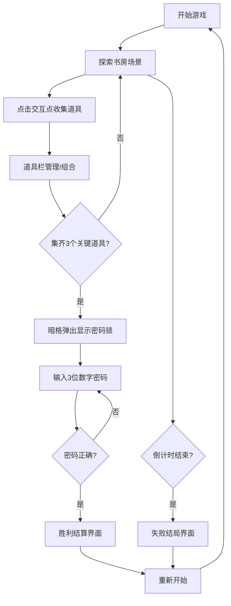

## 1. 产品概述
基于浏览器端的密室逃脱式解谜游戏，玩家在限时5分钟内通过收集线索、组合道具和破解机关，从一间被诅咒的古老书房中逃出。

- 目标用户：解谜游戏爱好者、休闲游戏玩家
- 产品价值：提供沉浸式的密室逃脱体验，锻炼逻辑思维和观察力

## 2. 核心功能

### 2.1 功能模块
1. **书房场景**：2D俯视视角，包含书桌、书架、壁炉、地毯、挂钟、盆栽等可交互家具
2. **道具系统**：道具栏管理、道具拾取、道具拖拽组合
3. **解谜系统**：数字密码锁、线索组合、机关验证
4. **计时系统**：5分钟倒计时、最后30秒警告、超时结局
5. **结算系统**：胜利/失败界面、数据统计、重新开始

### 2.2 页面详情
| 页面名称 | 模块名称 | 功能描述 |
|-----------|-------------|---------------------|
| 游戏主界面 | 书房场景 | 2D俯视视角渲染，随机木纹地板，6个可交互点 |
| 游戏主界面 | 交互点视图 | 点击物品后弹出200x200px局部放大视图 |
| 游戏主界面 | 道具栏 | 底部固定，最多8个道具，支持选中高亮和拖拽组合 |
| 游戏主界面 | 倒计时 | 顶部显示，最后30秒变红闪烁 |
| 游戏主界面 | 密码锁 | 3x3数字密码锁，按下动画和开锁音效 |
| 胜利界面 | 结算展示 | 显示用时、收集道具数、解谜次数、随机祝福语 |
| 失败界面 | 失败展示 | 黑色迷雾扩散动画，显示结局文字 |

## 3. 核心流程
玩家进入游戏 → 探索书房点击各交互点收集线索和道具 → 拖拽组合道具获取密码提示 → 集齐3个关键道具触发暗格弹出 → 输入3位数字密码 → 密码正确触发胜利结算 / 超时触发失败结局

## 4. 用户界面设计

### 4.1 设计风格
- **主色调**：深棕#2E1F16、家具棕#4A3B32、金色高光#D4A574、暗红点缀
- **按钮样式**：圆角8px，悬停变亮，点击微缩反馈
- **字体**：等宽字体用于倒计时，衬线字体用于游戏文字
- **布局风格**：全屏Canvas + 顶部倒计时 + 底部道具栏
- **氛围**：古老沉郁的神秘图书馆氛围

### 4.2 页面设计概述
| 页面名称 | 模块名称 | UI元素 |
|-----------|-------------|-------------|
| 游戏主界面 | 书房场景 | 4:3比例Canvas，暗色木纹地板，可交互家具位置标注 |
| 游戏主界面 | 交互视图 | 居中弹出矩形200x200px，阴影边框，关闭按钮 |
| 游戏主界面 | 道具栏 | 底部固定高度60px/50px，半透明深棕背景，圆角12px |
| 游戏主界面 | 密码锁 | 3x3网格按钮，20x20px，按下下沉动画，发光反馈 |
| 胜利界面 | 结算卡片 | 居中显示统计数据，金色祝福语，渐弱背景音乐 |
| 失败界面 | 迷雾动画 | 四角向中心径向渐变扩散，结局文字居中 |

### 4.3 响应式设计
- 桌面优先，Canvas保持4:3比例，最小尺寸800x600
- 浏览器宽度<768px时：道具栏高度50px，文字字号14px
- 可交互区域自适应缩放

## 5. 技术约束
- 使用TypeScript、原生HTML/CSS、Vite构建
- Canvas渲染使用requestAnimationFrame，稳定60FPS
- 道具组合逻辑≤5ms/帧
- 无内存泄漏：清理事件监听和定时器
