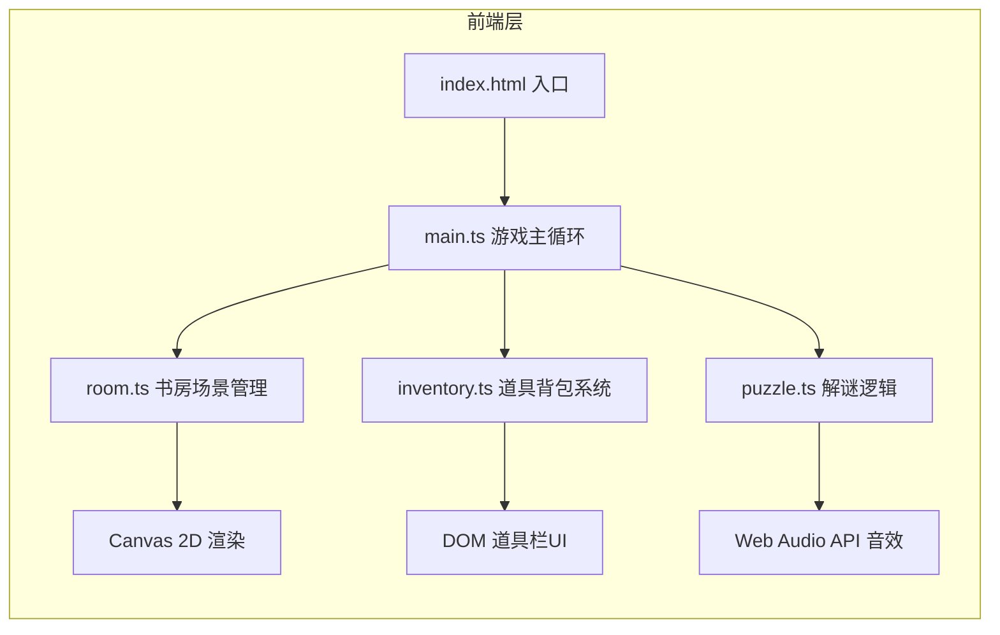

## 1. 架构设计



## 2. 技术描述
- **前端框架**：原生HTML/CSS + TypeScript，无UI框架
- **构建工具**：Vite@5
- **渲染技术**：Canvas 2D API
- **音频技术**：Web Audio API（程序生成音效）
- **类型系统**：TypeScript严格模式

## 3. 文件结构

| 文件路径 | 作用 |
|----------|------|
| `/package.json` | 项目依赖和脚本配置（vite、typescript） |
| `/index.html` | 入口页面，包含Canvas和DOM锚点 |
| `/vite.config.js` | Vite构建配置，端口8080 |
| `/tsconfig.json` | TypeScript严格模式配置 |
| `/src/main.ts` | 游戏主循环，事件绑定，状态驱动 |
| `/src/room.ts` | 书房布局、交互点坐标与状态管理 |
| `/src/puzzle.ts` | 解谜逻辑、密码验证、道具组合规则 |
| `/src/inventory.ts` | 道具背包、拖拽组合、选中状态 |

## 4. 核心数据模型

### 4.1 交互点 (InteractivePoint)
```typescript
interface InteractivePoint {
  id: string;
  name: string;
  x: number;
  y: number;
  width: number;
  height: number;
  hovered: boolean;
  clicked: boolean;
  interacted: boolean;
  containsItem?: string;
  onClick: () => void;
}
```

### 4.2 道具 (Item)
```typescript
interface Item {
  id: string;
  name: string;
  icon: string;
  description: string;
  combinable: string[];
}
```

### 4.3 游戏状态 (GameState)
```typescript
interface GameState {
  timeLeft: number;
  inventory: string[];
  puzzlesSolved: number;
  isPlaying: boolean;
  hasWon: boolean;
  hasLost: boolean;
  secretCompartmentOpen: boolean;
  passwordInput: string;
}
```

## 5. 游戏状态管理
- 采用集中式状态对象，由main.ts持有
- 各模块通过回调函数修改状态
- 每帧由requestAnimationFrame统一渲染更新

## 6. 性能优化策略
- Canvas分层渲染：静态背景预渲染到离屏Canvas
- 脏矩形渲染：仅更新变化区域
- 事件委托：减少事件监听器数量
- 对象池：复用动画效果对象
- 及时清理：移除过期的定时器和事件监听
