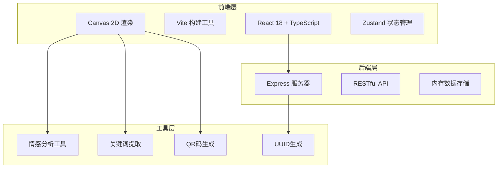
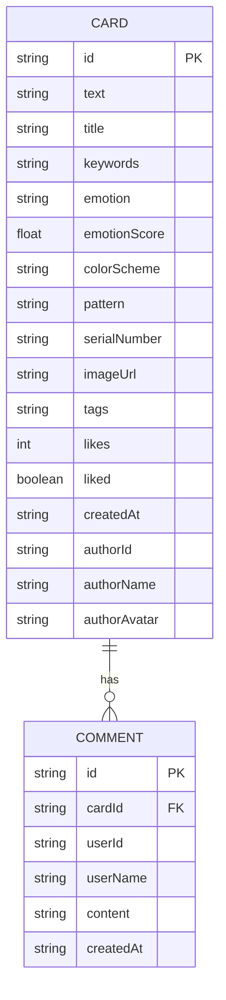

## 1. 架构设计


## 2. 技术说明
- **前端框架**：React 18 + TypeScript
- **构建工具**：Vite（开发端口8080）
- **后端框架**：Express 4 + TypeScript
- **数据存储**：内存数组（开发演示用）
- **状态管理**：Zustand
- **HTTP客户端**：Axios
- **QR码生成**：qrcode.react
- **唯一ID**：uuid

## 3. 路由定义
| 路由 | 用途 |
|------|------|
| /create | 卡片生成页面 |
| /gallery | 个人画廊页面 |
| /explore | 探索页面 |
| /card/:id | 卡片详情页面 |

## 4. API定义

### 4.1 类型定义
```typescript
interface Card {
  id: string;
  text: string;
  title: string;
  keywords: string[];
  emotion: 'positive' | 'negative' | 'neutral';
  emotionScore: number;
  colorScheme: string;
  pattern: 'circles' | 'triangles';
  serialNumber: string;
  imageUrl: string;
  tags: string[];
  likes: number;
  liked: boolean;
  comments: Comment[];
  createdAt: string;
  author: {
    id: string;
    name: string;
    avatar: string;
  };
}

interface Comment {
  id: string;
  cardId: string;
  userId: string;
  userName: string;
  content: string;
  createdAt: string;
}
```

### 4.2 API端点
| 方法 | 路径 | 描述 | 请求体 | 响应 |
|------|------|------|--------|------|
| GET | /api/cards | 获取卡片列表 | - | Card[] |
| POST | /api/cards | 创建新卡片 | { text, title, keywords, emotion, emotionScore, colorScheme, pattern, tags } | Card |
| POST | /api/cards/:id/like | 点赞卡片 | - | { likes: number, liked: boolean } |
| POST | /api/cards/:id/comment | 添加评论 | { content, userName } | Comment |

## 5. 服务器架构图


## 6. 数据模型

### 6.1 数据模型定义


### 6.2 目录结构
```
e:\solo\VersionFast\tasks\auto279\
├── package.json
├── index.html
├── vite.config.js
├── tsconfig.json
├── src/
│   ├── App.tsx
│   ├── components/
│   │   └── CanvasCard.tsx
│   └── utils/
│       └── emotionAnalyzer.ts
└── server/
    └── index.ts
```
