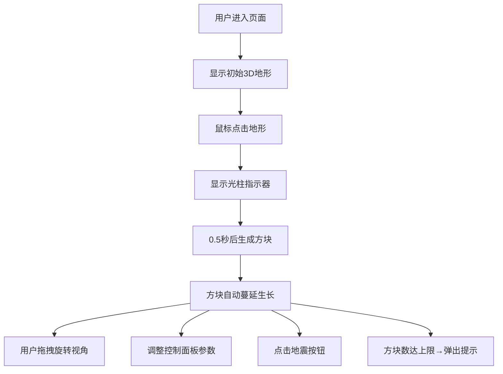

## 1. 产品概述

息壤是一款基于WebGL的3D创意交互应用，用户通过点击和拖拽在虚拟地形上播种彩色方块，观察其自动生长蔓延形成动态地貌景观。

- 主要目的：提供治愈系创意交互体验，让用户在简单操作中感受生命生长的视觉美学
- 目标用户：创意爱好者、艺术创作者、休闲娱乐用户
- 产品价值：低门槛的3D创意工具，无需专业技能即可生成独特的视觉艺术作品

## 2. 核心特性

### 2.1 功能模块

1. **3D场景模块**：Three.js渲染的圆形地形平面、深度渐变背景、环境光照
2. **播种交互模块**：鼠标点击放置种子方块、光柱指示器动画
3. **生长系统模块**：方块自动蔓延复制、颜色混合过渡、边界限制
4. **视角控制模块**：OrbitControls旋转缩放、视角信息实时显示
5. **控制面板模块**：生长速度调节、最大数量限制、颜色倾向开关、地震特效
6. **UI反馈模块**：方块上限提示、hover动效、移动端适配

### 2.2 页面详情

| 页面名称 | 模块名称 | 功能描述 |
|---------|---------|---------|
| 主场景 | 3D画布 | 全屏Three.js渲染，圆形地形，方块生长动画 |
| 主场景 | 左下角悬浮面板 | 实时显示当前相机视角坐标 |
| 主场景 | 右侧控制面板 | 生长参数调节、颜色倾向开关、地震按钮 |
| 主场景 | 右上角提示弹窗 | 方块数达上限时的滑入提示 |

## 3. 核心流程

用户进入页面 → 看到初始圆形地形 → 鼠标点击任意位置 → 显示金色光柱指示器 → 0.5秒后冒出彩色方块 → 方块自动向周围蔓延生长 → 用户可拖拽旋转视角、滚轮缩放 → 通过右侧控制面板调整参数 → 点击地震按钮触发特效 → 方块数达上限时右上角弹出提示

## 4. 用户界面设计

### 4.1 设计风格
- 主色调：深蓝黑渐变背景 (#0D0F1C → #1B1D2E)
- 点缀色：金色 (#FFD700)、四色方块 (#E67E22 / #27AE60 / #2980B9 / #8E44AD)
- 警示色：红色 (#D32F2F / #F44336 / #FF6B6B)
- 按钮风格：圆角设计，hover过渡动画0.2秒
- 字体：monospace等宽字体，字号14px
- 布局风格：全屏沉浸式3D画布，悬浮控制面板叠加

### 4.2 页面设计概览

| 页面区域 | 模块名称 | UI元素 |
|---------|---------|--------|
| 全屏区域 | 3D画布 | 深蓝黑渐变、圆形地形、动态方块、光照阴影 |
| 左下角 | 视角面板 | 半透明深灰圆角矩形 (#1A1A2ECC, 圆角12px, 160×60px) |
| 右侧 | 控制面板 | 半透明面板 (#16182DCC, 圆角16px, 宽240px)、三个滑块、地震按钮 |
| 右上角 | 提示弹窗 | 黑色半透明背景、白色文字、圆角8px、右滑入动画 |

### 4.3 响应式设计
- 桌面端：右侧固定宽度240px控制面板
- 移动端：控制面板宽度自适应为屏幕宽度的85%
- 触摸滑动支持视角控制
- 所有控件支持触摸操作

### 4.4 3D场景指导
- 环境：深蓝黑渐变天空，营造深邃宇宙/地底氛围
- 光照：环境光 + 方向光组合，突出方块光泽材质
- 相机：PerspectiveCamera，初始距离约20单位，OrbitControls带阻尼
- 构图：圆形地形居中，方块生长形成视觉焦点
- 交互：点击播种、拖拽旋转、滚轮缩放、地震抖动
- 性能：200方块维持60FPS，地震动画不低于30FPS
