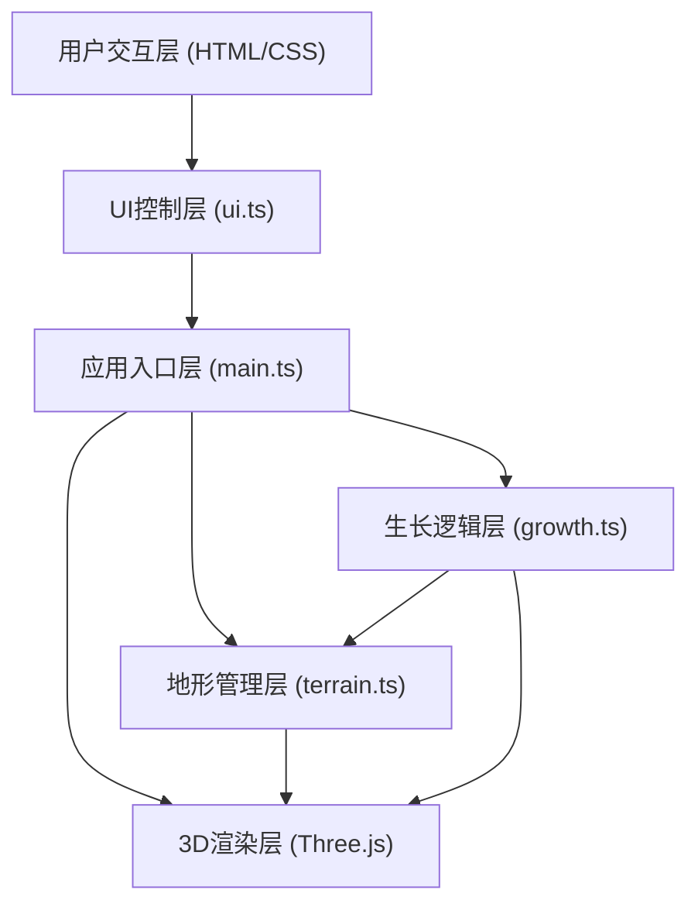

## 1. 架构设计



## 2. 技术说明

- 前端框架：TypeScript + 原生HTML/CSS
- 3D渲染：Three.js (latest)
- 构建工具：Vite 5.x
- 开发调试：dat.gui（可选，用于参数调试）
- 无后端服务，纯前端应用

## 3. 文件结构定义

```
.
├── package.json          # 项目依赖和脚本
├── vite.config.js        # Vite构建配置
├── tsconfig.json         # TypeScript编译配置
├── index.html            # HTML入口页面
└── src/
    ├── main.ts           # 应用入口，整合所有模块
    ├── terrain.ts        # 地形生成、方块放置与管理
    ├── growth.ts         # 方块生长逻辑、颜色混合算法
    └── ui.ts             # DOM控制面板、事件绑定、UI更新
```

## 4. 模块职责定义

### 4.1 src/main.ts
- 创建Three.js渲染器、场景、相机
- 初始化OrbitControls视角控制
- 整合terrain、growth、ui模块
- 主循环渲染与动画帧调度
- 全局光照与背景设置

### 4.2 src/terrain.ts
- 生成64x64细分的圆形地形平面（半径10单位）
- 创建花岗岩纹理材质
- 管理所有方块的Mesh数组和空间坐标映射
- 处理射线检测，响应鼠标点击放置种子
- 创建光柱指示器动画
- 创建带光泽和发光边框的方块Mesh
- 执行地震动画（位移+正弦波衰减）

### 4.3 src/growth.ts
- 方块自动生长定时器（可配置间隔0.3-2.0秒）
- 六方向邻居检测（上下左右前后）
- 圆形边界限制（不超出半径10单位）
- 颜色混合算法（父0.7 + 邻0.3，色差值>20插值）
- 颜色倾向通道加成（红/绿/蓝 +50%）
- 最大方块数限制与自动停止

### 4.4 src/ui.ts
- DOM元素创建与样式设置
- 三个滑块控件（生长速度、最大数量、颜色倾向）
- 地震按钮绑定
- 左下角视角信息面板实时更新
- 右上角提示弹窗滑入/淡出动画
- 响应式布局适配（移动端控制面板85%宽度）
- Hover过渡动画（0.2秒）

## 5. 关键数据结构

### 5.1 方块数据
```typescript
interface BlockData {
  mesh: THREE.Mesh;           // Three.js网格对象
  position: THREE.Vector3;    // 网格坐标位置（整数）
  color: THREE.Color;         // 当前颜色
  baseY: number;              // 基准Y坐标（地震动画用）
}
```

### 5.2 生长配置
```typescript
interface GrowthConfig {
  speed: number;              // 生长间隔（秒），范围0.3-2.0
  maxBlocks: number;          // 最大方块数，范围50-500
  colorBias: {                // 颜色倾向开关
    red: boolean;
    green: boolean;
    blue: boolean;
  };
}
```

### 5.3 预设颜色
```typescript
const PRESET_COLORS = [
  0xE67E22,  // 橙
  0x27AE60,  // 绿
  0x2980B9,  // 蓝
  0x8E44AD,  // 紫
];
```

## 6. 性能优化策略

- 方块使用共享几何体（BoxGeometry单例）
- 材质实例复用，仅修改color属性
- 生长定时器使用setTimeout + requestAnimationFrame混合
- 地震动画使用增量时间计算，避免setInterval累积误差
- 空间坐标使用Map<string, BlockData>快速查询邻居
- 圆形边界使用平方距离比较（避免Math.sqrt开销）
