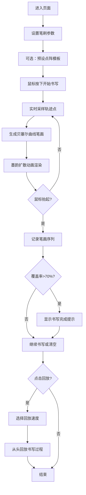

## 1. 产品概述

"墨迹潮汐"是一款交互式汉字笔画生成与动画工具，让用户通过鼠标拖拽模拟毛笔在宣纸上书写，实时生成带有墨韵扩散效果的动态笔画，最终组合成完整的汉字。

- 面向书法爱好者、汉字学习者和创意设计师
- 提供沉浸式的数字毛笔书写体验，融合传统水墨美学与现代交互技术
- 核心价值：低门槛的数字书法创作、真实的墨韵视觉效果、可回放的书写过程记录

## 2. 核心功能

### 2.1 用户角色

| 角色 | 注册方式 | 核心权限 |
|------|---------|---------|
| 普通用户 | 无需注册，直接使用 | 全部书写、调节、回放功能 |

### 2.2 功能模块

1. **主画布区域**：毛笔书写、墨迹渲染、墨韵扩散动画
2. **顶部工具栏**：笔刷大小调节、墨色浓度调节、墨色颜色选择、清空画布
3. **底部状态栏**：7x7点阵汉字模板、书写完成检测、帧率显示、回放控制

### 2.3 功能详情

| 页面名称 | 模块名称 | 功能描述 |
|---------|---------|---------|
| 主页面 | 毛笔书写引擎 | 鼠标轨迹采样、贝塞尔曲线插值、压力变化、笔锋收尖 |
| 主页面 | 墨韵扩散模拟 | 墨汁向外扩散、高斯渐变边缘、重叠区域浓度叠加 |
| 主页面 | 参数控制面板 | 笔刷大小(2-40px)、墨色浓度(10%-100%)、五种预设墨色 |
| 主页面 | 汉字点阵模板 | 7x7像素点阵、点击预设目标汉字、覆盖率检测(>70%完成) |
| 主页面 | 动画回放系统 | 笔画序列记录、多倍速回放(0.5x/1x/2x)、动画效果复现 |

## 3. 核心流程

## 4. 用户界面设计

### 4.1 设计风格

- **主色调**：仿古宣纸米黄(#F5E6C8)、画布米白(#FDF5E6)、深棕边框(#8B7355)
- **点缀色**：纯黑(#1A1A1A)、赭石(#8B4513)、胭脂(#9E3B3B)、花青(#2B5B84)、藤黄(#DAA520)
- **按钮风格**：内凹阴影营造嵌入感，悬停scale(1.05)，按压scale(0.95)，圆角12px
- **字体**：使用宋体/楷体类衬线字体，营造传统书法氛围
- **布局风格**：三栏式垂直布局(顶部工具栏/中央画布/底部状态栏)
- **视觉细节**：深棕木框质感边框、宣纸纹理背景、内凹阴影工具栏

### 4.2 页面设计详情

| 页面名称 | 模块名称 | UI元素 |
|---------|---------|--------|
| 主页面 | 顶部工具栏 | 高度60px、底色#E8D5B7、内凹阴影、间距16px、三个滑块+颜色按钮+清空按钮 |
| 主页面 | 中央画布区域 | 宽度80%、高度75%、底色#FDF5E6、2px深棕边框(#8B7355)、居中显示 |
| 主页面 | 底部状态栏 | 高度50px、底色#D4C4A8、7x7点阵模板(每格12px)、状态文字、回放控制 |
| 主页面 | 滑块控件 | 轨道深灰#333333、滑块头为墨色颜色、圆角12px |

### 4.3 响应式设计

- 桌面优先(Desktop-first)设计
- 宽度<768px时：工具栏变为两行(第一行笔刷参数，第二行颜色和功能按钮)
- 宽度<768px时：画布高度调整为60%
- 宽度<768px时：底部状态栏高度调整为40px
- 所有交互元素支持触控操作

### 4.4 动画与交互

- 墨迹扩散：落笔后2秒内半径从0线性增长到笔画宽度1.5倍，边缘高斯渐变
- 笔画收尖：末段宽度渐变为初始宽度的20%
- 书写完成：模板闪烁绿色，周期0.5秒
- 按钮交互：hover: scale(1.05) 0.2s ease-out；active: scale(0.95)
